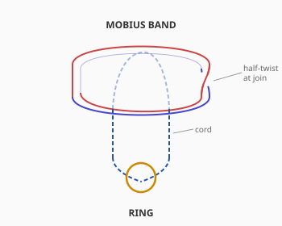
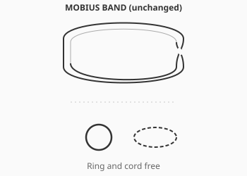
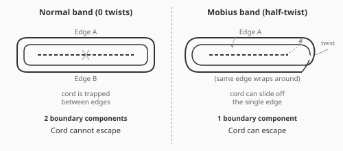

# Puzzle 4: Mobius Snare

**Difficulty:** Intermediate
**Type:** Disentanglement
**Topological Principle:** Non-orientability (Mobius boundary)

---

## Overview

A cord loop with a dangling ring is threaded around a Mobius band — a strip of leather joined with a half-twist. On an ordinary (untwisted) band, the cord would be permanently trapped between the two distinct edges. But a Mobius band has only one edge, and this changes everything.

## Components

| Part | Material | Dimensions |
|------|----------|-----------|
| Mobius band | Chrome-tanned leather | 300mm x 25mm x 2mm, joined with half-twist |
| Join | Brass rivets | 2 rivets securing the half-twisted overlap |
| Ring | Welded steel O-ring | 40mm OD |
| Cord | 3mm braided nylon | 250mm long, both ends tied to ring |

The cord forms a closed loop that hangs from the ring. The total cord-plus-ring assembly forms one closed curve.

## Setup

The cord loop is threaded around the Mobius band — it passes through the interior of the band loop (inside the leather strip's circumference) at one point. The ring dangles below, weighted by gravity.

## Solved State

## Objective

Free the ring-and-cord assembly from the Mobius band. Nothing may be cut, unriveted, or broken.

## The Topology

An ordinary (untwisted) band has **two edges** and **two sides**. A cord threaded around such a band is trapped between the two edges — it cannot pass over either edge without cutting the band.

A Mobius band has **one edge** and **one side**. The half-twist connects what would be the "top edge" to the "bottom edge," creating a single continuous boundary curve. A cord positioned on the band can follow this single edge all the way around and eventually reach any point — including the escape path.

The Mobius band's boundary is a single unknotted closed curve. The cord loop and this boundary have linking number 0 (they can be separated), which is only possible because the single edge wraps around the band twice before closing.

### How One-Sidedness Enables Escape

On a normal (0-twist) band, the cord is trapped between the top edge and the bottom edge — two distinct boundary curves. Think of it like a track with two rails: the cord sits between the rails and cannot jump over either one to escape.

On a Mobius band, there is only **one boundary curve**. The cord can follow this single boundary all the way around and reach any point — including positions that *appear* to be on the 'other side' of the band (but are really the same side). This means the cord can slide to the edge and off.

**Edge-tracing exercise:** Place your finger on the edge of the Mobius band at any point. Trace along the edge without lifting your finger. You will visit the *entire* boundary — both what looks like the 'top edge' and what looks like the 'bottom edge' — before returning to your starting point. This proves it is a single continuous edge.

**Physical Intuition:** What you feel in your hands: as you slide the cord along the band toward the twist, you feel it transition smoothly from what looks like the 'inside face' to the 'outside face' without ever leaving the surface. At the twist, the cord just... keeps going. There's no barrier, no edge to cross. The twist that looks like a complication is actually an open door.

*For the mathematical foundation of orientability and boundary components, see [Topology Primer: Orientability and the Mobius Band](../theory/topology-primer.md#orientability-and-the-mobius-band).*

## Solution

1. Identify the half-twist in the leather band (where the rivet join is)
2. **Flatten the cord's loop against one face of the band.** Pinch the loop so it lies flat on the leather — snug against the surface like a flat rubber band pressed onto the strip, not hanging down through the band's central hole. Keep it flat for the entire procedure: the escape depends on the cord never leaving the surface.
3. **Slide the flattened loop along the band, straight across the half-twist.** At the riveted join, pinch the leather flat and pass the cord over the twist point without lifting it off the surface. This completes the first full circuit around the band.

**Checkpoint (after step 3):**
It feels like the cord has arrived on the "other face" of the
leather. It has not: run a finger along the surface from your
starting point and you reach the cord without ever crossing an
edge. This is the SAME face — one-sidedness made tangible. You
are halfway done. Keep sliding in the same direction.

4. **Continue a second full circuit, following the single boundary edge.** The band's boundary is one closed curve, but that curve makes two trips around the band before it closes. The cord must follow it for both trips. The first circuit only exchanges apparent faces; the second circuit is what actually carries the loop off the band.

**Stop-test (after step 4):**
Look through the band's central hole. If the cord still passes
through the hole, you have completed only one circuit — keep
sliding. When the second circuit is done, the cord no longer
passes through the hole at all: the entire loop hangs outside
the band's single edge.

5. **Lift the loop off the edge.** It comes away freely — nothing to force, nothing to stretch. The ring and cord drop clear of the band.

The key physical move: at the half-twist, pinch the leather flat and slide the cord straight across the twist point, keeping the loop flat on the surface. You will make this move twice — once per circuit — because the band's boundary is a single curve of two circuits, and the cord must follow it around both before the edge "closes" behind it.

Why the escape is possible at all: kept flat against the surface, the cord's loop is being deformed continuously — a homotopy — from a loop that encircles the band into a loop that never encircles it. After the first circuit the loop has merely traded apparent faces; after the second, the deformation is complete and the loop lies entirely outside the single edge, encircling nothing. On an untwisted band no such deformation exists: the two separate boundary circles fence the cord in, and every flat slide leaves it encircling the strip. The half-twist welds those two circles into one continuous edge — and that edge is the path the cord rides out.

## Why It's Tricky

**The twist is perceived as a complication, not a solution.** Solvers look at the half-twist and think "that makes it harder — more tangled." In reality, the twist is precisely what makes escape possible. On an untwisted band, the puzzle would be genuinely unsolvable.

**Two-sided thinking:** People intuitively treat surfaces as two-sided. They think the cord is between a "top edge" and a "bottom edge" and try to pass it over one of those edges. On a Mobius band, there is only one edge, but the visual appearance of two sides persists. The solver must abandon two-sided intuition.

**Lesson:** Twists can change the boundary structure of a surface in ways that enable rather than restrict. Non-orientability (one-sidedness) is not just a mathematical curiosity — it has physical consequences.

## Common Mistakes

1. **Trying to pull the cord over the edge directly.** On a normal band, this would be the only option (and it would fail). On the Mobius band, you don't need to go over the edge — you can reach the edge by following the surface through the twist. Pulling over the edge fights the geometry; sliding through the twist uses it.

2. **Ignoring the half-twist.** Solvers often try to solve the puzzle by working the cord around the non-twisted portions of the band, avoiding the riveted join. But the twist is the solution — it's the feature that converts two edges into one. Working away from the twist guarantees failure.

3. **Confusing the Mobius band with a regular loop.** If you mentally model the band as a simple ring (ignoring the twist), every approach you try will fail because you're solving the wrong puzzle. The twist fundamentally changes the topology.

## Construction Notes

- Use chrome-tanned leather for flexibility; vegetable-tanned leather is too stiff
- The half-twist must be precise: exactly 180 degrees of twist before riveting
- Rivet the join with the overlap lying flat (about 15mm overlap); the rivet heads must be flush so the cord slides over them
- **Visual aid:** Before joining, color one side of the leather (e.g., dye one side dark, leave the other natural). After joining with the half-twist, the color will be continuous — trace it with your finger to verify the Mobius property. This also provides a visual clue for solvers
- The cord must be thin enough (3mm) to slide smoothly around the band, especially through the twist region
- Test that the cord slides freely over the riveted join — file down any sharp edges
