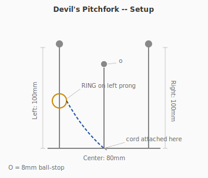
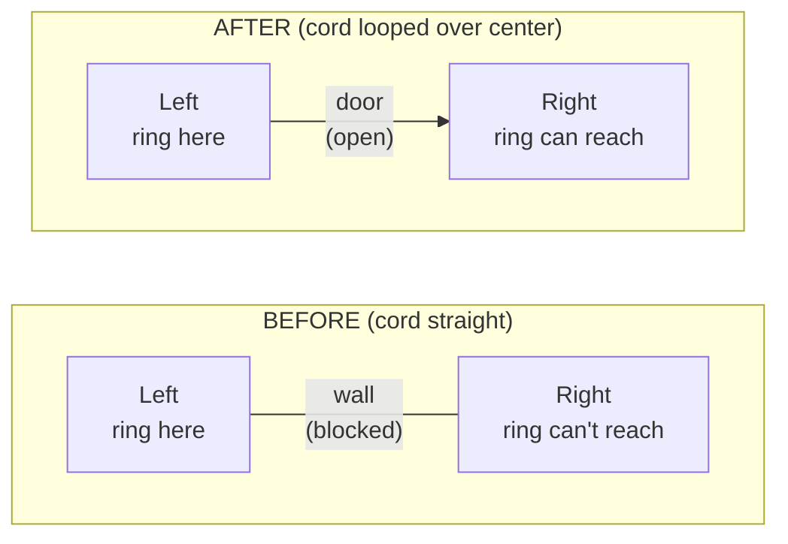
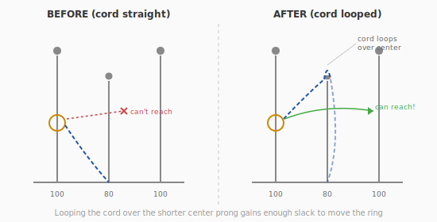

# Puzzle 7: Devil's Pitchfork

**Difficulty:** Intermediate-Advanced
**Type:** Transfer (manipulation)
**Topological Principle:** Fundamental group of configuration space

---

## Overview

A ring sits on the left prong of a three-pronged fork. Ball-stops on the prong tips prevent the ring from being lifted off. A cord connects the ring to the base of the center prong — too short to allow a direct transfer. But the center prong is subtly shorter than the others, and this dimensional asymmetry is the key to everything.

## Components

| Part | Material | Dimensions |
|------|----------|-----------|
| Base | 4mm steel rod, U-shaped | 200mm wide, forms the base connecting three prongs |
| Left prong | 4mm steel rod, vertical | 100mm tall |
| Center prong | 4mm steel rod, vertical | 80mm tall (20mm shorter) |
| Right prong | 4mm steel rod, vertical | 100mm tall |
| Ball-stops | 8mm steel balls | Welded to tips of all three prongs |
| Ring | Welded steel O-ring | 50mm OD |
| Cord | 5mm braided nylon, closed loop | 300mm circumference |

The cord loop connects the ring to the base of the center prong via a small hole drilled at the prong's base.

## Setup

The ring is on the left prong, resting against the ball-stop. The cord runs from the ring down to the base of the center prong. The cord is too short to allow the ring to be lifted over any ball-stop.

## Objective

Move the ring from the left prong to the right prong. The ring cannot be removed from the assembly entirely.

## The Topology

The set of possible positions for the ring (its **configuration space**) is not simply connected. The ring can be at various heights on each prong and in the channels between prongs, but the ball-stops and cord length create barriers that partition the space.

The configuration space has a non-trivial **fundamental group**: there exists a loop in configuration space (a sequence of moves that returns to a seemingly identical state) that is not contractible to a point. The ring must trace a specific element of this fundamental group — corresponding to looping the cord over the center prong — before the transfer becomes possible.

In physical terms: you must change the **cord's topology** (its relationship with the center prong) as a precondition for changing the **ring's position**. The puzzle has two layers — cord configuration and ring position — and the first must be solved before the second.

### Configuration Space Intuition

The **configuration space** of this puzzle is the set of all possible positions for the ring AND all possible states of the cord. It's not just where the ring can go — it's the combination of ring position and cord geometry.

Before looping the cord over the center prong, the configuration space is 'disconnected' between left and right — there is no continuous path of ring-and-cord states that moves the ring from the left prong to the right prong. The cord constraint creates an invisible wall in configuration space.

After looping the cord over the shorter center prong, the configuration space changes. The cord now acts like a pulley, redirecting the constraint so the ring can reach the right channel. Think of it as unlocking a door: the cord loop over the center prong is the key turn, and the ring transfer is walking through the door.

*For the general theory of configuration spaces, see [Topology Primer: Configuration Spaces](../theory/topology-primer.md#configuration-spaces).*

**Physical Intuition:** What you feel in your hands: before the cord loop, the ring slides freely up and down the left prong but hits an invisible wall when you try to move it right. The cord goes taut and stops you. After looping the cord over the center prong's ball-stop, you'll feel the cord go slack in the right channel — suddenly there's room. The ring slides right as if a barrier has been removed. That moment of sudden slack IS the configuration space changing topology.

## Solution

### Phase 1: Reconfigure the cord

1. Slide the ring down to the base of the left prong, between the left and center prongs
2. Pull the cord to create maximum slack near the top of the center prong
3. The center prong is 20mm shorter than the others — the cord can **just barely** reach over the center prong's ball-stop
4. Loop the cord bight over the center prong's ball-stop
5. The cord is now looped over the center prong, changing its effective geometry

### Cord Geometry Change

### Phase 2: Transfer the ring

6. With the cord looped over the center prong, the ring now has a different effective "reach" in the right channel
7. Slide the ring from the left channel, under the cord's new configuration, into the right channel
8. Work the ring up the right prong to the ball-stop position

The key is that the cord loop over the center prong creates a **pulley-like** redirection of the constraint, giving the ring enough freedom to reach the right side.

## Why It's Tricky

**The height difference is dismissed.** The center prong being 20mm shorter looks like an imprecision or aesthetic choice. Solvers do not recognize it as the critical functional feature. It is, in puzzle design terms, a "hidden in plain sight" element.

**Meta-level thinking required.** Most puzzles have one layer: move the object. This puzzle has two layers: first reconfigure the constraint (the cord), then move the object (the ring). Solvers who focus only on the ring will never solve it because the ring's movement is impossible under the cord's initial configuration.

**The precondition is invisible.** The cord's state change (looping over the center prong) doesn't look like "progress." It looks like a meaningless intermediate step. Solvers who accidentally achieve it may undo it, not realizing they were one step away from the solution.

**Lesson:** Configuration space has its own topology. Sometimes you must change the constraints before you can move the constrained object. The structure of the problem changes as you manipulate it.

## Common Mistakes

1. **Trying to force the ring over a ball-stop.** The ball-stops (8mm) are larger than the ring's passage — forcing will damage the puzzle. The ring is not meant to go over any prong tip.

2. **Ignoring the center prong's height difference.** The center prong being 20mm shorter is the entire puzzle. If you haven't used the height difference, you haven't started solving. Look at the prong tips — one is shorter. That's your clue.

3. **Undoing the cord loop accidentally.** After looping the cord over the center prong (Phase 1), solvers often accidentally undo the loop while attempting Phase 2. Keep tension on the cord to maintain the loop, and work the ring with your other hand.

## Construction Notes

- The height difference (20mm) must be **precisely calibrated:**
  - Cord circumference (300mm) minus the path from ring (at base) to center prong base (~60mm each way = 120mm) leaves 180mm of slack
  - The cord needs to travel from ring position, up to center prong tip (80mm), over the ball-stop, and back — about 160-170mm
  - This leaves only 10-20mm of margin — tight enough to be non-obvious, loose enough to be physically achievable
- **Test with prototypes.** Build with adjustable prong heights (use set screws) and fine-tune the cord length
- Weld all joints cleanly; the ring must slide freely between prongs without catching
- The ball-stops must be centered and round — any flat spot or misalignment will let the ring slip past, breaking the puzzle
- Deburr the hole at the center prong base where the cord attaches
