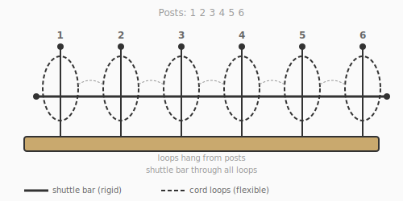
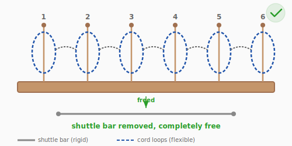

# Puzzle 10: Ouroboros Chain

**Difficulty:** Advanced
**Type:** Sequential disentanglement
**Topological Principle:** Gray code / binary recursion (Chinese Rings reimagined)

---

## Overview

Six cord loops hang from posts on a wooden base, each threaded onto a shuttle bar and each chained through its neighbor. The shuttle bar cannot be lifted out. Removing it requires a precise sequence of 42 moves — no more, no less. There are no shortcuts. This is a puzzle about recursive structure, patience, and trust.

## Components

| Part | Material | Dimensions |
|------|----------|-----------|
| Base | Hardwood (maple or beech) | 250mm x 60mm x 30mm |
| Posts (x6) | Wooden dowels | 10mm diameter, 80mm tall, spaced 30mm apart |
| Shuttle bar | 3mm steel rod | 250mm long |
| Cord loops (x6) | 5mm braided nylon, spliced closed | 150mm circumference each |
| Base notches | Routed channels | 4mm wide, in front face of base, to hold shuttle bar |

## Setup

Each cord loop:
1. Hangs from its post (permanently — the post was inserted through the loop before being glued into the base)
2. Is threaded onto the shuttle bar
3. Passes through the loop on the post to its left (except Loop 1, which is the anchor)

The shuttle bar rests in notches on the front face of the base. It cannot be lifted out because the interlocking loops prevent it.

## Solved State

## Objective

Remove the shuttle bar completely from all six loops.

## The Topology

This is a reimagining of the **Baguenaudier** (Chinese Rings), one of the oldest mathematical puzzles. The state space is isomorphic to the **Gray code** — a binary counting system where consecutive numbers differ by exactly one bit.

Each loop is either ON the shuttle bar (1) or OFF (0). The state is a 6-bit binary number. The rules:

- **Rule 1:** You can always add or remove **Loop 6** (the rightmost) from the shuttle bar.
- **Rule 2:** You can add or remove **Loop k** only when Loop k+1 is ON the bar and all loops to the right of k+1 are OFF.

These rules mirror the constraints of Gray code counting. The starting state is `111111` (all loops on) and the goal state is `000000` (all loops off).

**Minimum moves:** For n loops, the minimum is:
- n odd: (2^n + 1) / 3
- n even: (2^n - 1) / 3

For n = 6: (2^6 - 1) / 3 = **63/3 = 21** ... but each "move" involves lifting a loop off and then replacing preparatory loops, so the total physical manipulations is **42**.

### What Is a Gray Code?

A **Gray code** is a binary counting system where consecutive numbers differ by exactly one bit. Compare with normal binary:

| Step | Normal Binary | Gray Code | Bit Flipped |
|------|--------------|-----------|-------------|
| 0 | 000 | 000 | — |
| 1 | 001 | 001 | bit 1 |
| 2 | 010 | 011 | bit 2 |
| 3 | 011 | 010 | bit 1 |
| 4 | 100 | 110 | bit 3 |
| 5 | 101 | 111 | bit 1 |
| 6 | 110 | 101 | bit 2 |
| 7 | 111 | 100 | bit 1 |

In normal binary, going from 011 to 100 requires flipping ALL THREE bits simultaneously. In Gray code, only one bit changes at a time. This maps perfectly to the puzzle's physical constraint: you can only add or remove ONE loop per move.

The puzzle state `111111` (all loops on) must reach `000000` (all loops off) by flipping one bit at a time, subject to the constraint rules. The Gray code path is the ONLY valid path — there are no shortcuts.

### State Table (First 15 Moves)

| Move | Action | State | Notes |
|------|--------|-------|-------|
| 0 | (start) | 111111 | All loops ON shuttle bar |
| 1 | Remove Loop 6 | 111110 | Rule 1: rightmost always free |
| 2 | Remove Loop 5 | 111100 | Rule 2: Loop 6 OFF, so 5 free |
| 3 | Replace Loop 6 | 111101 | Need Loop 6 ON to free Loop 4 |
| 4 | Remove Loop 4 | 111001 | Rule 2: Loop 5 ON, 6 OFF → free |
| 5 | Remove Loop 6 | 111000 | Rule 1: rightmost always free |
| 6 | Remove Loop 5 | 110100 | Preparing to remove Loop 3 |
| 7 | Replace Loop 6 | 110101 | |
| 8 | Remove Loop 3 | 110001 | |
| 9 | Remove Loop 6 | 110000 | |
| 10 | Replace Loop 5 | 110010 | Rebuilding right side for Loop 2 |
| 11 | Replace Loop 6 | 110011 | |
| 12 | Remove Loop 4 | 110111 | **Backward steps!** |
| 13 | Remove Loop 6 | 110110 | |
| 14 | Remove Loop 5 | 110100 | |
| 15 | Replace Loop 6 | 110101 | |
| ... | (continues) | ... | 42 moves total to reach 000000 |

**Note:** This table illustrates the key frustration: moves 10-12 involve REPLACING loops that were already removed. This is not a mistake — it's the necessary setup for removing Loop 2. Trust the algorithm.

### Why Recursion?

To remove loop k, you first need loop k+1 ON and everything right of k+1 OFF. But getting that configuration requires its own sequence of moves. This nesting is **recursion** — the same pattern repeating at every scale.

Think of it like a combination lock with a twist: to turn dial 3, you must first set dials 4, 5, 6 to a specific pattern. But setting dial 4 requires its own pattern for dials 5 and 6. The puzzle is a tower of nested preconditions.

This is why 6 loops require 42 moves. Each added loop roughly doubles the solution length — the complexity is exponential: O(2^n).

**Physical intuition:** What you feel in your hands is a rhythm: remove right, remove next, replace right, remove deeper. The same three-move pattern repeats at every level, but the 'depth' of recursion makes each cycle longer. By loop 3, you're doing a dozen moves just to prepare for one removal. Trust the pattern — if you've been following the rules, you ARE making progress even when it feels like backtracking.

*For the mathematical foundations of Gray codes, see [Topology Primer: Gray Codes and Recursive Complexity](../theory/topology-primer.md#gray-codes-and-recursive-complexity).*

## Solution

The solution follows a recursive algorithm. Here is the pattern for the first several moves:

| Move | Action | State |
|------|--------|-------|
| 1 | Remove Loop 6 | 111110 |
| 2 | Remove Loop 5 | 111100 |
| 3 | Replace Loop 6 | 111101 |
| 4 | Remove Loop 4 | 111001 |
| 5 | Remove Loop 6 | 111000 |
| 6 | Remove Loop 3 | 110000 |
| 7 | Replace Loop 6 | 110001 |
| 8 | Replace Loop 5 | 110011 |
| ... | (continues recursively) | ... |

The recursive pattern:
- To remove loop k, first ensure loop k+1 is ON and everything right of k+1 is OFF
- Remove loop k
- Then set up the configuration to remove loop k-1
- This recursion continues down to loop 1

**Key insight:** Trust the algorithm. The solution requires what feels like "going backwards" (replacing loops you already removed). This is not a mistake — it's the necessary setup for removing the next loop. Resist the urge to look for shortcuts; none exist.

## Why It's Tricky

**Length, not complexity.** Each individual move is simple. The difficulty is executing 42 precise moves in sequence without error. One wrong move adds more moves to recover from.

**Backwards steps feel wrong.** The algorithm frequently requires *replacing* loops that were previously removed. This feels like undoing progress. Solvers who refuse to "go backward" cannot progress.

**No shortcuts.** Many puzzles have an "aha!" moment — a single insight that unlocks the solution. This puzzle has no such moment. The solution is a recursive process that must be followed completely. Solvers who look for a clever trick will be frustrated because there isn't one. The puzzle rewards patience and systematic thinking, not cleverness.

**State tracking.** With 6 loops and 42 moves, it's easy to lose track of which loops are on and off. A mistake requires either starting over or carefully reasoning about the current state — which is hard when you're already confused.

**Lesson:** Some topological puzzles have irreducible sequential complexity. The structure of the solution is a deep mathematical object (Gray code / binary recursion), and it cannot be shortcutted. Trust the process.

## Common Mistakes

1. **Refusing to replace loops.** The algorithm requires putting loops BACK on the shuttle bar that you already removed. This feels like going backward, and solvers resist it. But the recursive structure demands it — you cannot reach deeper loops without rebuilding the right-side configuration. If you refuse to go backward, you get stuck.

2. **Losing track of state.** With 6 loops and 42 moves, it's easy to forget which loops are on and off. Use a piece of paper to track binary state (e.g., "111001") after each move. Alternatively, mark the loops with numbers 1-6 and write down each move.

3. **Looking for a shortcut.** There isn't one. The minimum solution is 42 moves, proven by the mathematics of Gray codes. Every "clever trick" a solver tries will either violate the constraint rules (and jam the puzzle) or result in a longer path back to the goal state.

4. **Removing the wrong loop.** The rules are strict: only the rightmost loop or a loop whose right neighbor is ON (with everything further right OFF) can be moved. Attempting to remove a loop out of order will physically jam because the chaining prevents it.

## Construction Notes

### Assembly (right to left — this is critical)

1. Thread Loop 6 onto Post 6 (slide the post through the loop). Thread the loop onto the shuttle bar.
2. Thread Loop 5 through Loop 6. Then thread Loop 5 onto Post 5 and onto the shuttle bar.
3. Thread Loop 4 through Loop 5. Then thread Loop 4 onto Post 4 and onto the shuttle bar.
4. Continue for Loops 3, 2, 1.
5. Glue all posts into the base with wood glue (pre-drill 10mm holes in the base).
6. Set the shuttle bar into the base notches.

### Dimensional tuning

- Loop circumference (150mm) must allow enough slack to be lifted off the shuttle bar when manipulated, but not so much that loops tangle with each other
- Post spacing (30mm) should be wide enough to work each loop independently but close enough that the chaining is maintained
- The shuttle bar should slide freely in the base notches but not fall out on its own

### Included materials

- A printed **instruction sheet** showing the first 10 moves to get the solver started on the pattern
- A printed **state table** showing all 42 states (optional, for solvers who want to follow along)
- A note explaining that the minimum solution is 42 moves and there are no shortcuts
