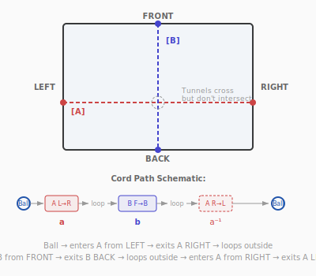
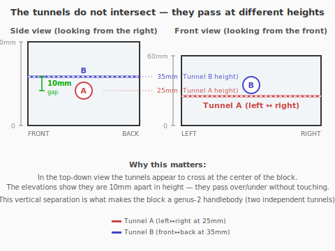
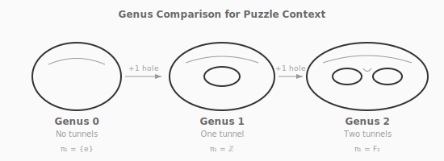
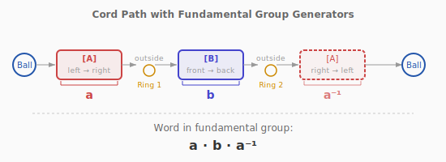
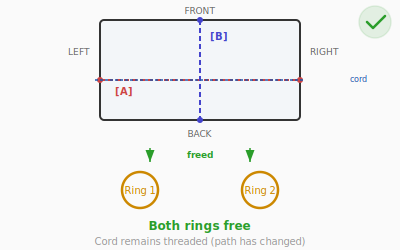

# Puzzle 11: Genus Trap

**Difficulty:** Expert
**Type:** Disentanglement
**Topological Principle:** Genus-2 surface fundamental group

---

## Overview

A clear acrylic block contains two through-tunnels that pass over and under each other without intersecting. A cord is threaded through both tunnels in a specific pattern, with two rings captured on the cord between the tunnels. Wooden balls on the cord ends prevent them from pulling through. The cord's path encodes an algebraic word in the fundamental group — and only the right algebraic manipulation (generator cancellation) will free the rings.

This puzzle has the highest **cognitive load** in the series. Even though the acrylic is clear, you cannot easily reason about how the two tunnels relate to each other and how the cord winds through them — your eyes report a confusing tangle of curves that seem to intersect (they don't — they pass at different heights). You must build, in your mind, a 3D map of the two tunnels and the cord's path through them, and then plan a sequence of physical manipulations that will simplify that path. There is no way to peek inside and check your model against reality except by trying a move and seeing what happens.

## Components

| Part | Material | Dimensions |
|------|----------|-----------|
| Block | Clear cast acrylic | 120mm x 80mm x 60mm |
| Tunnel A | Drilled through-hole (left ↔ right) | 15mm diameter, at 25mm height |
| Tunnel B | Drilled through-hole (front ↔ back) | 15mm diameter, at 35mm height |
| Ring 1 | Welded steel O-ring | 40mm OD |
| Ring 2 | Welded steel O-ring | 40mm OD |
| Cord | 5mm braided nylon | 900mm long |
| Ball stops (x2) | Wooden balls | 30mm diameter, attached to cord ends |

Tunnel A runs horizontally left-to-right at 25mm height. Tunnel B runs horizontally front-to-back at 35mm height. They cross in the center of the block but at different heights (10mm vertical separation) — they do **not** intersect.

## Setup

The top-down view above can be misleading — the tunnels appear to intersect at the center. They don't. The two elevations below show their vertical separation:

### Cord path in detail

1. Left ball-stop → cord enters **Tunnel A** from the left face
2. Cord exits Tunnel A on the right face
3. Cord loops around the outside of the block (right → front)
4. **Ring 1** is on this external section of cord
5. Cord enters **Tunnel B** from the front face
6. Cord exits Tunnel B on the back face
7. Cord loops around the outside of the block (back → left → right)
8. **Ring 2** is on this external section of cord
9. Cord enters **Tunnel A** from the right face (re-entering the same tunnel from the opposite end)
10. Cord exits Tunnel A on the left face
11. Right ball-stop

The ball-stops (30mm) are too large to pass through the tunnels (15mm).

## Objective

Free both rings from the cord-and-block assembly. The cord remains threaded through the block. Nothing is cut or broken.

## The Topology

The acrylic block with two non-intersecting through-tunnels is topologically a **genus-2 handlebody** — a solid body with two handles. Each tunnel contributes one handle.

### What Is a Genus-2 Handlebody?

A **handlebody** is a solid body with tunnel-handles drilled through it. The **genus** counts the number of tunnels:

- **Genus 0:** A solid ball. No tunnels. Any loop on the surface can be shrunk to a point.
- **Genus 1:** A solid donut (torus). One tunnel. A loop going through the tunnel cannot be shrunk.
- **Genus 2:** A solid body with two tunnels. Two independent families of non-shrinkable loops.

The acrylic block in this puzzle — with Tunnel A (left↔right) and Tunnel B (front↔back) — is topologically a genus-2 handlebody. Each tunnel contributes one 'handle' to the topology.

The **fundamental group** of a genus-2 handlebody is the **free group on two generators**, F(a, b), where:
- Generator **a** = a path through Tunnel A
- Generator **b** = a path through Tunnel B

The cord's path traces the word **a b a⁻¹** in this fundamental group:
1. Through Tunnel A left→right = **a**
2. Through Tunnel B front→back = **b**
3. Through Tunnel A right→left = **a⁻¹** (same tunnel, opposite direction)

The word **aba⁻¹** is **non-trivial** in the free group — it cannot be simplified to the identity. This is why the rings are trapped: the cord's topology in the region where the rings sit is non-trivially linked with the block's handle structure.

### What Is the Fundamental Group?

The **fundamental group** of a space is the set of all loops you can draw in it, where two loops are considered 'the same' if one can be continuously deformed into the other (without cutting or leaving the space).

On a genus-2 handlebody, some loops can be shrunk to a point — they're **trivial** (they don't go through any tunnel). Others cannot be shrunk because they go through a tunnel. The loops that go through Tunnel A are called **a**, and through Tunnel B are called **b**.

The fundamental group of a genus-2 handlebody is the **free group on two generators**, written F(a, b). 'Free' means there are no relations between a and b — the only simplification rule is that a path and its reverse cancel: **aa⁻¹ = identity** (going through a tunnel and immediately coming back is the same as not going at all).

### Worked Example: Why aba⁻¹ ≠ Identity

The cord path in this puzzle traces the word **aba⁻¹**:

| Step | Path | Generator |
|------|------|-----------|
| 1 | Through Tunnel A left→right | **a** |
| 2 | Through Tunnel B front→back | **b** |
| 3 | Through Tunnel A right→left | **a⁻¹** (reverse of a) |
| | **Full word:** | **aba⁻¹** |

Can this simplify to the identity (trivial loop)? Let's check:
- **aba⁻¹**: The 'a' and 'a⁻¹' CANNOT cancel because **b** is between them. In a free group, only adjacent inverse pairs cancel. The b blocks the cancellation like a wall between them.
- Compare with **aa⁻¹b**: Here a and a⁻¹ ARE adjacent, so this simplifies to **b**. Not the identity either, but simpler.
- Compare with **aa⁻¹**: Adjacent inverses cancel → **identity**. The rings would be free.

**The solution strategy:** Transform the cord's word from **aba⁻¹** (non-trivial) to something where the generators cancel to the **identity**. This means physically rerouting the cord to eliminate the **b** generator from the region where the rings sit.

### Cord Path with Generators Labeled

What you feel in your hands: the cord is tight. There's very little slack to work with, and every inch must be managed carefully. When you pull a bight out of Tunnel B, you feel the cord resisting — it has to come from somewhere, and that somewhere is the external sections where the rings sit. The moment the bight clears the tunnel and you reroute it through Tunnel A instead, the tension changes. The region between the tunnels where the rings hang goes slack. That slack IS the algebraic cancellation — the word has simplified, and the rings can slide free.

*For the complete treatment of fundamental groups and free groups, see [Topology Primer: The Fundamental Group](../theory/topology-primer.md#the-fundamental-group).*

### The solution: algebraic cancellation

To free the rings, the cord's path in the ring-bearing region must be changed to the **trivial word** (identity element). This is achieved by:

1. Canceling the **b** generator: reroute the cord so it no longer passes through Tunnel B in the ring region
2. This leaves **a a⁻¹ = identity** — the cord is trivially wound and the rings are free

Physically: pull a loop (bight) of the cord backward out of Tunnel B from the front face. The cord will resist — the slack must come from the external sections, so first slide both rings toward Tunnel A to release tension. Once the bight clears the front of Tunnel B, route it horizontally around the block's left side and feed it into Tunnel A from the left face. The cord now traces a different word: where it previously went `... b a⁻¹` it now traces `... (aa⁻¹) a⁻¹`. The new `aa⁻¹` pair is adjacent and cancels, leaving only `a⁻¹`. Combined with the earlier `a`, the entire ring-region word collapses to `aa⁻¹ = identity`. The slack that suddenly appears between the rings IS that algebraic cancellation — and it is exactly the slack the rings need to slide off.

## Solution

1. **Create slack** in the cord near Tunnel B by sliding both rings to one side and pulling cord through the tunnels.

2. **Pull a bight** of cord out of Tunnel B (from the front face). This requires working slack from the external sections into the tunnel.

3. **Pass the bight** around the outside of the block — specifically, route it so that it reaches Tunnel A.

4. **Thread the bight through Tunnel A.** This reroutes the cord: where it previously went through Tunnel B, it now goes through Tunnel A (in addition to the existing Tunnel A paths).

5. **The algebraic result:** The cord path in the ring region is now **a a a⁻¹** — but wait, the bight creates a loop that cancels with the original **a⁻¹** passage, simplifying the word to **a** — no, more precisely:

   The actual process: by pulling the Tunnel B segment out and rerouting through Tunnel A, you change the word from **aba⁻¹** to **a(aa⁻¹)a⁻¹ = aa⁻¹ = identity** in the region where the rings sit.

6. **The rings are now on a section of cord** that is topologically trivial (not linked with the block). Slide them off.

This takes approximately 6-8 sequential manipulations of the cord, each requiring careful slack management.

## Solved State

## Common Mistakes

1. **Random rethreading.** Without understanding the algebraic structure, solvers try pulling cord through tunnels at random. This typically makes the word LONGER (e.g., from aba⁻¹ to aba⁻¹ba or worse), adding generators instead of canceling them. Each random move is equally likely to help or harm, and the state space is large enough that random exploration almost never converges.

2. **Trying to slide the rings off without changing the cord path.** The rings are on a non-trivial section of cord (the aba⁻¹ region). They cannot be removed without simplifying the word to the identity. No amount of sliding, twisting, or forcing will free them while the cord topology remains unchanged.

3. **Losing track of the cord path.** The cord passes through tunnels twice, loops around the outside, and has rings and ball-stops. It's easy to lose track of which section goes where. Before attempting any manipulation, trace the entire cord path from one ball-stop to the other and verify it matches the aba⁻¹ pattern described above.

4. **Forgetting which direction is a vs. a⁻¹.** Direction matters: left→right through Tunnel A is 'a', but right→left is 'a⁻¹'. Rerouting cord through a tunnel in the wrong direction can change the word to aa instead of canceling.

## Why It's Tricky

**Invisible internal geometry.** Even with clear acrylic, the tunnel crossing inside the block is hard to reason about spatially. The solver must build a mental model of how the two tunnels relate in 3D and track the cord's path through this model.

**Algebraic thinking required.** The solution is fundamentally algebraic: it requires recognizing that the cord path encodes a word in a group, and that the right manipulation performs a group-theoretic cancellation. Solvers without this framework try random threading, which typically makes the configuration more complex (introduces additional generators rather than canceling them).

**High-dimensional moves.** Unlike earlier puzzles where the key move is a single insight, this puzzle requires a multi-step cord rerouting. Each step must preserve the ability to complete subsequent steps. One wrong rerouting can create a word that is harder to simplify than the starting configuration.

**Working memory overload.** Tracking the cord's path (which sections are in which tunnels, which direction they go, where the rings are) exceeds most people's spatial working memory. The puzzle rewards solvers who draw diagrams or develop a systematic notation for the cord state.

**Lesson:** When the topology is invisible, you must build mental models. Algebraic descriptions of topology (fundamental groups, words, generators) are not just abstractions — they are practical tools for solving physical puzzles.

## Construction Notes

### Block fabrication

- Use **cast acrylic** (not extruded) for optical clarity
- Drill tunnels with a **15mm Forstner bit** on a drill press at slow speed
- Use cutting fluid / coolant to prevent acrylic from melting and becoming opaque
- Tunnel A (left↔right) at height 25mm from bottom
- Tunnel B (front↔back) at height 35mm from bottom
- The tunnels' centers must be separated by at least 12mm vertically (10mm + 2×radius would mean they just touch; 10mm separation between 15mm-diameter tunnels means 2.5mm clearance — verify this is sufficient)
- **Alternative fabrication:** Laminate acrylic sheets. Route channels in middle sheets, then bond with acrylic cement. This allows more precise tunnel placement.
- Polish tunnel interiors: 400 → 800 → 1200 grit sandpaper, then flame polish or apply plastic polish

### Cord and rings

- The cord must slide freely through the tunnels — test with prototypes
- Rings (40mm OD) must slide freely on the cord but must NOT fit through the tunnels (40mm > 15mm — satisfied)
- Ball-stops (30mm) must not fit through the tunnels (30mm > 15mm — satisfied)
- Attach ball-stops by drilling a 6mm hole through the ball, threading the cord through, and tying a stopper knot on the far side

### Included materials

- A **topology map** card showing the tunnel layout from a cutaway perspective (cross-section views from top, front, and side)
- A **hint card** (sealed envelope) stating: "The cord path encodes the word aba⁻¹. To free the rings, cancel the b."
