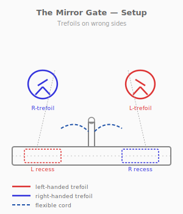
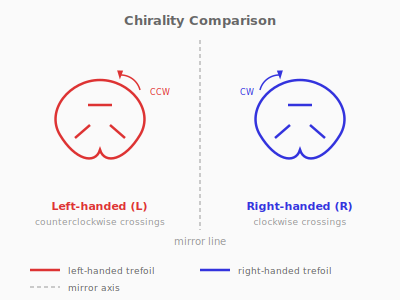
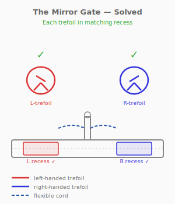

# Puzzle 11: The Mirror Gate

**Difficulty:** Intermediate
**Type:** Identification
**Topological Principle:** Chirality (handedness)

---

## Overview

Two trefoil-shaped wire frames sit on a shared cord, with two mirror-image recesses in a wooden base. The frames look identical — but one is left-handed and the other is right-handed. No rotation in three-dimensional space can turn one into the other.

## Components

| Part | Material | Dimensions |
|------|----------|-----------|
| Trefoil frame (left-handed) | 4mm steel rod | ~100mm across, welded closed |
| Trefoil frame (right-handed) | 4mm steel rod | ~100mm across, welded closed |
| Base | Hardwood | 200mm x 80mm x 20mm |
| Cord | 5mm braided nylon | 350mm long |
| Center post | 6mm steel rod | 30mm tall, press-fit into base |

The base has two shaped recesses — one contoured for the left-handed trefoil, one for the right-handed. They are mirror images of each other, with 0.5mm clearance on the correct hand and physical interference on the wrong hand.

## Setup

1. Both trefoil frames are threaded on the cord
2. The cord passes through a hole in the center post
3. Each trefoil can slide along the cord toward either recess
4. The trefoils are presented in scrambled positions (each near the wrong recess)

## Objective

Seat each trefoil frame into its correct matching recess. Each recess accepts only one specific handedness.

## The Topology

The two trefoil frames are **chiral** — they are mirror images that are topologically inequivalent. A left-handed trefoil and a right-handed trefoil cannot be continuously deformed into each other in three-dimensional space. They are as fundamentally different as your left and right hands.

### What Is Chirality?

A knot is **chiral** if it is not equivalent to its mirror image. The trefoil is the simplest chiral knot — it comes in two versions (left-handed and right-handed) that are topologically distinct. No sequence of Reidemeister moves can convert one to the other.

Some knots are **amphichiral** — they ARE equivalent to their mirror image. The figure-eight knot (Puzzle 16) is amphichiral. The trefoil is not. Chirality is a topological invariant: it depends on the knot type, not on the particular diagram or physical realization.

### How to Tell Them Apart

At each crossing of the trefoil, one strand passes over the other. If you follow the knot in a consistent direction and the overpasses spiral clockwise, the trefoil is right-handed. If they spiral counterclockwise, it is left-handed. The crossing pattern is the signature of handedness.

**Physical Intuition:** What you feel in your hands: both trefoils feel the same weight, have the same dimensions, and look nearly identical when held at arm's length. But when you try to seat one in the wrong recess, it simply does not fit — the curves of the trefoil press against the recess walls at the wrong points. The physical mismatch IS the chirality. Your hands can feel the difference that your eyes initially cannot see.

*For more on chirality and knot invariants, see [Topology Primer: Chirality and Handedness](../theory/topology-primer.md#chirality-and-handedness).*

## Solution

1. Examine both trefoils closely. Look at the crossings — one spirals clockwise, the other counterclockwise
2. Test-fit each trefoil against each recess. The correct pairing will drop in smoothly; the incorrect pairing will resist

3. Route the cord through the center post to give each trefoil enough slack to reach its designated recess
4. Seat both trefoils

The solution takes 1-2 minutes once the handedness is identified.

## Why It's Tricky

The trefoils look identical to a casual observer. The human visual system is not naturally attuned to chirality in three-dimensional curves — we habitually perceive mirror images as "the same thing." This is why chirality in chemistry (enantiomers) was so difficult to discover and remains a source of errors in drug design.

**Lesson:** Mirror images can be topologically inequivalent. Before assuming two objects are interchangeable, check their handedness. Chirality is an invariant that visual similarity cannot override.

## Common Mistakes

1. **Trying to force a trefoil into the wrong recess.** The curves are close enough that it almost fits, but the interference points are structural. Forcing risks bending the wire frame.

2. **Rotating a trefoil 180 degrees and assuming it becomes the other hand.** Rotation changes orientation but does not change chirality. A left-handed trefoil rotated any way in 3D space remains left-handed.

3. **Concluding the puzzle is defective.** Some solvers assume both recesses should accept both trefoils and that the manufacturing is imprecise. The non-interchangeability is the entire point.

4. **Ignoring the crossing pattern.** Solvers who focus on the overall shape rather than the over/under crossings cannot identify the handedness. The chirality is in the crossings, not the silhouette.

## Construction Notes

- Bend trefoil frames from 4mm steel rod using a jig to ensure consistent curves
- The left-handed trefoil is bent with crossings spiraling counterclockwise; the right is clockwise
- Weld the join point and grind smooth so the join is not a visual cue
- Route recesses in the hardwood base using a 2mm ball-end mill on a CNC router, following the trefoil curves with 0.5mm clearance for the correct hand
- The recesses should be 5mm deep — enough to visually confirm seating
- Drill a 6mm hole in the center of the base for the post
- The cord must be long enough for both trefoils to reach either recess
