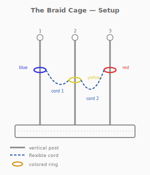
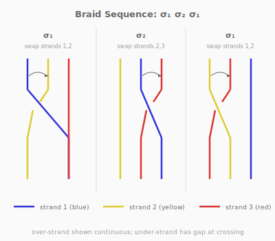
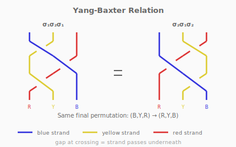

# Puzzle 12: The Braid Cage

**Difficulty:** Intermediate-Advanced
**Type:** Transfer
**Topological Principle:** Braid groups (Yang-Baxter relation)

---

## Overview

Three colored rings sit on three posts connected by cords. The rings must be rearranged to target positions — but naive swap sequences tangle the cords into impossible configurations. Only specific sequences that obey the braid group's algebraic relations keep the cords untangled.

## Components

| Part | Material | Dimensions |
|------|----------|-----------|
| Base | Hardwood | 180mm x 60mm x 15mm |
| Posts (x3) | 10mm dowel | 120mm tall, 50mm spacing |
| Finial balls (x3) | Wood | 14mm diameter, press-fit on posts |
| Red ring | Steel, painted | 35mm OD, 4mm wire |
| Blue ring | Steel, painted | 35mm OD, 4mm wire |
| Yellow ring | Steel, painted | 35mm OD, 4mm wire |
| Cords (x2) | 4mm paracord | 100mm each, anchored through base |

Each cord connects adjacent post pairs through holes in the base, constraining which rings can pass over which posts.

## Setup

1. Three posts stand in a row on the base, spaced 50mm apart
2. Each post has a finial ball at the top
3. Initial ring positions: Blue (left), Yellow (center), Red (right)
4. Target positions: Red (left), Blue (center), Yellow (right)
5. Cord 1 connects left and center posts through the base
6. Cord 2 connects center and right posts through the base
7. Target positions are marked by colored dots on the base

## Objective

Move each ring to its target post without cutting, detaching, or tangling the cords. After the rearrangement, the cords must hang freely without knots or twists.

## The Topology

The three rings on three posts form a **braid** — and the allowed moves are the **generators** of the braid group on three strands.

### What Is a Braid Group?

A **braid** on n strands is a set of n non-intersecting curves connecting n top points to n bottom points, where the curves may cross over and under each other. Two braids are equivalent if one can be continuously deformed into the other. The set of all braids on n strands, with composition (stacking) as the operation, forms the **braid group** B_n.

For three strands, the braid group B_3 has two generators:
- **sigma_1**: swap strands 1 and 2 (strand 1 crosses over strand 2)
- **sigma_2**: swap strands 2 and 3 (strand 2 crosses over strand 3)

These generators do not commute: sigma_1 * sigma_2 does NOT equal sigma_2 * sigma_1. The order of swaps matters — performing them in the wrong order tangles the cords.

### The Yang-Baxter Relation

The key algebraic relation in B_3 is the **Yang-Baxter relation** (also called the braid relation):

**sigma_1 * sigma_2 * sigma_1 = sigma_2 * sigma_1 * sigma_2**

This means: swapping 1-2, then 2-3, then 1-2 again produces the same result as swapping 2-3, then 1-2, then 2-3. Both sequences achieve the same permutation AND leave the cords in the same untangled state.

The naive approach — arbitrary sequences of swaps — will tangle the cords even if it achieves the correct permutation. Only sequences that respect the braid relation leave the cords free.

**Physical Intuition:** What you feel in your hands: when you lift a ring over a finial and place it on the adjacent post, the cord connecting those posts either hangs freely or develops a twist. After a correct braid sequence, the twists cancel and the cords hang straight. After an incorrect sequence, the cords are visibly twisted around each other and resist the final placement. The tangle IS the failure of the braid relation — you can feel non-commutativity.

*For more on braids and their algebra, see [Topology Primer: Braid Groups](../theory/topology-primer.md#braid-groups).*

## Solution

1. **sigma_1:** Lift Blue ring over left finial, place it on center post. (Blue and Yellow swap.)
2. **sigma_2:** Lift Blue ring over center finial, place it on right post. (Blue and Red swap.)
3. **sigma_1:** Lift Yellow ring over left finial, place it on center post. (Yellow and Red swap.)

Result: Red (left), Blue (center — wait, this doesn't land correctly with that initial state). Actually, with initial Blue-Yellow-Red and target Red-Blue-Yellow:

1. Lift Blue from post 1 over finial to post 2 (swap positions 1-2)
2. Lift Blue from post 2 over finial to post 3 (swap positions 2-3)
3. Lift Yellow from post 1 over finial to post 2 (swap positions 1-2)

Final: Red on post 1, Yellow on post 2, Blue on post 3 — but we want Red-Blue-Yellow, so the specific sequence depends on the exact initial and target states. The key insight is that the Yang-Baxter sequence keeps cords untangled.

## Why It's Tricky

The puzzle exploits the non-commutativity of braids. Solvers instinctively think of ring-swapping as a simple permutation problem — and it is, if you ignore the cords. But the cords enforce the braid structure, and most permutation sequences that achieve the correct ring positions leave the cords tangled.

**Lesson:** When operations have memory (the cords record the history of swaps), the ORDER of operations matters, not just the outcome. Non-commutative algebra is not an abstraction — it is a physical constraint.

## Common Mistakes

1. **Performing sigma_1 twice in a row.** This creates a full twist in cord 1 that cannot be removed without undoing the swap. Adjacent identical generators accumulate twists rather than canceling.

2. **Trying to untangle the cords after achieving the correct permutation.** If the cords are tangled, the braid word was wrong. You cannot fix the cords without moving the rings — the braid is a holistic structure.

3. **Assuming all paths to the target permutation are equivalent.** In the symmetric group S_3, many transposition sequences achieve the same permutation. In the braid group B_3, most of these sequences produce different braid words with different cord configurations.

4. **Ignoring which ring goes OVER vs UNDER at a swap.** The over/under direction matters — sigma_1 and sigma_1^{-1} are different generators. Swapping in the wrong direction introduces the inverse generator, compounding the tangle.

## Construction Notes

- Drill three 10mm holes in the base at 50mm spacing for the posts
- Press-fit posts with a drop of wood glue
- Drill 4mm holes through the base between each adjacent post pair (two holes total), ~15mm deep
- Thread cord through, tie stopper knots on the underside
- Finial balls: drill 10mm socket, 8mm deep, press-fit onto post tops
- Paint rings in distinct colors (automotive spray paint over primer)
- The finial ball diameter (14mm) must be smaller than the ring ID (35 - 2*4 = 27mm) so rings can lift over
- Mark target positions with small colored adhesive dots on the base
