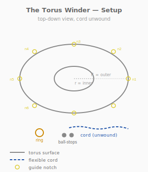
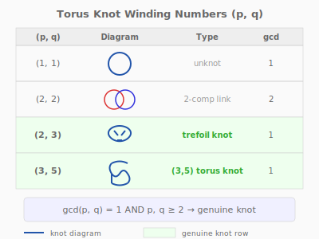
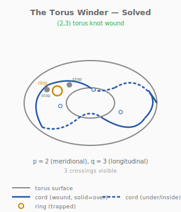

# Puzzle 14: The Torus Winder

**Difficulty:** Advanced
**Type:** Assembly
**Topological Principle:** Torus knots — (p,q) winding numbers

---

## Overview

A large steel torus has guide notches on its surface. A cord with ball-stops must be wound around the torus following a specific path — the (2,3) torus knot — to trap a small sliding ring. Most windings fail to create a knot; only specific winding number pairs produce genuine knots.

## Components

| Part | Material | Dimensions |
|------|----------|-----------|
| Torus | 6mm steel rod | 120mm outer diameter, 15mm tube radius |
| Cord | 4mm paracord | 500mm long |
| Ball-stops (x2) | Wood | 10mm diameter, too large to pass through torus hole |
| Sliding ring | Welded steel O-ring | 25mm OD, 3mm wire |
| Guide notches | Filed into torus surface | 2mm deep, 3mm wide, 6 positions |

The guide notches are filed into the torus surface at the 6 key positions where the (2,3) torus knot path crosses.

## Setup

1. The torus sits on a flat surface
2. The cord is threaded through the sliding ring
3. Ball-stops are fixed on both ends of the cord (too large to pass through the torus center hole)
4. Guide notches mark the correct winding path on the torus surface
5. The cord starts unwound — loosely lying on the torus

## Objective

Wind the cord around the torus so that it follows the (2,3) torus knot path — wrapping 2 times through the torus hole and 3 times around the torus tube. When wound correctly, the sliding ring becomes trapped on the cord.

## The Topology

### What Is a Torus Knot?

A **(p,q) torus knot** is a knot that lies on the surface of a torus, winding p times through the torus hole (the long way around) and q times around the torus tube (the short way around).

Not all (p,q) pairs produce knots:
- **(1,q)** for any q: the curve winds around the tube but never links with the torus hole. Result: **unknot** — not knotted, ring slides free.
- **(2,2)**: the curve closes into two separate loops. Result: **link** (two components), not a knot.
- **(2,3)**: the curve closes as a single strand that crosses itself 3 times. Result: **trefoil knot** — the simplest genuine torus knot.
- **(2,5)**: a more complex torus knot (Solomon's seal knot, 5 crossings).
- **(3,4)**: a torus knot with 8 crossings.

The rule: a (p,q) torus knot is a genuine knot if and only if **gcd(p,q) = 1** and **both p ≥ 2 and q ≥ 2**.

### Why (2,3) Produces a Trefoil

The (2,3) winding wraps through the hole twice and around the tube three times. Because gcd(2,3) = 1, the cord returns to its starting point after a single traversal — forming one closed curve, not multiple loops. The curve crosses itself exactly 3 times, making it a trefoil knot.

The trefoil is **genuinely knotted** — it cannot be deformed into a simple circle without cutting. This is what traps the ring: the cord forms a barrier that the ring cannot pass over.

**Physical Intuition:** What you feel in your hands: when you wind the cord incorrectly — say, (2,2) — the cord makes two separate loops and the ring slides right through the gap between them. When you wind (2,3), the cord locks into itself at the three crossing points. Tugging the ring toward a crossing, you feel it catch — the crossing forms a physical gate that the ring cannot pass. That catching IS the knottedness.

*For a systematic treatment of torus knots and their classification, see [Topology Primer: Torus Knots](../theory/topology-primer.md#torus-knots).*

## Solution

1. Thread one ball-stop through the torus hole to place it on one side
2. Follow the guide notches: pass the cord through the torus hole (1st pass through)
3. Wind around the tube following the notch, then pass through the hole again (2nd pass through)
4. Continue around the tube, completing the 3rd wrap around the tube

5. Verify: the cord crosses itself exactly 3 times
6. Test: try to slide the ring past a crossing — it should be trapped

## Why It's Tricky

The torus surface is curved in two directions simultaneously, making it difficult to track the winding path. Solvers lose count of how many times the cord has passed through the hole vs. around the tube. The (2,3) winding is the simplest non-trivial case, but even it requires careful attention to the guide notches.

**Lesson:** Knots come in parametric families. The winding numbers (p,q) are not arbitrary — they determine whether the cord forms a knot, a link, or an unknot. The numbers matter.

## Common Mistakes

1. **Winding (2,2) instead of (2,3).** The cord makes two separate loops — a link, not a knot. The ring slides between the loops. This is the most common error and the most instructive: the solver sees that one fewer wrap around the tube transforms a knot into a trivially escaped link.

2. **Winding (1,3) or (3,1).** Either produces an unknot — the cord winds but never knots. The ring slides freely despite the apparent complexity of the winding.

3. **Losing track of the winding direction.** The cord must wind consistently (always clockwise or always counterclockwise around the tube). Reversing direction mid-wind creates crossings that cancel rather than reinforce.

4. **Ignoring the guide notches.** The notches exist precisely to mark the (2,3) path. Solvers who try to "eyeball" the winding almost always produce the wrong (p,q) pair.

## Construction Notes

- The torus is made by bending 6mm steel rod around a circular form (tube radius 15mm), then bending the resulting ring into the toroidal shape (major radius 50mm)
- File guide notches at 6 evenly-spaced positions along the (2,3) path: use a triangular file, 2mm deep, 3mm wide
- The ball-stops must be larger than the torus center hole to prevent the cord from pulling through entirely
- The sliding ring must be small enough to fit on the cord but large enough that it cannot pass through the three-crossing gate when the (2,3) winding is complete
- Alternative: 3D print the torus with guide notch channels molded in — see OpenSCAD model
