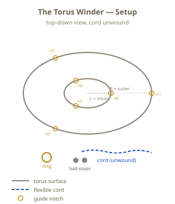
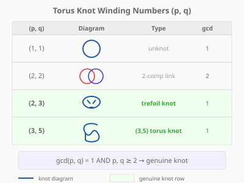
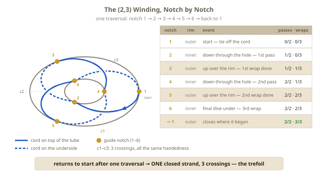
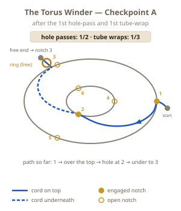
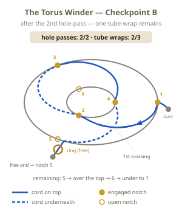
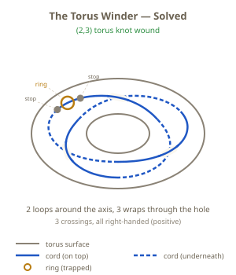

# Puzzle 14: The Torus Winder

**Difficulty:** Advanced
**Type:** Assembly
**Topological Principle:** Torus knots — (p,q) winding numbers

---

## Overview

A large steel torus has guide notches on its surface. A cord with ball-stops must be wound around the torus following a specific path — the (2,3) torus knot — to trap a small sliding ring. Most windings fail to create a knot; only specific winding number pairs produce genuine knots.

## Components

| Part | Material | Dimensions |
|------|----------|-----------|
| Torus | 6mm steel rod | 120mm outer diameter, 15mm tube radius |
| Cord | 4mm paracord | 500mm long |
| Ball-stops (x2) | Wood | 10mm diameter, too large to pass through torus hole |
| Sliding ring | Welded steel O-ring | 25mm OD, 3mm wire |
| Guide notches | Filed into torus surface | 2mm deep, 3mm wide, 6 positions |

The guide notches are filed into the torus surface at the 6 positions where the (2,3) torus knot path crosses a rim: three on the outer rim, where the cord climbs back up over the top of the tube, and three on the inner rim, where it dives down through the hole.

## Setup

1. The torus sits on a flat surface
2. The cord is threaded through the sliding ring
3. Ball-stops are fixed on both ends of the cord (too large to pass through the torus center hole)
4. Guide notches mark the correct winding path on the torus surface
5. The cord starts unwound — loosely lying on the torus

## Objective

Wind the cord around the torus so that it follows the (2,3) torus knot path — circling 2 times around the central axis (the long way around) while wrapping 3 times around the tube (the short way around, dipping through the hole on each wrap). When wound correctly, the sliding ring becomes trapped on the cord.

## The Topology

### What Is a Torus Knot?

A **(p,q) torus knot** is a knot that lies on the surface of a torus, winding p times around the central axis (the long way around) and q times around the torus tube (the short way around — each tube wrap dips through the hole and re-emerges over the outer rim).

Not all (p,q) pairs produce knots:
- **(1,q)** for any q: the cord circles the central axis only once, so however many times it twists around the tube, the whole winding can be untwisted off. Result: **unknot** — not knotted, ring slides free.
- **(2,2)**: the curve closes into two separate loops. Result: **link** (two components), not a knot.
- **(2,3)**: the curve closes as a single strand that crosses itself 3 times. Result: **trefoil knot** — the simplest genuine torus knot.
- **(2,5)**: a more complex torus knot (Solomon's seal knot, 5 crossings).
- **(3,4)**: a torus knot with 8 crossings.

The rule: a (p,q) torus knot is a genuine knot if and only if **gcd(p,q) = 1** and **both p ≥ 2 and q ≥ 2**.

### Why (2,3) Produces a Trefoil

The (2,3) winding circles the central axis twice while wrapping around the tube three times. Because gcd(2,3) = 1, the cord returns to its starting point after a single traversal — forming one closed curve, not multiple loops. The curve crosses itself exactly 3 times, making it a trefoil knot.

The trefoil is **genuinely knotted** — it cannot be deformed into a simple circle without cutting. But "the knot traps the ring" compresses two different claims into one sentence, and the puzzle is easier to trust once they are pulled apart.

**The topological layer.** The ball-stops are too large to pass through the torus hole, so once the winding is complete the cord behaves as a closed curve — its ends cannot retrace the path. That closed curve, following the (2,3) winding, *is* a trefoil. Knottedness means exactly this: no sequence of slides, shifts, or rearrangements of the cord can unwind it without reversing the winding itself. This is the guarantee that no clever shortcut exists — any sequence of moves that freed the ring would amount to unknotting a trefoil, which cannot be done.

**The geometric layer.** What stops the ring at any particular moment is local, not global: at each crossing the ring meets the **crossing clearance** — the gap between the over-strand and the under-strand, set by the notch depth and the cord diameter. The Construction Notes calibrate these two dimensions so that the clearance at every crossing is too small for the ring's wire to slip through. The geometry does not create the trap; it enforces, crossing by crossing, what the topology already guarantees — the hardware is built so that the physical catch faithfully witnesses the topological fact.

**Physical Intuition:** What you feel in your hands: when you wind the cord incorrectly — say, (2,2) — the cord makes two separate loops and the ring slides right through the gap between them. When you wind (2,3), the cord locks into itself at the three crossing points. Tugging the ring toward a crossing, you feel it catch — two strands pinched too closely together for the ring to pass. That catch is geometric. What is topological is the certainty that no amount of cleverness helps: backing up, trying a different crossing, working the ring through at an angle — every route is closed, because escaping would unknot the trefoil. The catch you feel is geometry; the guarantee that no sequence of slides escapes is topology.

### Worked Example: tracing the (2,3) winding

The six guide notches are the rim-transition points of the winding: at each odd-numbered notch (1, 3, 5) the cord crosses the **outer rim** and rides up over the top of the tube; at each even-numbered notch (2, 4, 6) it crosses the **inner rim** and dives down through the hole. Follow the cord once around, notch by notch:

| Notch | Rim | What happens | Hole-passes so far | Tube-wraps so far | Crossing created |
|-------|-----|--------------|--------------------|--------------------|------------------|
| 1 | outer | start — tie off the cord | 0 of 2 | 0 of 3 | — |
| 2 | inner | down through the hole — 1st pass | 1 of 2 | 0 of 3 | — |
| 3 | outer | up over the rim — 1st wrap done | 1 of 2 | 1 of 3 | — |
| 4 | inner | down through the hole — 2nd pass | 2 of 2 | 1 of 3 | — |
| 5 | outer | up over the rim — 2nd wrap done | 2 of 2 | 2 of 3 | c1: the underside run from notch 4 passes beneath the first wrap's top strand |
| 6 | inner | final dive under — 3rd wrap under way | 2 of 2 | 2 of 3 | c2: the top run from notch 5 lies over the first wrap's underside |
| → 1 | outer | closes where it began | 2 of 2 | 3 of 3 | c3: the closing underside run passes beneath the second wrap's top strand |

Two bookkeeping notes keep the counters honest. First, the cord dips at the inner rim three times — once per tube wrap — but only the first two dips are the numbered hole-passes of solution steps 2 and 3; the final dip at notch 6 is counted as part of the third wrap, which closes when the cord arrives back at notch 1. Second, the p = 2 of (2,3) is visible in the figure's left panel: each leg between consecutive notches advances the cord 120° around the central axis, so the six legs make exactly two full circuits.

The traversal ends where it began, and that is the whole argument:

- **One component.** The cord returns to its starting notch after a single traversal — because gcd(2,3) = 1, the path closes into one strand, not separate loops.
- **Exactly 3 crossings.** c1, c2, c3 — all with the same handedness, so none cancel. One closed strand with three same-handed crossings is the trefoil.

*For a systematic treatment of torus knots and their classification, see [Topology Primer: Torus Knots](../theory/topology-primer.md#torus-knots).*

## Solution

1. Thread one ball-stop through the torus hole to place it on one side
2. Follow the guide notches: from notch 1, carry the cord over the top of the tube, pass it down through the hole at notch 2 (1st hole-pass), and bring it back under toward notch 3 — the 1st tube-wrap is done

3. Wind on around the tube: up over the rim at notch 3, over the top, and down through the hole again at notch 4 (2nd hole-pass) — running back under toward notch 5, the cord locks in the first crossing

4. Continue around the tube: up at notch 5, over the top to the final dive at notch 6, and back under to close at notch 1 — the 3rd tube-wrap is complete

5. Verify: the cord crosses itself exactly 3 times
6. Test: try to slide the ring past a crossing — it should be trapped

## Why It's Tricky

The torus surface is curved in two directions simultaneously, making it difficult to track the winding path. Solvers lose count of how many circuits the cord has made around the central axis vs. how many wraps around the tube. The (2,3) winding is the simplest non-trivial case, but even it requires careful attention to the guide notches.

**Lesson:** Knots come in parametric families. The winding numbers (p,q) are not arbitrary — they determine whether the cord forms a knot, a link, or an unknot. The numbers matter.

## Common Mistakes

1. **Winding (2,2) instead of (2,3).** The cord makes two separate loops — a link, not a knot. The ring slides between the loops. This is the most common error and the most instructive: the solver sees that one fewer wrap around the tube transforms a knot into a trivially escaped link.

2. **Winding (1,3) or (3,1).** Either produces an unknot — the cord winds but never knots. The ring slides freely despite the apparent complexity of the winding.

3. **Losing track of the winding direction.** The cord must wind consistently (always clockwise or always counterclockwise around the tube). Reversing direction mid-wind creates crossings that cancel rather than reinforce.

4. **Ignoring the guide notches.** The notches exist precisely to mark the (2,3) path. Solvers who try to "eyeball" the winding almost always produce the wrong (p,q) pair.

## Construction Notes

- The torus is made by bending 6mm steel rod around a circular form (tube radius 15mm), then bending the resulting ring into the toroidal shape (major radius 50mm)
- File guide notches at the 6 rim-transition points of the (2,3) path — three on the outer rim and three on the inner rim, at axis angles 0°, 120°, and 240° on each rim (each over-the-top leg of the cord leaves the outer rim at one notch and dives at the inner rim 120° further around): use a triangular file, 2mm deep, 3mm wide
- The ball-stops must be larger than the torus center hole to prevent the cord from pulling through entirely
- The sliding ring must be small enough to fit on the cord but large enough that it cannot pass the crossing clearance at any of the three crossings: the 2mm notch recesses the under-strand into the surface, so the 4mm cord crossing over it leaves a gap of roughly 2mm — comfortably smaller than the ring's 3mm wire. This calibration is what lets the geometry faithfully witness the topology: the local catch at each crossing enforces the global guarantee that the trefoil cannot be unwound
- Alternative: 3D print the torus with guide notch channels molded in — see OpenSCAD model
