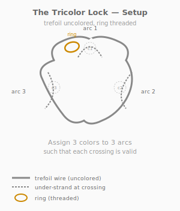
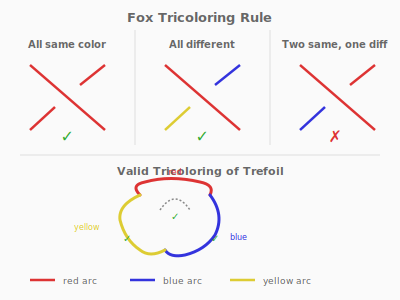
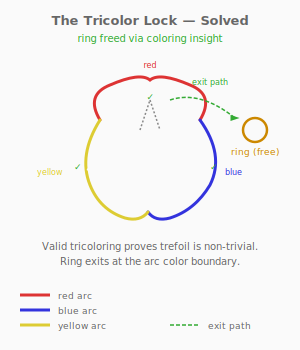

# Puzzle 14: The Tricolor Lock

**Difficulty:** Intermediate
**Type:** Assembly
**Topological Principle:** Fox tricolorability (knot invariant)

---

## Overview

A rigid trefoil wire frame with three arcs separated at crossings sits on a wooden base. Colored sleeves snap onto the arcs. The solver must find the valid Fox 3-coloring — a coloring where at every crossing, the three meeting strands are either all the same color or all different. Valid coloring reveals a passage that frees a trapped ring.

## Components

| Part | Material | Dimensions |
|------|----------|-----------|
| Trefoil frame | 4mm steel rod | ~150mm across, welded closed |
| Base | Hardwood | 150mm x 150mm x 20mm |
| Colored sleeves (x9) | Heat-shrink tubing or printed clips | 3 red, 3 blue, 3 yellow |
| Ring | Welded steel O-ring | 30mm OD, 3mm wire |

At each of the three crossings, the over-strand is raised 10mm above the under-strand, creating a visible gap. The trefoil has 3 arcs (strands between consecutive undercrossings).

## Setup

1. The trefoil wire frame is mounted on the base
2. At each crossing, one strand passes over the other with a 10mm gap
3. The ring is threaded onto the trefoil frame and can slide along the wire
4. The ring cannot be removed while the crossings are in their default configuration
5. Nine colored sleeves are provided (3 of each color)

## Objective

Place one colored sleeve on each of the three arcs of the trefoil, using three colors, such that at every crossing, the Fox 3-coloring rule is satisfied. When the coloring is valid, the ring can be extracted through a specific crossing.

## The Topology

### What Is Fox 3-Coloring?

A **Fox 3-coloring** (or tricoloring) of a knot diagram assigns one of three colors to each arc such that at every crossing, the three arcs that meet are either:
- **All the same color**, OR
- **All different colors**

This is NOT the same as graph coloring. The three "meeting arcs" at a crossing are: the over-strand and the two segments of the under-strand on either side of the crossing.

### Tricolorability as a Knot Invariant

A knot is **tricolorable** if it admits a non-trivial Fox 3-coloring (one that uses more than one color). Tricolorability is a **topological invariant**: it depends on the knot type, not on the particular diagram.

Key facts:
- The **unknot** is NOT tricolorable (any single-arc diagram has only one arc, so only trivial colorings exist)
- The **trefoil** IS tricolorable (3 arcs, 3 colors, all crossings valid)
- The **figure-eight knot** is NOT tricolorable (4 arcs, but no valid non-trivial 3-coloring exists)

Since the unknot is not tricolorable and the trefoil is, tricolorability **distinguishes the trefoil from the unknot**. This proves that the trefoil is genuinely knotted — no deformation can simplify it to the unknot.

### The Physical Mechanism

In this puzzle, the colored sleeves have notched profiles. When the correct Fox coloring is applied, the notches on the three sleeves at the critical crossing align, creating a gap wide enough for the ring to pass through. When an incorrect coloring is applied, the notches misalign, and the ring remains trapped.

**Physical Intuition:** What you feel in your hands: with the wrong coloring, the ring bumps against the sleeves at every crossing — no gap is large enough. With the correct coloring, one crossing opens up: you slide the ring toward it and feel it catch momentarily on the sleeve edges, then pop through. The valid coloring changes the physical geometry at the crossing. The algebraic rule (all same or all different) has become a physical constraint (aligned vs. misaligned notches).

*For a deeper treatment of knot coloring invariants, see [Topology Primer: Knot Coloring and Tricolorability](../theory/topology-primer.md#knot-coloring-and-tricolorability).*

## Solution

1. Identify the three arcs of the trefoil (separated by undercrossings)
2. Assign one color per arc: Red to arc 1, Blue to arc 2, Yellow to arc 3
3. Snap the colored sleeves onto each arc

4. Verify at each crossing: all three colors are different (Red, Blue, Yellow at each)
5. Slide the ring to the crossing where the notches align
6. Pass the ring through the aligned gap

## Why It's Tricky

The puzzle has two layers of difficulty. First, the solver must understand the Fox coloring rule (most people's intuition about "coloring" comes from graph coloring, where adjacent regions must be different — the Fox rule is more specific). Second, the solver must correctly identify the three arcs of the trefoil, which is harder than it sounds because the crossings interrupt visual continuity.

**Lesson:** A purely algebraic property (the coloring rule) has a direct physical consequence (ring freedom). Knot invariants are not just numbers you compute — they tell you something real about the structure.

## Common Mistakes

1. **Applying graph-coloring intuition.** Solvers try to ensure "no two adjacent strands have the same color." This is the wrong rule. Fox coloring allows all-same at a crossing — the rule is "all same OR all different," not "all different."

2. **Misidentifying the arcs.** The trefoil has exactly 3 arcs. An arc starts at one undercrossing and ends at the next. Solvers who count 6 segments (two per crossing) are subdividing arcs incorrectly.

3. **Using only two colors.** A 2-color scheme cannot satisfy the Fox rule at all three crossings of a trefoil. The solver must use all three colors.

4. **Placing multiple sleeves on one arc.** Each arc gets exactly one color. Placing red and blue sleeves on the same arc violates the rule that arcs have a single color.

## Construction Notes

- Bend the trefoil frame from 4mm rod, ensuring 10mm vertical separation at each crossing
- Weld the frame closed and grind the join smooth
- The crossing gaps must be consistent — use a 10mm spacer during welding
- Colored sleeves: cut 30mm sections of colored heat-shrink tubing and file a 2mm notch in each
- The notch positions must be calibrated so that three correctly-colored sleeves at a crossing create a ring-width gap when aligned
- Mount the frame on a short post (15mm) press-fit into the base for stability
- The ring (30mm OD) must fit through the aligned notch gap but not through misaligned configurations
