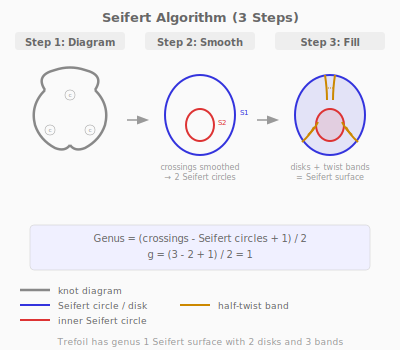
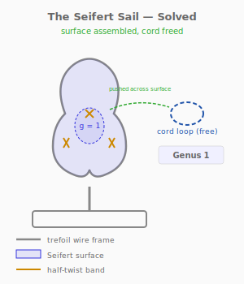

# Puzzle 16: The Seifert Sail

**Difficulty:** Advanced
**Type:** Assembly (surface construction)
**Topological Principle:** Seifert surfaces (surfaces bounded by knots)

---

## Overview

A trefoil wire frame is mounted vertically on a wooden base. A cord loop is threaded through the frame, apparently permanently linked. Three shaped flexible panels must be assembled inside the frame to form a Seifert surface — a continuous orientable surface whose boundary is the trefoil knot. Once the surface is built, the cord can be pushed across it and freed.

## Components

| Part | Material | Dimensions |
|------|----------|-----------|
| Trefoil frame | 4mm steel rod | ~120mm across, mounted vertically |
| Base | Hardwood | 160mm x 80mm x 20mm |
| Mounting post | 6mm steel rod | 40mm tall, welded to frame |
| Panel A | 0.5mm polypropylene sheet | ~40mm x 50mm, shaped edge |
| Panel B | 0.5mm polypropylene sheet | ~40mm x 50mm, shaped edge |
| Panel C | 0.5mm polypropylene sheet | ~40mm x 50mm, shaped edge |
| Cord loop | 5mm braided nylon | 250mm circumference, closed |

Each panel has interlocking tabs and slots on its edges for connecting to adjacent panels.

## Setup

1. The trefoil wire frame stands vertically on the base
2. The cord loop passes through the trefoil in a way that links it with the frame
3. Three shaped panels lie beside the base, unassembled
4. Each panel's edges are contoured to match a region of the trefoil's interior

## Objective

Assemble the three panels inside the trefoil frame to form a continuous surface whose boundary is the knot. Then push the cord loop across this surface to free it from the frame. Nothing is cut.

## The Topology

### Seifert's Theorem

Every knot bounds an orientable surface. This profound result, proved by Herbert Seifert in 1934, means that no matter how complex a knot looks, there exists a surface — an orientable, connected 2-manifold — whose edge (boundary) IS the knot.

For the trefoil, this Seifert surface has **genus 1** (one handle, like a torus with a hole punched in it). The genus of the Seifert surface is itself a knot invariant — different knots bound surfaces of different genera.

### The Seifert Algorithm

The algorithm constructs the surface in three steps:

1. **Resolve each crossing.** At every crossing in the knot diagram, replace the crossing with two parallel arcs (smoothing). This eliminates all crossings.

2. **Identify Seifert circles.** After smoothing, the arcs form a collection of simple closed curves called **Seifert circles**. For the trefoil (3 crossings), the smoothing produces 2 Seifert circles.

3. **Fill and connect.** Fill each Seifert circle with a disk. Then reconnect at each former crossing point with a **half-twist band** — a narrow rectangular strip with a 180-degree twist. The result is a single connected, orientable surface bounded by the original knot.

### Genus Calculation

For the trefoil:
- Crossings: c = 3
- Seifert circles: s = 2
- Genus = (c - s + 1) / 2 = (3 - 2 + 1) / 2 = 1

A genus-1 surface has one handle. The unknot bounds a genus-0 surface (a disk). The figure-eight knot bounds a genus-1 surface. The genus is a knot invariant — it provides a lower bound on the knot's complexity.

**Physical Intuition:** What you feel in your hands: the panels are thin and flexible. As you slide them into position inside the trefoil frame, each panel curves to follow the frame's interior contour. At the crossing points, the tab-and-slot connections force a half-twist — you feel the panel resist slightly as it rotates 180 degrees. When all three panels are connected, you have a continuous sheet spanning the interior of the trefoil. Now push the cord: it slides across the surface, over the half-twist bands, and pops free on the other side. The surface you built IS the topological proof that the cord can escape.

*For the complete treatment of Seifert surfaces and genus, see [Topology Primer: Seifert Surfaces](../theory/topology-primer.md#seifert-surfaces).*

## Solution

1. Identify the three crossing regions of the trefoil frame
2. At each crossing, determine which side is the "over" strand and which is "under"
3. Slide Panel A into the upper region of the trefoil interior (between two crossings)
4. Slide Panel B into the lower-left region
5. Connect Panels A and B at the crossing using the interlocking tab (the connection creates a half-twist)

6. Slide Panel C into the lower-right region and connect to both A and B
7. Verify: the three panels form a continuous surface whose edge follows the trefoil wire
8. Push the cord loop across the surface — it slides over the panels and off the frame

## Why It's Tricky

The trefoil looks like it cannot possibly bound any surface — it is too twisted, too knotted. The solver's intuition says "a surface can't span this shape." But Seifert's theorem guarantees the surface exists, and the Seifert algorithm constructs it explicitly. The trick is that the surface is not flat — it has half-twist bands at the crossings that accommodate the knot's topology.

**Lesson:** Every knot bounds an orientable surface. The Seifert surface is not just a mathematical abstraction — it is a physical object you can build. The genus of this surface measures the knot's complexity in a way that crossing number alone does not.

## Common Mistakes

1. **Trying to span the trefoil with flat panels.** Flat panels cannot fill the trefoil interior — the crossings prevent it. The panels must incorporate half-twists at the crossing connections.

2. **Connecting panels without the half-twist.** If the tabs are connected straight (no twist), the result is a non-orientable surface (like a Mobius band). The Seifert surface must be orientable — the half-twist ensures this.

3. **Trying to free the cord without building the surface.** The cord is genuinely linked with the trefoil frame. Without the Seifert surface to "push across," there is no deformation path to free the cord.

4. **Assembling the panels outside the frame.** The panels must be assembled INSIDE the frame, conforming to its interior. Assembling outside and then trying to insert the result will not work — the completed surface is topologically locked to the frame boundary.

## Construction Notes

- Bend the trefoil frame from 4mm rod with consistent 120mm overall diameter
- Weld to a short mounting post (6mm rod, 40mm tall) for vertical display
- Press-fit the mounting post into a drilled hole in the base
- Cut panels from 0.5mm polypropylene sheet using templates derived from the Seifert algorithm
- Each panel edge has two tabs and two slots — laser-cut or hand-cut with a precision knife
- Tab width: 3mm. Slot width: 3.5mm (0.5mm clearance for easy assembly)
- The half-twist at each connection point should be pre-formed in the tab geometry
- The cord loop circumference (250mm) must be large enough to pass over the assembled surface but short enough to be visibly linked with the frame before assembly
- Mark each panel with a letter (A, B, C) and orientation arrows for assembly guidance
