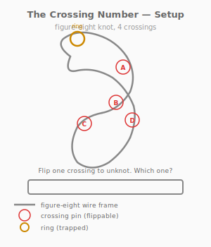
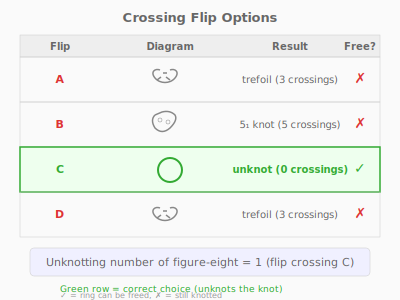
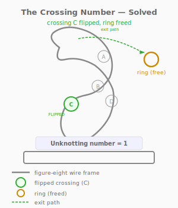

# Puzzle 9: The Crossing Number

**Difficulty:** Beginner-Intermediate
**Type:** Transformation
**Topological Principle:** Unknotting number (crossing changes)

---

## Overview

A figure-eight knot wire frame has 4 crossings, each controlled by a removable steel pin. Flipping a pin swaps which strand goes over and which goes under at that crossing. The figure-eight knot has unknotting number 1 — exactly one crossing flip converts it to the unknot, freeing a trapped ring. But which of the 4 crossings?

## Components

| Part | Material | Dimensions |
|------|----------|-----------|
| Figure-eight frame | 4mm steel rod | ~150mm across |
| Base | Hardwood | 150mm x 150mm x 20mm |
| Crossing pins (x4) | 3mm steel rod | 20mm tall, with 5mm ball caps |
| Pin sockets (x4) | Drilled into frame | 3.5mm diameter, at each crossing |
| Ring | Welded steel O-ring | 25mm OD, 3mm wire |

Each pin sits in a socket at a crossing point. A groove in the pin holds the strands in their current over/under configuration. Removing and reinserting a pin upside-down swaps the crossing.

## Setup

1. The figure-eight knot frame is mounted on the base
2. Four crossing pins (labeled A, B, C, D) maintain the over/under pattern
3. The ring is threaded onto the frame and can slide along the wire
4. The ring cannot be removed while the frame forms a genuine figure-eight knot

## Objective

Flip exactly one crossing pin to convert the figure-eight knot to the unknot, thereby freeing the ring. Identify which crossing to flip.

## The Topology

### The Figure-Eight Knot

The figure-eight knot (also called the Listing knot or knot 4_1) is the second-simplest non-trivial knot, with exactly 4 crossings in its minimal diagram. Unlike the trefoil, the figure-eight is **amphichiral** — it is equivalent to its mirror image. This makes it the simplest amphichiral knot.

### What Is Unknotting Number?

The **unknotting number** u(K) of a knot K is the minimum number of crossing changes needed to convert K into the unknot. A crossing change swaps which strand goes over and which goes under at a single crossing.

Key values:
- **Unknot**: u = 0 (it's already unknotted)
- **Trefoil**: u = 1
- **Figure-eight**: u = 1
- **5_1 knot** (cinquefoil): u = 2
- **Granny knot**: u = 1

The figure-eight's unknotting number of 1 means that a single crossing flip can convert it to the unknot — but only at the RIGHT crossing.

### Not All Crossings Are Equal

Flipping different crossings produces different knots:
- **Flip A**: produces a trefoil (still knotted, u = 1)
- **Flip B**: produces a 5_1 knot (more complex, u = 2)
- **Flip C**: produces the unknot (ring goes free!)
- **Flip D**: produces a trefoil (still knotted, u = 1)

Only crossing C works. The other three flips change the knot type but do not simplify it to the unknot. Some even make it more complex.

**Physical Intuition:** What you feel in your hands: pull a pin out, flip it, push it back in. The strands at that crossing swap — the strand that was on top is now on the bottom. Try sliding the ring: if it still catches at every turn, you flipped the wrong crossing. Put the pin back and try the next one. When you flip crossing C, the ring slides freely along the entire wire with no catch points. The absence of catch points IS the unknot — the wire no longer forms any barriers.

*For the complete treatment of unknotting number and crossing changes, see [Topology Primer: Unknotting Number](../theory/topology-primer.md#unknotting-number).*

## Solution

1. Start by examining the 4 crossing pins (A, B, C, D)
2. Try flipping crossing A: remove pin, reinsert upside-down, test ring → still caught (trefoil)
3. Restore crossing A. Try crossing C: remove pin, reinsert upside-down, test ring → ring slides free!

4. The figure-eight is now the unknot. Slide the ring off.

At most 4 attempts are needed (fewer if the solver reasons about which crossings are load-bearing).

## Why It's Tricky

The puzzle exploits a natural assumption: "all crossings are equivalent, so any one should work." In fact, each crossing has a different structural role in the knot. Flipping the wrong crossing changes the knot type — sometimes making it simpler, sometimes more complex — but only one specific crossing leads to the unknot.

**Lesson:** Unknotting number measures a knot's intrinsic distance from the unknot. This distance is well-defined (it is a topological invariant), but the *path* to the unknot — which crossing to change — is not obvious from the diagram alone. The puzzle introduces the concept of crossing changes as a fundamental operation in knot theory.

## Common Mistakes

1. **Flipping multiple crossings simultaneously.** The unknotting number is 1, so only one flip is needed. Flipping two crossings typically produces a new knot rather than the unknot.

2. **Forgetting to test after each flip.** Solvers who flip a pin and then immediately move to the next without testing miss the solution when they correctly flip C.

3. **Assuming the puzzle is solved because the knot "looks simpler."** Flipping A or D produces a trefoil, which has fewer crossings than the figure-eight but is still knotted. Visual simplification is not the same as unknotting.

4. **Not restoring incorrect flips before trying the next.** The puzzle assumes only one crossing is flipped at a time. If the solver leaves A flipped while flipping C, the result is a different knot entirely.

## Construction Notes

- Bend the figure-eight frame from 4mm rod, ensuring crossings are clearly separated
- At each crossing, one strand must pass 10mm above the other
- Drill 3.5mm sockets at each of the 4 crossing points
- Machine pins from 3mm rod: 20mm tall, with a 2mm groove at the midpoint that holds the strands
- Ball caps (5mm) welded to pin tops for grip
- The pin-and-groove mechanism must hold the strands firmly in the current over/under configuration
- When flipped, the groove engages the strands in the reversed configuration
- Mount the frame on a short post press-fit into the base
- The ring (25mm OD) should slide freely along the wire when the knot is the unknot
