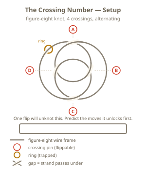
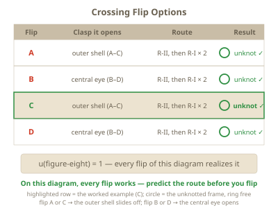
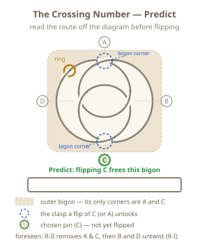
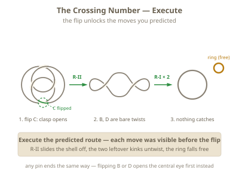
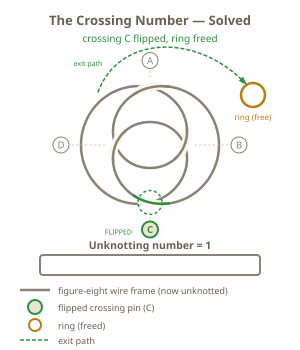

# Puzzle 9: The Crossing Number

**Difficulty:** Beginner-Intermediate
**Type:** Transformation
**Topological Principle:** Unknotting number (crossing changes)

---

## Overview

A figure-eight knot wire frame has 4 crossings, each controlled by a removable steel pin. Flipping a pin swaps which strand goes over and which goes under at that crossing. The figure-eight knot has unknotting number 1 — a single crossing flip converts it to the unknot and frees the trapped ring. And on this diagram the situation is friendlier than the definition promises: **every one of the four flips works.** The puzzle is not a hunt for a magic crossing. It is a test of foresight: study the diagram, predict exactly which simplifying moves a flip will unlock, then flip and watch the frame dissolve on schedule.

## Components

| Part | Material | Dimensions |
|------|----------|-----------|
| Figure-eight frame | 4mm steel rod | ~150mm across |
| Base | Hardwood | 150mm x 150mm x 20mm |
| Crossing pins (x4) | 3mm steel rod | 20mm tall, with 5mm ball caps |
| Pin sockets (x4) | Drilled into frame | 3.5mm diameter, at each crossing |
| Ring | Welded steel O-ring | 25mm OD, 3mm wire |

Each pin sits in a socket at a crossing point. A groove in the pin holds the strands in their current over/under configuration. Removing and reinserting a pin upside-down swaps the crossing.

## Setup

1. The figure-eight knot frame is mounted on the base
2. Four crossing pins (labeled A, B, C, D) maintain the over/under pattern
3. The ring is threaded onto the frame and can slide along the wire
4. The ring cannot be removed while the frame forms a genuine figure-eight knot

## Objective

Choose a crossing pin and, **before touching it**, predict the sequence of Reidemeister moves its flip will unlock. Then flip the pin and execute the simplification — trace the moves until the frame is an unknotted loop and the ring slides free. Flip first and you learn nothing: the puzzle is solved in your head before your hands move.

## The Topology

### The Figure-Eight Knot

The figure-eight knot (also called the Listing knot or knot 4_1) is the second-simplest non-trivial knot, with exactly 4 crossings in its minimal diagram. Unlike the trefoil, the figure-eight is **amphichiral** — it is equivalent to its mirror image. This makes it the simplest amphichiral knot.

### What Is Unknotting Number?

The **unknotting number** u(K) of a knot K is the minimum number of crossing changes needed to convert K into the unknot. A crossing change swaps which strand goes over and which goes under at a single crossing.

Key values:
- **Unknot**: u = 0 (it's already unknotted)
- **Trefoil**: u = 1
- **Figure-eight**: u = 1
- **5_1 knot** (cinquefoil): u = 2
- **Granny knot** (trefoil # trefoil): u = 2

The figure-eight's unknotting number of 1 means that *some* single crossing change, in *some* diagram, converts it to the unknot. On the minimal 4-crossing diagram this puzzle is built from, the promise is over-delivered: every single flip works.

### Every Flip Works on This Diagram

All four flips produce the unknot — what differs is the *route* the simplification takes:

| Flip | Clasp it opens | Route to the unknot | Result |
|------|----------------|---------------------|--------|
| **A** | outer shell (corners A, C) | R-II across the outer bigon, then two R-I untwists | unknot — ring free |
| **B** | central eye (corners B, D) | R-II across the central bigon, then two R-I untwists | unknot — ring free |
| **C** | outer shell (corners A, C) | R-II across the outer bigon, then two R-I untwists | unknot — ring free |
| **D** | central eye (corners B, D) | R-II across the central bigon, then two R-I untwists | unknot — ring free |

The skill being tested is not choosing correctly — any choice is correct here — but *seeing the dissolution before touching the cord*: naming the clasp your flip opens and the moves that follow.

### Why any crossing works here

The minimal figure-eight diagram is built from **two clasps**. Look at its faces: exactly two of them are bigons (two-sided regions). The *outer shell* is a bigon whose corners are crossings A and C — the two outermost arcs of the diagram cross each other there and nowhere else. The *central eye* is a bigon whose corners are B and D. Every crossing is a corner of exactly one bigon, so every crossing belongs to one clasp.

In the alternating diagram each clasp is locked: each of its two arcs goes over at one corner and under at the other, so neither arc can slide past the other. Flip either corner and the lock opens — one arc of that bigon is now *over at both corners* and the other *under at both*. That is precisely the configuration a Reidemeister II move removes: the over-arc slides off, and both crossings of the clasp vanish at once. The two surviving crossings, orphaned by the disappearance of their neighbors, degenerate into bare kinks — each undone by a Reidemeister I untwist. Four crossings, two clasps, every crossing a corner of one: **every flip unknots the frame.**

### When the choice matters

The definition of u(K) minimizes over *all diagrams* of K and all choices of crossings — and that quantifier is where the difficulty of unknotting number lives:

- **This diagram's generosity is a fact about this diagram, not a law.** On the cinquefoil (5_1, u = 2), no single flip of any diagram produces the unknot at all. On larger knots, different crossings of the same diagram genuinely lead to different knots, and choosing badly leaves you knotted.
- **No flip here — or anywhere — turns the figure-eight into a trefoil.** On this diagram all four flips land on the unknot, and a 2012 theorem of Kawauchi shows that is no accident of the picture: no single crossing change in *any* diagram of the figure-eight yields a trefoil. The Gordian distance between the two knots is 2. Like unknotting number itself, distance between knots is a question about the knots, not about the diagram in front of you.
- **A knot where the choice genuinely decides the destination: 5_2.** Its minimal diagram is a clasp plus a three-crossing twist region. Flip either clasp crossing and an R-II dissolves everything — the unknot. Flip a crossing in the twist region instead and two twists cancel, leaving a trefoil. Same diagram, different pins, different knots — the decisive-crossing hunt this puzzle spares you is waiting one knot up the table.

That is exactly why unknotting number is hard to compute: the optimal crossing change may not be visible in the diagram in front of you, and no simple algorithm tells you which diagram to look at.

**Physical Intuition:** What you feel in your hands: pull a pin out, flip it, push it back in. The steel never moves, yet the knot type changes instantly — the strand that was on top is now on the bottom. Slide the ring: where it used to jam against the opened clasp's crossings, it now finds slack, because the over-arc of that bigon no longer bars the way. The ring glides past every former catch point and off the end of nothing at all. The absence of catch points IS the unknot — and if you predicted the route, you knew exactly where the slack would appear before you felt it.

*For the complete treatment of unknotting number and crossing changes, see [Topology Primer: Unknotting Number](../theory/topology-primer.md#unknotting-number).*

## Solution

The worked line below uses crossing C; the same method works from any pin.

1. **Examine.** Find the diagram's two bigons: the outer shell (corners A and C) and the central eye (corners B and D). Note which clasp your chosen crossing belongs to — C is a corner of the outer shell.
2. **Predict.** Flipping C puts the right-hand shell arc on top at *both* of its corners. Foresee the moves: an R-II slides the shell arcs apart (crossings A and C vanish), leaving B and D as bare single twists; two R-I untwists dissolve those, leaving a plain loop.

3. **Flip.** Remove pin C, invert it, reinsert. The frame is now — topologically, before anything visibly moves — the unknot.
4. **Execute.** Trace your predicted moves with the ring: slide it along the wire and it glides past both shell crossings (the R-II you foresaw), then past the two leftover twists (the R-I kinks). No catch points remain.

5. **Free the ring.** Slide it off the frame.

6. Restore pin C and repeat from another pin if you like: A opens the same outer shell; B or D opens the central eye instead. Every route ends at the unknot — predicting *which* route is the whole game.

If your prediction was right, the dissolution feels anticlimactic. That is the point.

## Why It's Tricky

The trap is behavioral, not structural. The puzzle *looks* like a search — four pins, one ring, surely one right answer — and that framing sends solvers into flip-and-test loops. But on this diagram every answer is "correct," so random flipping succeeds immediately and teaches nothing: the frame dissolves and the solver cannot say why.

The real challenge is to earn the flip: to look at a locked clasp and see, in advance, the R-II that isn't there yet. Solvers who do this discover something the flip-and-test solver never notices — that the four crossings pair into two clasps, and that a crossing change is not magic but simply the key that turns one clasp's lock.

**Lesson:** Unknotting number measures a knot's intrinsic distance from the unknot, minimized over *all* diagrams. This diagram makes u(4_1) = 1 visible four ways at once — and what it *cannot* show is just as instructive: no flip here produces a trefoil, and by a 2012 theorem of Kawauchi no flip in any other figure-eight diagram does either — the Gordian distance from figure-eight to trefoil is 2. Distances measured in crossing changes are invariants of the knots themselves, settled by no single picture of them. That is what makes crossing changes a fundamental — and genuinely difficult — operation in knot theory.

## Common Mistakes

1. **Flipping before predicting.** The flip will succeed — every flip here does — but you learn nothing. Restore the pin, and this time say out loud which bigon opens and which moves follow before you touch it.

2. **Predicting the wrong bigon.** Each pin opens only its own clasp: flipping C opens the outer shell (A–C), not the central eye (B–D). If you foresee the wrong bigon, the moves you expect won't appear — the slack shows up at the other pair of crossings.

3. **Assuming this diagram's generosity generalizes.** "Any crossing works" is a fact about the minimal figure-eight diagram, not about knots. On the cinquefoil no single flip works at all (u = 2), and on larger diagrams different flips lead to genuinely different knots.

4. **Confusing the wire's shape with the knot type.** After the flip the frame still *looks* like a figure-eight — the steel hasn't moved. The knot type changed, not the geometry: the Reidemeister moves happen in your model (and in the ring's newfound freedom), not in the rod. Trust the ring, not your eyes.

## Construction Notes

- Bend the figure-eight frame from 4mm rod, ensuring crossings are clearly separated
- At each crossing, one strand must pass 10mm above the other
- Drill 3.5mm sockets at each of the 4 crossing points
- Machine pins from 3mm rod: 20mm tall, with a 2mm groove at the midpoint that holds the strands
- Ball caps (5mm) welded to pin tops for grip
- The pin-and-groove mechanism must hold the strands firmly in the current over/under configuration
- When flipped, the groove engages the strands in the reversed configuration
- Mount the frame on a short post press-fit into the base
- The ring (25mm OD) should slide freely along the wire when the knot is the unknot
