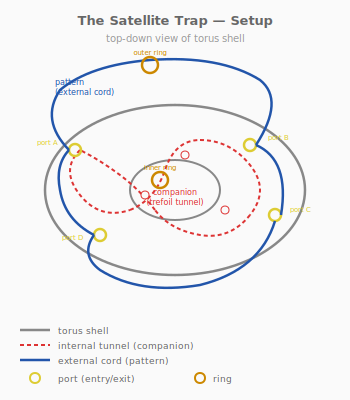
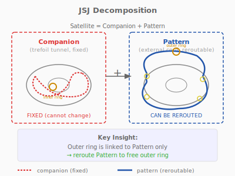
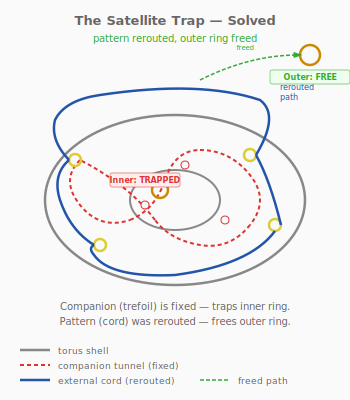

# Puzzle 17: The Satellite Trap

**Difficulty:** Expert
**Type:** Extraction
**Topological Principle:** Satellite knots (JSJ decomposition)

---

## Overview

A translucent torus shell hides a trefoil-knotted internal tunnel. A cord threads through this tunnel with ball-stops at each end. Two rings are part of the assembly — an inner ring on the cord (trapped forever by the companion knot) and an outer ring linked only to the cord's external path. The solver must decompose the two-level satellite structure and free the outer ring without disturbing the inner.

## Components

| Part | Material | Dimensions |
|------|----------|-----------|
| Torus shell | Semi-transparent resin or acrylic (2 halves, clip-together) | 120mm OD, 20mm tube diameter |
| Internal tunnel | Molded channel in shell wall | 6mm diameter, trefoil (2,3) torus knot path |
| Cord | 4mm paracord | 800mm long |
| Ball-stops (x2) | Wood | 10mm diameter |
| Inner ring | Welded steel O-ring | 22mm OD, 3mm wire |
| Outer ring | Welded steel O-ring | 30mm OD, 4mm wire |
| Surface ports (x4) | Open channels in shell surface | 6mm wide, cord access points |

The torus shell is made from two half-shells that clip together. The internal tunnel follows a (2,3) torus knot path through the tube wall. Four ports on the surface allow the cord to exit and re-enter the torus.

## Setup

1. The cord enters the torus at port 1 and follows the trefoil tunnel inside
2. The cord exits at port 2, loops outside where the outer ring sits
3. The cord re-enters at port 3, continues through the tunnel
4. The cord exits at port 4, with the inner ring on this external section
5. Ball-stops on both cord ends prevent full extraction

### Cord path summary
- **Internal (companion):** Through trefoil tunnel inside the torus shell
- **External (pattern):** Two arcs on the torus surface connecting ports, with rings

## Objective

Free the outer ring (30mm) from the assembly. The inner ring (22mm) must remain trapped. Nothing is cut or broken.

## The Topology

### What Is a Satellite Knot?

A **satellite knot** is a knot that contains a non-trivial knot (the **companion**) within a torus neighborhood, combined with a specific winding pattern (the **pattern**) on the torus boundary. The satellite knot is more complex than either the companion or pattern alone.

In this puzzle:
- **Companion:** The trefoil knot formed by the internal tunnel (fixed, embedded in the shell)
- **Pattern:** The way the cord connects outside the torus (the external arcs through the ports)

The satellite structure has a critical property: **the two layers are independent.** The companion can be analyzed separately from the pattern, and vice versa.

### JSJ Decomposition

The **Jaco-Shalen-Johannson (JSJ) decomposition theorem** states that every compact, orientable, irreducible 3-manifold can be uniquely decomposed along incompressible tori into pieces that are either Seifert-fibered or hyperbolic. For knot complements, this means satellite knots decompose uniquely into companion and pattern components.

This decomposition is the key to solving the puzzle:
- The **outer ring** is linked only with the pattern (the external cord arcs). Changing the pattern can free it.
- The **inner ring** is linked with the companion (the trefoil tunnel). The companion cannot be changed — it is molded into the shell.

### Why the Outer Ring Can Be Freed

The external cord path (the pattern) can be rerouted at the surface ports. By pulling a bight of cord through a port and rerouting it around the outer ring, the pattern changes from "linked with the ring" to "unlinked." This rerouting changes ONLY the pattern — the companion (internal tunnel) is unaffected.

The inner ring, by contrast, is on a section of cord that passes through the trefoil tunnel. Its topological relationship is with the companion knot, which is physically embedded in the shell and cannot be changed by cord manipulation at the surface. The inner ring is trapped permanently.

**Physical Intuition:** What you feel in your hands: the torus is smooth and heavy. The cord emerges from ports and dives back in, and you can trace its path by feel. The outer ring is on an external arc — push a finger under the cord near a port and you can feel the cord slide through the port channel. Pull a bight of cord through the port, reroute it around the ring, and feed it back in. The outer ring falls free. Now try the same with the inner ring — the cord goes into the tunnel and you cannot reach it. No amount of manipulation at the surface changes what happens inside. That impenetrability IS the companion knot — the topology you cannot touch.

*For the complete treatment of satellite knots and decomposition, see [Topology Primer: Satellite Knots and JSJ Decomposition](../theory/topology-primer.md#satellite-knots-and-jss-decomposition).*

## Solution

1. **Trace the cord path.** Identify which sections are internal (in the tunnel) and which are external (between ports).
2. **Identify the outer ring's cord section.** It is on the external arc between ports 2 and 3.
3. **Pull a bight** of cord through port 2 by working slack from the external section.
4. **Reroute the bight** around the outer ring — pass the bight over the ring to change the linking.
5. **Feed the bight back** through port 3.
6. **The outer ring is now unlinked** with the cord. Slide it off.

7. **Verify:** the inner ring remains trapped — it is on cord passing through the trefoil tunnel.

This takes approximately 8-12 manipulations, each requiring careful slack management at the ports.

## Why It's Tricky

The puzzle has two layers of knotting that solvers must distinguish. Most solvers initially treat the entire assembly as a single knot and attempt to free both rings simultaneously. The realization that the two rings have fundamentally different topological relationships — one with the pattern (changeable), one with the companion (fixed) — is the breakthrough.

**Lesson:** Complex topological structures can be decomposed into independent layers. Solving the whole puzzle at once is impossible, but solving each layer independently is straightforward. The JSJ decomposition is not just a classification theorem — it is a practical problem-solving strategy.

## Common Mistakes

1. **Trying to free the inner ring.** The inner ring is on cord that passes through the trefoil tunnel. No manipulation at the surface ports can change this. Solvers who spend time on the inner ring are working on an impossible sub-problem.

2. **Pulling cord through the wrong port.** The ports are close together and the cord path is complex. Pulling a bight through the wrong port changes the pattern in a way that links the outer ring MORE rather than less.

3. **Not tracing the full cord path before starting.** The cord enters and exits the torus four times. Without a complete map of the path, manipulations are blind and typically make things worse.

4. **Assuming both rings are trapped by the same mechanism.** The outer ring is a pattern problem; the inner ring is a companion problem. They require entirely different analyses, and only one has a solution.

## Construction Notes

### Torus shell fabrication

- 3D print two half-shells in semi-transparent PETG or resin
- The internal tunnel follows a (2,3) torus knot path through the tube wall, offset from the center by half the minor radius
- Tunnel diameter: 6mm (allows 4mm cord to slide freely)
- Four surface ports: 6mm-wide channels connecting the tunnel to the exterior surface
- The two halves join with snap-fit clips (3 clips per half, 120 degrees apart)
- Alignment pins ensure the internal tunnel aligns correctly between halves

### Cord and rings

- Thread cord through the tunnel before assembling the shell halves
- The inner ring (22mm OD) goes on the cord between ports 3 and 4 (internal section)
- The outer ring (30mm OD) goes on the cord between ports 2 and 3 (external section)
- Ball-stops: drill 4mm hole through 10mm wooden balls, thread cord, tie stopper knots
- Ball-stops must be larger than the port channels (10mm > 6mm — satisfied)

### Included materials

- A **cord path diagram** card showing the tunnel layout and port positions (cutaway view)
- A **hint card** (sealed envelope) stating: "The two rings are trapped by different mechanisms. Which ring is linked to the pattern? Which to the companion?"
