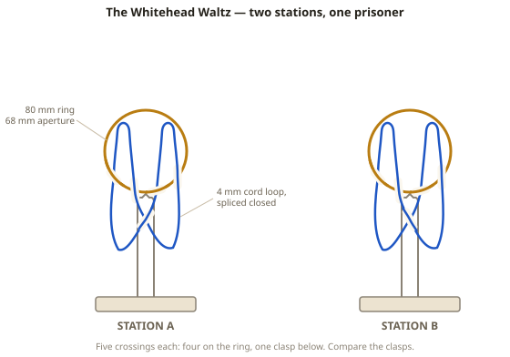
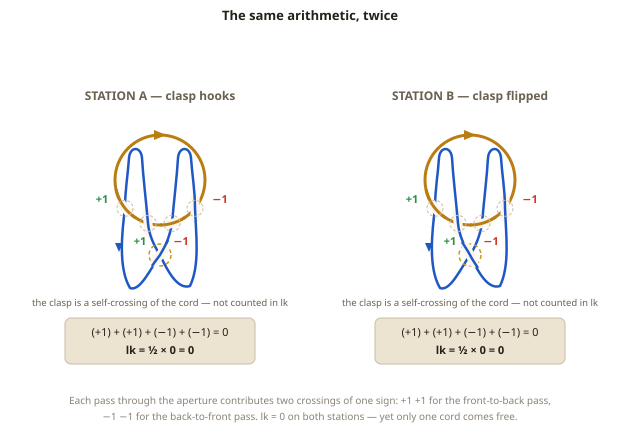
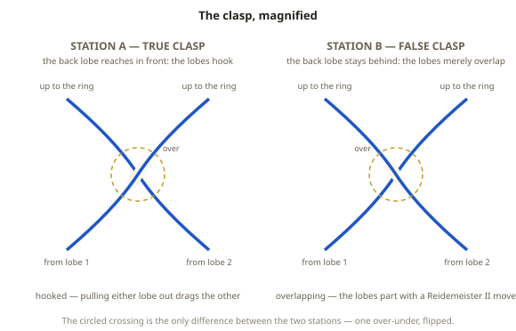
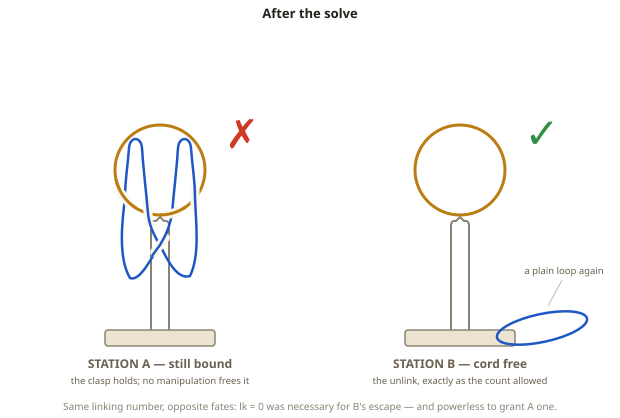

# Puzzle 18: The Whitehead Waltz

**Difficulty:** Advanced
**Type:** Identification / Disentanglement
**Topological Principle:** Whitehead link — linking number zero without splittability

---

## Overview

Two stations stand side by side, and they appear to be the same puzzle twice. Each is a rigid ring resting upright in a printed stand, with a closed cord loop woven through the ring twice — once from each side — its two hanging lobes meeting in a small clasp below. Compute the linking number: both stations give exactly zero, the number that meant "free" in Puzzle 3. Yet only one cord can be removed; the other is a genuine Whitehead link, and no manipulation will ever free it. Determine which is which — and prove it by freeing the free one.

## Components

| Component | Specification | Purpose |
|-----------|---------------|---------|
| Rings (x2) | Welded steel O-ring, 80mm OD, 6mm wire (68mm aperture) | The rigid component each cord is woven through |
| Cord loops (x2) | 4mm braided nylon, spliced closed, ~450mm circumference | The flexible component; one is trapped, one is not |
| Stands (x2) | 3D-printed PETG, saddle-top pedestal on a base | Holds each ring upright, open air below the aperture |
| Crossing-pattern card | Both weaves printed strand by strand | Reset reference — re-tangling from memory changes the puzzle |
| Station marks | "A" and "B" engraved on the bases | Lets solvers commit to an answer before touching anything |

## Setup

1. Seat each ring upright in its stand's saddle, aperture facing the solver.
2. Weave each cord loop through its ring twice: one pass through the aperture front to back, the other back to front. Each pass crosses the ring wire twice in the flat view: **four ring-cord crossings** per station.
3. Let the loop's two lobes hang below the ring and bring them together in a **single self-crossing** — the clasp — centered under the aperture. Five crossings per station in all.
4. On **Station A**, set the clasp so the lobes hook: the lobe hanging behind the ring's plane reaches *in front of* the other lobe at the clasp. This is the Whitehead link.
5. On **Station B**, set the same weave with that one clasp crossing **flipped**: the back lobe stays behind everywhere, so the lobes merely overlap. This is the decoy.
6. Side by side, the stations are indistinguishable at arm's length.

## Objective

Determine which station's cord can be freed from its ring, then free it — nothing cut, unspliced, or forced. The other cord must be recognized for what it is: permanently inseparable.

## The Topology

The **Whitehead link** is two closed curves — here, the ring and the cord — with linking number zero that nevertheless cannot be pulled apart. It is the standard counterexample to the most tempting inference in this series: *lk = 0, therefore separable.*

### The count that lies

Orient the ring and the cord, then sign each ring-cord crossing exactly as in Puzzle 3:

The front-to-back pass contributes two positive crossings; the back-to-front pass contributes two negative ones:

**Sum of signs** = (+1) + (+1) + (−1) + (−1) = **0**, so **lk = ½ × 0 = 0**.

(The ½ appears because, between two closed loops, every threading shows up as *two* crossings — Puzzle 3's open crossbar let us count piercings directly.) Equivalently: span a disk across the aperture; one pass pierces it toward you (+1), the other away (−1) — net zero. The clasp is a self-crossing of the cord alone and never enters the linking number. Both stations give this identical arithmetic; on Station B it tells the truth, on Station A it does not.

### What the count cannot see

Linking number is a *first-order* count: how many net times does one curve pass through the other? It is blind to *how* the two passes relate to each other — and that is where Station A hides its trap. The +1 and −1 passes would happily cancel — pull one back through the aperture, then the other — but the clasp ties the cord's two lobes together, and each lobe can only retract by first passing through the other. The cancellation exists on paper and cannot be executed in space. **The clasp remembers what the count forgets.**

Certifying this honestly takes machinery beyond this series — the link's Alexander polynomial, or Milnor's *higher-order* linking invariants, the family that also certifies Puzzle 5's Borromean rings (pairwise lk = 0, yet inseparable as a trio; the Whitehead link is the two-component distillation of that warning). We cite those invariants as a certificate, not a proof. What matters is that the conclusion is a theorem, not a difficulty rating: **Station A's cord cannot be freed by any manipulation whatsoever.** And one more theorem: the Whitehead link has **unlinking number 1** — flip one well-chosen crossing, the clasp, and it becomes the unlink. Station B *is* that crossing change, built in cord.

The arc's lesson, stated plainly: **lk = 0 is necessary for separability, never sufficient.** Puzzle 3 taught you the tool; this puzzle shows you its limit. A zero means the door isn't provably locked. It does not mean the door opens.

**Physical Intuition:** What you feel in your hands: on Station B, fold a bight of the lobe that lies *underneath* at the clasp and push it up through the aperture — it rises without resistance, the clasp goes slack, and the loop suddenly has nothing holding it. On Station A the identical motion loads up at once: the bight drags the other lobe with it, and the clasp cinches down against the ring wire. You can feel the hook — a distinct catch. You can slide the clasp anywhere along the cord, but it is always *somewhere*, and it always arrives at the aperture exactly when the cord tries to leave.

*For the complete treatment of the Whitehead link and higher-order linking invariants, see [Topology Primer: The Whitehead Link and Higher-Order Linking](../theory/topology-primer.md#the-whitehead-link-and-higher-order-linking).*

## Solution

1. **Compute the linking number on both stations.** Orient, sign the four ring-cord crossings, sum, halve. Both give lk = 0 — the real point of the step: the answer is not in these four crossings.

2. **Inspect the clasps.** Sight each station from the front at ring height and ask one question: does the lobe hanging *behind* the ring's plane cross *in front of* the other at the clasp (a hook), or stay behind (an overlap)? Hooked = Station A, trapped. Overlapping = Station B, free.

3. **Turn Station B so the clasp faces you** and grip the lobe that lies underneath at the clasp — the back lobe — at its lowest point.

4. **Fold that lobe into a bight and push it up through the aperture, toward yourself.** Clearance is not the fight: with both woven passes resident, the bight adds two thicknesses — four strands of 4mm cord using about 16mm of the 68mm opening. (That generosity is geometry, not topology — a tighter ring would make this move annoying, not impossible.)

5. **Watch the clasp dissolve.** As the bight comes through, the lobes' overlap peels apart — a Reidemeister II move: two crossings vanish as a pair. The loop now threads the ring in two plain passes with no self-crossing.

6. **Retract each pass in turn.** Pull the front-to-back pass out of the aperture (its two crossings cancel — another Reidemeister II), then the back-to-front pass. The cord slides free: a plain, unknotted loop in your hand.

7. **Now attempt step 4 on Station A.** The bight rises, hooks the other lobe, and jams the clasp against the ring wire. That catch is the higher-order linking the arithmetic couldn't see. Stop there: it is not a harder version of the same move; it is a move that does not exist.

Identification takes as long as the inspection is careful; the extraction itself is under a minute.

## Why It's Tricky

**Both stations compute identical on every count the solver knows.** Same components, same five crossings, same four signs, same lk = 0, same silhouette. The distinguishing information lives in a single over-under at a single crossing, and no arithmetic on the other four will reveal it.

**Puzzle 3 works against you.** There, lk = 0 was the whole story: the count said free, and the cord came free. The reflex "zero means out" is exactly the trap. Station A is the counterexample given mass and texture.

**The clasp doesn't look load-bearing.** Four crossings sit dramatically on the ring; the decisive one hides below, between the cord and itself — the one crossing the formula ignores.

**Lesson:** an invariant computing to the "free" value proves nothing by itself. Zero is where the analysis starts, not where it ends.

## Common Mistakes

1. **Trusting lk = 0 to mean separable.** It is a one-way test: nonzero proves you're stuck; zero proves nothing. Solvers who compute zero on both stations and conclude "both come free" spend a long time on Station A.

2. **Attacking the ring-cord crossings instead of the clasp.** Rearranging the passes through the aperture shuffles crossings without changing either link. The four signed crossings are where the *computation* happens; the clasp is where the *topology* happens.

3. **Brute-forcing Station A.** The trapped cord has 450mm of slack, so it always *feels* one clever move from freedom. It is not. Force proves only that the solver hasn't accepted the theorem.

4. **Re-tangling without the pattern card.** From memory it is easy to build two decoys, two Whiteheads, or (by botching a pass) a ±1-linked cord trapped for a duller reason. Rebuild from the card, then verify the four signs and the clasp before presenting.

## Construction Notes

- **Weave first, splice second.** Thread the cord through the ring along the card's path with both ends free, form the clasp, *then* splice the loop closed. Bury the splice in a lobe, away from the clasp.
- **The crossing-pattern card is essential equipment, not packaging.** One flipped crossing is the difference between the two stations — and between this puzzle and no puzzle. Print both weaves at full scale with the clasp crossing circled.
- **The ring must be rigid.** A flexible or split ring changes the problem: the trap assumes the ring stays a fixed closed curve. Welded steel at 6mm wire, no seams the cord could catch.
- **Match the stations obsessively.** Same cord color and length, same stand print, same lobe droop — a scuffed cord on the demonstration station leaks the answer.
- **Stand geometry:** a shallow V-notch saddle with a 6.4mm groove grips the lower 15–20mm of the ring without clamping it, leaving the aperture and ~120mm of air below clear for the clasp and the bight move.
- **Sizing arithmetic:** at 68mm aperture and 4mm cord, the working move uses under a quarter of the opening; below roughly 10 cord diameters, identification turns into fiddling. Scale ring and cord together.
