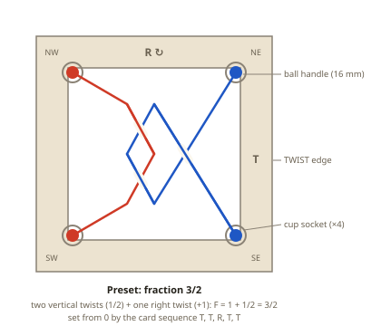
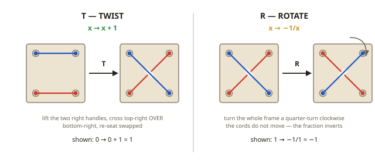
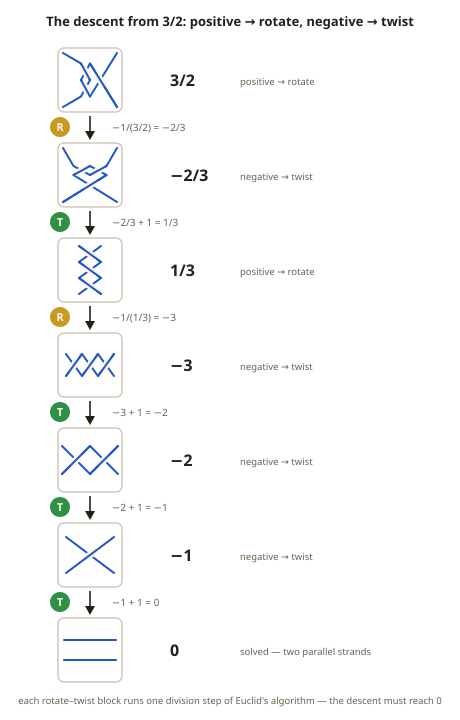
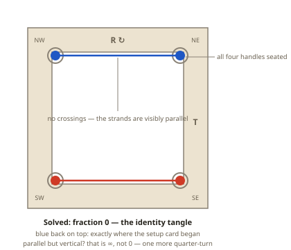

# Puzzle 19: The Tangle Dance

**Difficulty:** Intermediate-Advanced
**Type:** Sequential transformation
**Topological Principle:** Conway rational tangles — the fraction is a complete invariant

---

## Overview

Two cords span a square frame, and you are allowed exactly two moves: twist the right-hand ends, or rotate the whole frame a quarter-turn. Every state the puzzle can reach is described completely by a single fraction, and the two moves act on it as arithmetic — one adds 1, the other flips it to its negative reciprocal. Solving the tangle is not a search. It is a computation.

Puzzle 18 showed an invariant that forgets: a linking number can read zero while the cords stay stuck. This puzzle is built on the rare opposite — an invariant that remembers everything.

## Components

| Component | Specification | Purpose |
|-----------|---------------|---------|
| Frame plate | PETG print, 170mm square, 10mm thick, open 134mm interior | Rigid boundary; both moves are defined by its edges |
| Cup sockets (x4) | 17mm hemispherical cups printed into the corners | Seat the handles; define the NW/NE/SW/SE endpoints |
| Cords (x2) | 4mm braided nylon, one blue and one red, 500mm each | The tangle strands |
| Ball handles (x4) | 16mm printed ball on an 8mm stem, color-matched to its cord | Grip for lifting, crossing, and re-seating cord ends |
| Embossed glyphs | Twist icon on all four edges, rotation arrow on the plate face | On-board reminder of the two legal moves |
| Setup card | The preset sequence and the two move laws | Resets the puzzle to fraction 3/2 |

## Setup

1. **Zero the puzzle.** Seat the blue handles in the top sockets (NW, NE), red in the bottom (SW, SE). Two parallel horizontal strands: the **0 tangle**.
2. **Learn the moves.** TWIST (T): lift the two right-side handles, cross the top-right strand OVER the bottom-right, re-seat swapped. ROTATE (R): turn the whole frame a quarter-turn clockwise.
3. **Apply the card sequence:** T, T, R, T, T.
4. **Check with arithmetic** (T adds 1, R gives the negative reciprocal): 0 → 1 → 2 → −1/2 → 1/2 → 3/2. The puzzle sits at **3/2**.
5. **Compare with the diagram.** Blue occupies both right sockets, red both left. The card leaves four crossings; settling relaxes them into the equivalent three-crossing form shown — same fraction, same tangle.

## Objective

Using only the two legal moves, return the cords to fraction **0**: two visibly parallel, uncrossed horizontal strands, all four handles seated.

## The Topology

A **rational tangle** is a pair of strands in a disk with four fixed endpoints on the boundary, built from the trivial (parallel) tangle by twisting adjacent endpoints and rotating the disk a quarter-turn. Not every four-ended tangle is rational, but everything *this* puzzle can reach is: T and R are exactly the generating operations.

### The moves are arithmetic

Assign the 0 tangle the number 0. Then:

- **T (twist):** x → x + 1. A right-hand twist, top strand over bottom, adds one positive crossing.
- **R (rotate):** x → −1/x. The quarter-turn moves no cord relative to any other — it changes only which ends face the twist edge.

The states form the rationals plus one extra, ∞: strands parallel but *vertical*. R swaps 0 and ∞ — only one of the two trivial-looking states is the goal.

### Conway's theorem: a number that forgets nothing

John Conway proved (1970) that the fraction is a **complete invariant**: two rational tangles convert into each other by strand motion with endpoints held fixed **if and only if** their fractions are equal. Half a meter of cord, any pile of crossings — the entire physical state compresses, losslessly, into one rational number.

That is the hinge of this arc. Puzzle 18's linking number is a lossy summary — different configurations collapse onto one integer, so lk = 0 promised nothing. Equal fractions *mean* same tangle. A forgetful invariant can only prove impossibility; a complete one hands you an algorithm. (Completeness holds for rational tangles specifically — which is all this puzzle's grammar can build.)

One caution: nothing here is geometrically trapped. The sockets enforce a grammar, not a prison — moves outside it void the theorem.

### The compass: continued fractions

Write 3/2 as a continued fraction: 3/2 = 1 + 1/2 — one right twist stacked on two vertical twists, precisely the setup diagram. Unwinding a continued fraction from the outside in is Euclid's algorithm, and it dictates the solving rule:

- **Fraction positive?** ROTATE.
- **Fraction negative?** TWIST.
- **Zero?** Stop — you have won.

Each rotate-then-twist block is one division step of Euclid's algorithm on numerator and denominator (3/2 → −2/3 → 1/3 turns the pair (3,2) into (1,3)). Euclid always terminates, so the descent reaches 0 exactly, walking up from negative integers in unit steps — never skipping past.

**Physical Intuition:** What you feel in your hands: a twist is honest work — cords wrap, the tangle visibly thickens. A rotation is eerie. You turn the frame like a steering wheel and nothing between your hands changes — yet the number naming the state has flipped from 3/2 to −2/3, and a twist that was poison a moment ago is now medicine. At the very end, the last twist lands a crossing against its opposite — pull the handles gently apart and the pair annihilates. The cords fall parallel. You feel the zero.

*For the complete treatment of tangle arithmetic and the classification theorem, see [Topology Primer: Rational Tangles and Continued Fractions](../theory/topology-primer.md#rational-tangles-and-continued-fractions).*

## Solution

Six moves. Follow the compass — positive: rotate, negative: twist — and write each fraction down.

1. **R** — 3/2 is positive: rotate. −1/(3/2) = **−2/3**.
2. **T** — negative: twist. −2/3 + 1 = **1/3**.
3. **R** — positive: rotate. −1/(1/3) = **−3**.
4. **T** — −3 + 1 = **−2**.
5. **T** — −2 + 1 = **−1**.
6. **T** — −1 + 1 = **0**. The new positive crossing cancels the last negative one — a Reidemeister II pair, Puzzle 8's old friend — and the cords settle parallel.

| Move | Fraction | What your hands do |
|------|----------|--------------------|
| R | 3/2 → −2/3 | rotate 90° clockwise; touch nothing else |
| T | −2/3 → 1/3 | lift the right handles, cross top over bottom, re-seat swapped |
| R | 1/3 → −3 | rotate 90° clockwise |
| T | −3 → −2 | right twist |
| T | −2 → −1 | right twist — one crossing left |
| T | −1 → 0 | right twist; the final crossing pair cancels |

The picture does not get simpler on every move — step 3 turns a tidy 1/3 into three stacked crossings. The *number* gets simpler, and the picture catches up at the integers. Verify: strands horizontal, no crossings, blue back on top — exactly where the card began. With the ledger written, the dance takes under a minute.

## Why It's Tricky

**The most important move looks like doing nothing.** Rotation leaves every crossing untouched, so solvers dismiss it and grind away at twists — which, from a positive fraction, only climb: 3/2 → 5/2 → 7/2. The state you must change is not in the cords; it is their relationship to the twist edge.

**Progress feels like regress.** The path from 3/2 passes through −3, which looks worse than where you started. Solvers who judge by eye backtrack at exactly the moment the algorithm is about to win. Distance to solved is continued-fraction depth, not absolute value or crossing count.

**A wrong-handed twist is silent.** Cross bottom-right over top-right and you have computed x − 1. Nothing snags, nothing looks wrong — but the ledger now describes a tangle you are not holding, and every calculated move afterward deepens the divergence.

**Lesson:** an invariant that only obstructs (Puzzle 18) tells you when to stop trying; a complete invariant tells you what to do next. The fraction is not a grade on the tangle — it *is* the tangle.

## Common Mistakes

1. **Twisting the left-side handles.** The calculus is stated for the right edge; a left twist changes the fraction, but not by +1 — the ledger becomes fiction. After an R, whichever edge faces right *is* the twist edge; that is why the glyph appears on all four edges.

2. **Losing count.** Memory fails four moves in, and a five-crossing tangle offers few cues. Write the ledger (the plate border takes a wet-erase pen); if lost, read the twist regions off the settled cords and rebuild the fraction — or reset with the card.

3. **Un-rotating out of a negative.** Landing on −2/3 invites turning the frame back — but R is its own inverse (−1/(−1/x) = x), so that only returns you to 3/2. The way down from a negative is T, the move that looks like adding to the mess.

4. **Stopping at parallel-but-vertical.** Two uncrossed strands running top-to-bottom is ∞, not 0 — one quarter-turn from victory, and not victory. The goal is horizontal.

## Construction Notes

- **Socket fit is the feel of the puzzle.** Cups print at 17.0mm for the 16mm balls: handles must lift out with two fingers yet never fall out during a rotation. FDM holes shrink — test one corner first.
- **Handle assembly:** bore the 8mm stem 5mm (threads the 4mm cord, leaving a 1.5mm wall — at or above the minimum printable thickness), thread the cord, knot a stopper, add a drop of CA. The stem keeps the ball proud of the cup. (Final print dimensions in the forthcoming CAD model.)
- **Emboss the twist glyph on all four edges** (0.6mm relief): top-right strand passing OVER bottom-right, marked "+1". The over/under sense is load-bearing — a mirrored glyph teaches x − 1. The rotation arrow "−1/x" goes once, on the bottom bar.
- **Color coding:** handles match their cord — in the preset both blue handles sit on one side; mismatches make the card unverifiable.
- **Cord length:** interior diagonal ~190mm; each crossing eats ~35mm of slack. 500mm supports seven or eight crossings — the preset uses four, the solution needs no more.
- **Rotation direction:** the card says clockwise so ledgers match; counter-clockwise reaches the same tangle (rational tangles survive 180° flips unchanged). Pick the convention once and keep it.
- Print the plate flat, 25% infill; 10mm keeps it stiff through twists.
