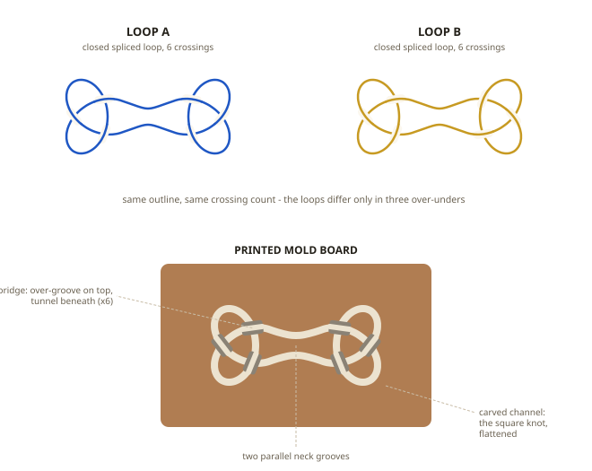
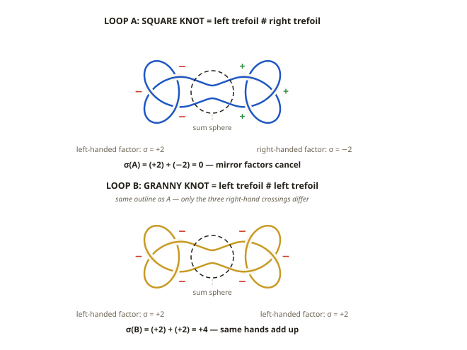
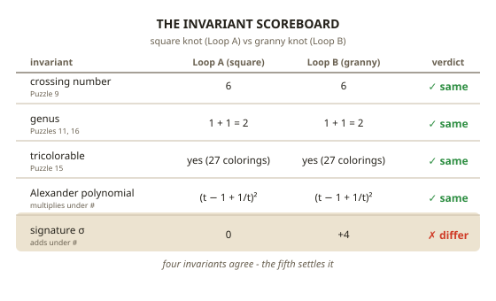
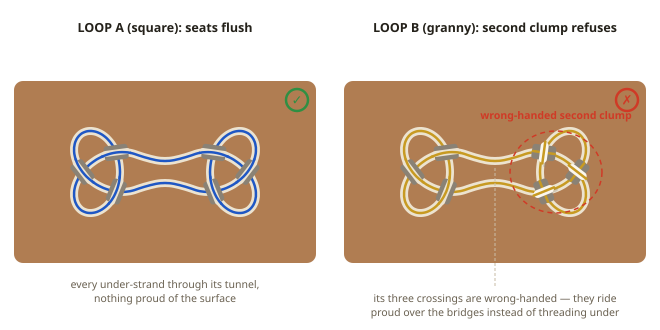

# Puzzle 20: The Granny's Downfall

**Difficulty:** Advanced
**Type:** Identification / Assembly
**Topological Principle:** Connected sums — composite knots and chirality under composition

---

## Overview

Two closed cord loops, each with six crossings arranged as two three-crossing clumps joined by a two-strand neck. One is a **square knot** — a left-handed trefoil joined to a right-handed one. The other is a **granny knot** — two left-handed trefoils joined. Same crossing count, same genus, same Alexander polynomial, both tricolorable with identical scores. Between them sits a printed mold board carved with the square knot's flattened diagram. Exactly one loop can lie down in it.

If your shoelaces keep coming untied, you are probably tying the granny. This puzzle turns the difference between the bow that holds and the bow that slips into something you can seat in plastic.

## Components

| Component | Specification | Purpose |
|-----------|---------------|---------|
| Loop A | 5mm braided nylon cord, ~750mm, ends bury-spliced closed | The square knot: left trefoil # right trefoil |
| Loop B | 5mm braided nylon cord, ~750mm, ends bury-spliced closed | The granny knot: left trefoil # left trefoil |
| Mold board | FDM-printed PETG, ~200mm x 120mm x 14mm | Carved channel tracing the symmetric flattened square-knot diagram |
| Bridges (x6) | Printed integral with the board; 7mm x 7mm tunnel beneath, open groove across the top | Enforce the over/under weave at each crossing |
| ID bands (x2) | Heat-shrink sleeves, one pale and one dark | Let the solver track which loop is which |

## Setup

1. Place the mold board flat on the table.
2. Hand over both loops loose and rumpled — not flattened, not pre-sorted. (The diagram shows them flattened, for comparison.)
3. State the rules: the loops may be flattened, flipped, and manipulated freely, but nothing is cut, untied, or forced. The splices are sealed.
4. The solver may seat and unseat cord in the channel as often as they like.

## Objective

Determine which loop can lie **fully seated** in the mold — every segment in the channel one strand deep, every under-strand through its bridge tunnel, nothing standing proud of the surface. Seat it. Then demonstrate, not just assert, why the other loop never can.

## The Topology

### What a Connected Sum Is

Tie one knot in a cord, tie a second after it, and splice the ends closed: the result is the **connected sum** K₁ # K₂. Each factor keeps its own territory, joined by a two-strand neck. That neck is where the **sum sphere** lives: an imaginary balloon the loop punctures at exactly two points, one factor inside, the other outside.

This is Puzzle 17's decomposition instinct, one level down: there we cut a satellite knot along a *torus* to separate companion from pattern; here we cut along a *sphere* to separate prime factors. Schubert proved in 1949 that the factorization is unique — a knot's prime factors are as fixed as an integer's.

### Chirality Under Composition

Puzzle 5 established that the trefoil is chiral. Composition inherits this, because mirroring a sum mirrors each factor:

- **mirror(square) = mirror(L # R) = R # L = square.** The square knot is its own mirror image — an amphichiral knot built from two chiral parts.
- **mirror(granny) = mirror(L # L) = R # R** — the *other* granny. The granny is chiral, and comes in mirror twins.

### The Invariant Scoreboard

Line up the series' whole toolkit:

| Invariant | Square (A) | Granny (B) | Verdict |
|-----------|------------|------------|---------|
| Crossing number (Puzzle 9) | 6 | 6 | same |
| Genus (Puzzles 11, 16) | 1 + 1 = 2 | 1 + 1 = 2 | same |
| Tricolorable (Puzzle 15) | yes — 27 colorings | yes — 27 colorings | same |
| Alexander polynomial | (t − 1 + 1/t)² | (t − 1 + 1/t)² | same |
| Signature σ | 0 | +4 | **different** |

The agreements are computable. Genus adds under connected sum: 1 + 1 = 2 for both. Crossing number is 3 + 3 = 6 for both (additivity is proved for alternating knots like these; in general it is an open problem). Fox 3-colorings multiply: each trefoil has 9, a sum has 9 x 9 / 3 = 27 — and mirroring never changes a coloring count. The Alexander polynomial multiplies, and is equally blind to handedness.

The **signature** σ is not. It is an integer computed from a knot's Seifert surface (Puzzle 16's object); it *adds* under connected sum and *flips sign* under mirroring. Fix the convention: the right-handed trefoil (all-positive crossings) has σ = −2, the left-handed σ = +2. Then:

- σ(square) = (+2) + (−2) = **0** — mirror factors cancel. (Any amphichiral knot must have σ = 0.)
- σ(granny, L # L) = (+2) + (+2) = **+4**. (Its mirror twin R # R has σ = −4; either way, not 0.)

That one disagreement proves square ≠ granny — and it is the arc's closing lesson: an invariant is a question you ask a knot, and the skill is knowing *which* question separates your suspects.

### The Mold Is a Theorem

A closed loop lying fully seated in the channel — one strand per groove, every under-strand through its tunnel — physically realizes the mold's diagram, so it *is* the knot that diagram denotes: the square knot. No manipulation of a closed spliced loop changes its knot type, so full seating of Loop B is not merely difficult — it is impossible. Keep the two impossibilities separate: the 7mm tunnels against 5mm cord are *geometry*, guaranteeing only that the right loop drops in without force. The granny's refusal is *topology* — success would make the granny a square knot.

**Physical Intuition:** What you feel in your hands: pull a loop from opposite sides and the two knotted clumps slide apart until a clean two-strand neck connects them — you are holding the sum sphere's equator. Seating the square loop feels like slotting a key: each bridge accepts its under-strand with slack to spare. The granny starts the same way, then in the second clump all three crossings insist on lying *over* bridges whose tunnels demand *under*. Flip that clump to fix it and nothing changes — the flip is a symmetry of the trefoil, so the same three bridges refuse and all you have added is a half-twist in the neck that unwinds the instant you flip back. What you keep failing to seat is not one crossing but the whole wrong-handed clump, a conserved lump — you are pushing on σ = +4.

*For the complete treatment of connected sums, prime factorization, and signatures, see [Topology Primer: Connected Sums and Composite Knots](../theory/topology-primer.md#connected-sums-and-composite-knots).*

## Solution

1. **Find each loop's neck.** Grip each loop at two opposite points and pull gently: the tangle separates into two three-crossing clumps joined by two parallel strands.
2. **Run Puzzle 5's spiral test on each clump.** Follow the overpasses around a clump: clockwise means right-handed, counterclockwise left-handed. Test all four clumps *viewed from the same side of the table*.
3. **Read the verdict.** One loop has a clockwise clump and a counterclockwise clump — mirror factors, the square knot (Loop A). The other's clumps match — the granny.
4. **Flatten the square loop mirror-symmetrically**, neck horizontal, one clump per side, using the board's channel as the template.
5. **Seat the neck first:** press the two neck strands into the parallel grooves at the board's center.
6. **Work outward, crossing by crossing.** At each bridge, thread the under-strand through the tunnel, then lay the over-strand into the groove across the bridge's top. Left clump's three crossings, then the right's.
7. **Check flush.** Sight along the board's surface with one eye: no cord above the plane. Fully seated.

8. **Now demonstrate the granny's downfall.** Seat Loop B the same way: neck first, then the first clump — crossings 1 through 3 drop under their bridges exactly as the square's did. Crossings 4 through 6 refuse together: each wants to pass *over* where its tunnel demands *under*, because this clump is left-handed and the mold's right side is carved for a right-handed one. Now try the only move the outline permits — flip the whole second clump like a page, 180° about the neck. Nothing improves. That flip is a *symmetry* of a trefoil (its strong inversion): it carries the clump's weave onto itself, so the same three bridges refuse in exactly the same way, and the only trace it leaves is a removable half-twist in the neck — flip back and the twist unwinds. There is no third registration. The obstruction is not one stray crossing you can chase around the board; it is the entire wrong-handed clump — three crossings at once, none of which a rotation can re-hand. That is the σ = +4 you are pushing on.

Identification takes two or three minutes; seating the square knot, about five more.

## Why It's Tricky

Every invariant this series has taught agrees on the two loops: six crossings and six, genus two and two, tricolorable and tricolorable. Even the loops' outlines match — flattened, they differ only in three over-unders that most eyes skate straight across.

The flip maneuver in step 8 is the cruelest part: it *feels* like it must work. Half the granny — the neck and one clump — seats beautifully, and flipping the rest looks like the obvious fix. That it changes nothing is the counterintuitive step: a rotation is the only move the outline allows, and no rotation can re-hand a clump. "Almost solved, one flip away" is exactly the shape of *provably stuck* — three crossings, wrong-handed, and no registration seats them.

**Lesson:** invariants are questions, and every question has blind spots. Tricolorability and the Alexander polynomial cannot see handedness; the signature is built to see it, and survives composition (it adds). When two objects stubbornly look identical, the failure may be in the question, not the objects.

## Common Mistakes

1. **Testing by force.** The mold is a theorem, not a friction fit. The correct loop seats with visible clearance; if you are mashing cord, you are either doubling strands in one groove (which proves nothing) or you have the granny.
2. **Flattening asymmetrically.** A clump flattened into a shape that does not match its side of the channel makes even the square loop appear to fail. Fix the *outline* first — lay it in the empty channel ignoring crossings — then resolve the bridges.
3. **Reading the spiral off the wrong strand.** The handedness test only works if you trace the *overpasses* — the strand riding on top at each crossing (Solution step 2). Follow the underpasses instead, or read the tilt of the lower strand where two cross, and every clump reports its opposite, so a matched granny reads as a mirror pair. Handedness is viewpoint-invariant — walk to the far side of the table and a clump spins the same way — so when two readings of one clump disagree, one of them traced the wrong strand.
4. **Chasing a single proud crossing.** The granny never reduces to one stray crossing you can shuffle around the board. Its whole second clump refuses at once — three crossings of the wrong handedness — and the flip that looks like it fixes them only trades the mismatch for a removable half-twist in the neck. There is nothing to chase: seating even one of those three would require re-handing the clump, dropping σ from +4 to 0 and turning the granny into a square knot.

## Construction Notes

- **Tie handedness before splicing, and verify it.** Tie the first trefoil, then the second *mirrored* for Loop A and *same-handed* for Loop B, then bury-splice each loop closed. Run the spiral test on both clumps **before** sealing — after splicing, a mistake means starting over.
- **Print a bridge test coupon first:** one 20mm block with a single 7mm x 7mm tunnel. Tunnel roofs sag on some printers; the coupon confirms the 5mm cord slides freely before committing to the full board print.
- **Tunnel and channel sizing:** cord_slot = 7mm tunnels and a 7mm-wide channel give the correct loop ~2mm clearance — it must seat *without* force, or the mold stops being an argument.
- **Channel depth at least 6mm** (cord + 1mm), so "fully seated" is unambiguous: sighting along the board's top, seated cord is invisible and any proud crossing is obvious.
- Chamfer the channel edges (~0.5mm); solvers will seat and unseat cord many times.
- Swap which loop carries which ID band between solvers — the puzzle dies once "the dark-banded one" is known to be the answer.
