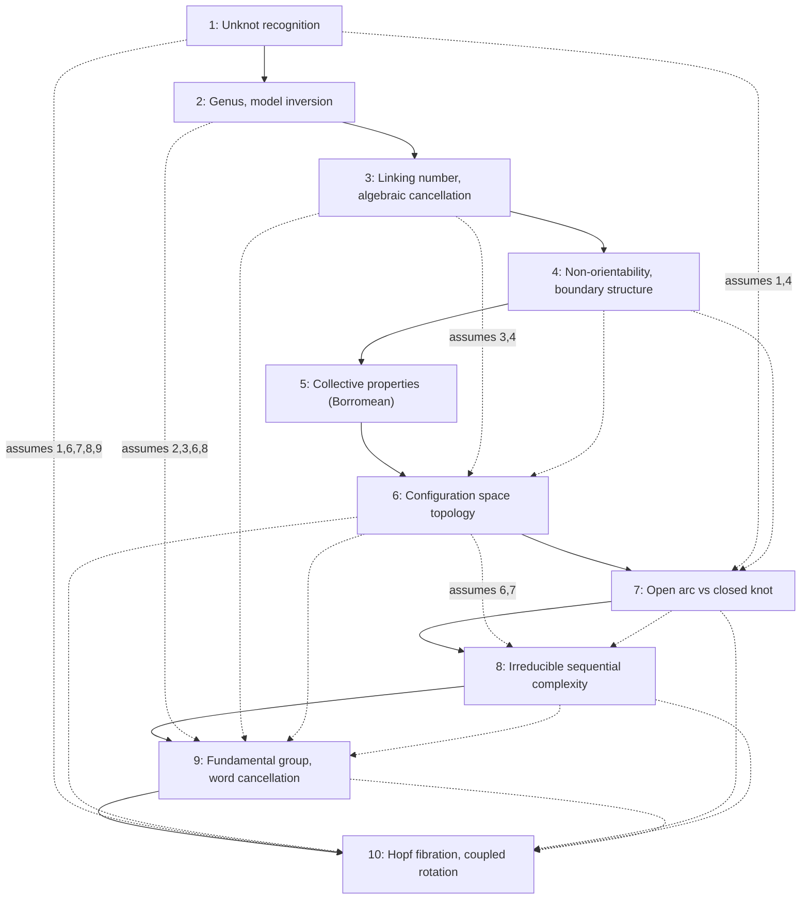
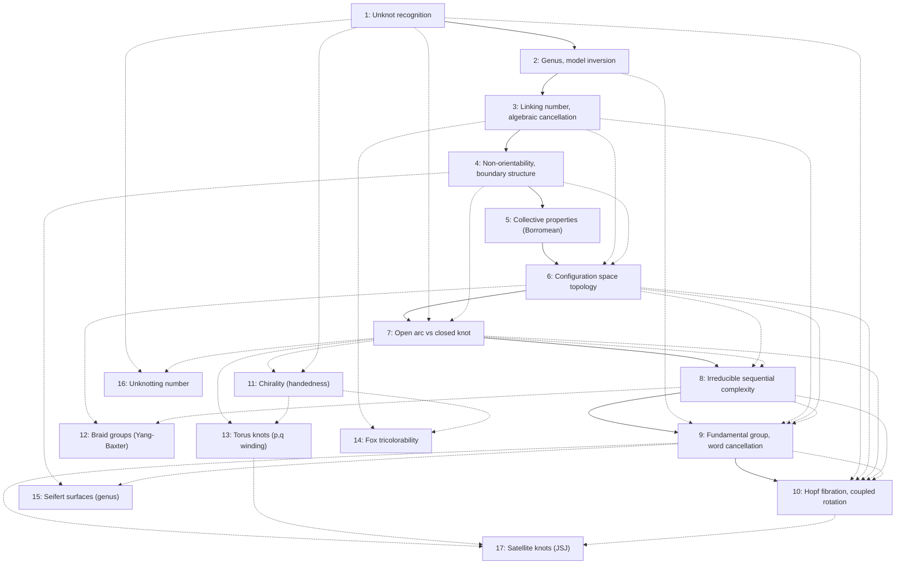

# Pedagogical Arc: A Teacher's Guide to the EXKNOTS Series

This document explains the deliberate ordering of the 10 EXKNOTS puzzles, why each puzzle appears where it does, and how the series functions as a coherent curriculum in topological thinking.

---

## 1. Why the Order Matters

The EXKNOTS series is not a difficulty ladder. It is a **concept sequence**: each puzzle introduces exactly one new topological idea while relying on ideas established by earlier puzzles. The solver who works through them in order builds a cumulative vocabulary — visual, physical, and eventually algebraic — for reasoning about topological structure.

Reordering the puzzles would not merely change the difficulty curve; it would break the conceptual dependencies. A solver who encounters the Genus Trap (Puzzle 9) without having internalized linking number cancellation (Puzzle 3) and configuration space topology (Puzzle 6) will lack the conceptual tools to even formulate what the puzzle is asking. Conversely, a solver who begins with Ouroboros Chain (Puzzle 8) will learn patience and recursion but will miss the more fundamental lesson that visual complexity is often topologically trivial — a lesson that must come first.

The ordering follows three principles:

1. **One new concept per puzzle.** No puzzle asks the solver to learn two unfamiliar ideas simultaneously. When a puzzle combines multiple topological ideas (as all later puzzles do), every idea except one has been encountered before.

2. **Misconception, then correction.** Each puzzle is designed to exploit a specific misconception, and the misconceptions are ordered from most universal ("tangled things are stuck") to most specialized ("sequential moves can always decompose spatial motion"). Early puzzles correct errors everyone makes; later puzzles correct errors that only informed solvers make.

3. **Physical before algebraic.** The series moves from puzzles where the topology can be seen and felt (Puzzles 1-4) to puzzles where the topology must be modeled mentally (Puzzles 5-7) to puzzles where the topology must be described algebraically or geometrically to be understood at all (Puzzles 8-10).

---

## 2. Concept Progression

### Puzzle 1: The Gatekeeper (Beginner)

**New concept introduced:** Unknot recognition — the distinction between visual complexity and topological complexity. An open arc with both endpoints on the same rigid body cannot link with anything.

**Prior concepts assumed:** None. This is the entry point.

**What the solver should understand afterward:** A curve that looks tangled may be topologically trivial. Before assuming something is stuck, check whether the cord is actually a closed loop. Open arcs attached to a rigid body are always free.

**Common misconceptions at this stage:**
- "The cord goes around the bar, so the ring is trapped." (Confusing draping with linking.)
- "There must be a trick — maybe you detach the cord." (Refusing to believe the topology permits escape.)
- Solvers who solve it instantly often cannot articulate *why* it works, which means the lesson has not yet landed. Ask them: "What would you need to change to make the ring genuinely trapped?"

---

### Puzzle 2: Shepherd's Yoke (Beginner)

**New concept introduced:** Buttonhole homotopy and the genus-1 surface. A hole in a surface creates a handle, and a flexible loop threaded through a handle can be freed by passing the rigid body through the loop (inverting which object moves through which).

**Prior concepts assumed:** From Puzzle 1 — the solver already knows that visual entanglement can be illusory. This frees them to look for non-obvious solutions rather than accepting the puzzle as unsolvable.

**What the solver should understand afterward:** When a flexible object (cord) seems trapped on a rigid object (paddle), consider inverting the model: can the rigid object pass through the flexible one? Holes are not always traps — they can be escape routes.

**Common misconceptions at this stage:**
- "The loop is too short to go over the paddle." (Correct, but irrelevant — the paddle goes through the loop, not vice versa.)
- "I need to stretch the cord." (Focusing on the wrong object.)
- Solvers who solved Puzzle 1 quickly may assume Puzzle 2 is "the same trick." It is not — Puzzle 1's lesson is about arc endpoints; Puzzle 2's lesson is about the model inversion. If a solver says "it's basically the same," they have not grasped the distinction.

---

### Puzzle 3: The Prisoner's Ring (Beginner-Intermediate)

**New concept introduced:** Linking number as an algebraic invariant. Crossings have signs (+1 and -1), and opposite signs cancel. A linking number of zero means the curves can be separated, regardless of how entangled they look.

**Prior concepts assumed:** From Puzzle 1 — visual complexity can be deceptive. From Puzzle 2 — the key move may involve manipulating something other than the obvious target. (In Puzzle 2, you move the paddle instead of the loop; in Puzzle 3, you manipulate the cord instead of the ring.)

**What the solver should understand afterward:** Linking is algebraic: crossings have signs, and opposite crossings cancel. Before trying to untangle something, count the signed crossings. If they sum to zero, separation is possible. The solver should also understand that the *ring* (the stated objective) is a distraction — the real puzzle is the cord's relationship to the crossbar.

**Common misconceptions at this stage:**
- "The cord goes around the crossbar, so it's linked." (Failing to notice that the two crossings have opposite signs.)
- "I need to get the ring off the cord." (Focusing on the ring rather than the cord-crossbar relationship.)
- Some solvers will stumble into the solution by accident (pulling cord over the crossbar end) without understanding why it works. Push them to explain the cancellation.

---

### Puzzle 4: Mobius Snare (Intermediate)

**New concept introduced:** Non-orientability. A half-twist changes a band's boundary from two edges to one. This single-edge boundary enables escape paths that do not exist on an ordinary (two-edged) band.

**Prior concepts assumed:** From Puzzle 1 — visual complexity may be illusory. From Puzzle 3 — topological properties (like linking number) determine what is possible, not visual appearance. Puzzle 4 extends this: the *surface itself* has a non-obvious property (one-sidedness) that determines the cord's freedom.

**What the solver should understand afterward:** The twist is the feature that enables escape, not the feature that prevents it. Surface properties (orientability, number of edges) have direct physical consequences. The solver should be able to explain why the puzzle would be unsolvable without the half-twist.

**Common misconceptions at this stage:**
- "The twist makes it harder." (The universal first reaction. The twist is, in fact, the entire reason the puzzle is solvable.)
- "There are two edges to the band." (The solver's two-sided intuition persists even when they have been told about Mobius bands. Physical manipulation at the twist point is needed to break this intuition.)
- "I solved it but I don't understand why the twist matters." (Common. Ask them to try the same puzzle with an untwisted band and observe that it becomes impossible.)

---

### Puzzle 5: Trinity Lock (Intermediate)

**New concept introduced:** Collective topological properties — the Borromean link. Three components are mutually interlocked yet no two are linked to each other. The linking is irreducibly a three-body phenomenon.

**Prior concepts assumed:** From Puzzle 3 — linking number as an algebraic concept. The solver understands pairwise linking numbers. Puzzle 5 reveals that pairwise linking numbers can all be zero while the system is still non-trivially linked — a higher-order invariant (the Milnor triple linking number) captures the collective structure.

**What the solver should understand afterward:** Some topological properties cannot be reduced to pairwise relationships. The Borromean link cannot be assembled incrementally (link two, then add a third) because no two components are ever linked. The solver should feel the difference between pairwise and collective properties in their hands.

**Common misconceptions at this stage:**
- "First connect A to B, then add C." (The dominant instinct, and it will fail because A and B cannot be linked.)
- "The puzzle is broken — these ovals can't link." (Correct for pairs, wrong for triples.)
- "I got two of them linked!" (No, you didn't — you are confusing overlapping with linking. Test by pulling gently: if they come apart, they were never linked.)

---

### Puzzle 6: Devil's Pitchfork (Intermediate-Advanced)

**New concept introduced:** Configuration space topology. The set of positions available to the ring has its own topological structure, and the solver must change the *constraint* (the cord's relationship with the prongs) before moving the *constrained object* (the ring). The puzzle has two layers, and the first must be solved to unlock the second.

**Prior concepts assumed:** From Puzzle 3 — crossings and linking numbers. From Puzzle 4 — structural features (twists, heights) that look incidental may be functionally critical. From Puzzle 5 — properties can be non-obvious and require a shift in perspective. Puzzle 6 combines these into a new demand: the solver must recognize that the center prong's shorter height is not a defect but the key feature, and that reconfiguring the cord is a precondition for moving the ring.

**What the solver should understand afterward:** A puzzle's state space can have its own topology. Sometimes the direct action (move the ring) is impossible not because of a visible obstacle but because the constraints make the current configuration topologically isolated from the goal. You must first change the constraints (reconfigure the cord) to connect the current state to the goal state in configuration space.

**Common misconceptions at this stage:**
- "The center prong's height doesn't matter." (It is the single most important dimension in the puzzle.)
- "I just need to find the right way to slide the ring across." (The ring cannot move until the cord is reconfigured.)
- "I accidentally looped the cord over the center prong but undid it because it seemed wrong." (Extremely common. The precondition step does not look like progress — it looks like a detour.)

---

### Puzzle 7: The Ferryman's Knot (Advanced)

**New concept introduced:** The distinction between open arcs and closed knots, and Reidemeister moves on constrained arcs. A cord wrapped around a post in a trefoil-like pattern is not a trefoil because it has endpoints. Open arcs on fixed axes can always be unwound.

**Prior concepts assumed:** From Puzzle 1 — open arcs behave differently from closed loops. From Puzzle 4 — features that look like constraints (the half-twist, the ball finial) can be tools. From Puzzle 6 — the relevant object may not be the obvious one (in Puzzle 6, the cord matters more than the ring; in Puzzle 7, the cord's endpoints matter more than its crossings).

**What the solver should understand afterward:** Classical knot theory applies to closed curves. The same crossing pattern that creates an unknottable trefoil in a closed loop creates a trivially unwound arc when the curve has endpoints. The finial is both a constraint (trapping the ring) and a tool (providing the fulcrum for unwinding). The solver should be wary of applying closed-curve intuition to open-arc problems.

**Common misconceptions at this stage:**
- "It's a trefoil, and trefoils can't be unknotted." (Knowledge as a trap. The more the solver knows about knot theory, the more convinced they are that the puzzle is impossible.)
- "The ball finial prevents the cord from coming off." (The finial prevents the ring from coming off. The cord can and must pass over the finial.)
- "I need to find some clever bypass." (There is no clever trick. The solution is direct: lift each wrap over the finial, one at a time.)

---

### Puzzle 8: Ouroboros Chain (Advanced)

**New concept introduced:** Irreducible sequential complexity. The puzzle has a minimum solution of 42 moves following a Gray code / binary recursion pattern. There is no shortcut, no single insight that collapses the solution. The structure demands trust in a systematic process.

**Prior concepts assumed:** From Puzzle 6 — configuration space has structure. From Puzzle 7 — individual moves can be simple even when the overall problem looks complex. Puzzle 8 combines these: each individual move (add or remove a loop) is simple, and the configuration space is well-defined, but the minimum path through configuration space is irreducibly long.

**What the solver should understand afterward:** Some topological structures have inherent sequential complexity that cannot be bypassed by insight. The solution's structure (Gray code) is itself a deep mathematical object. The solver must learn to trust the algorithm even when it requires "going backward" (replacing previously removed loops).

**Common misconceptions at this stage:**
- "There must be a trick I'm missing." (There is no trick. The solution is the algorithm.)
- "Going backward means I made a mistake." (Going backward is a necessary part of the recursive structure.)
- "I'll just try random moves until something works." (With 42 moves and no fault tolerance, random exploration is futile.)
- "Six loops, six moves." (Off by a factor of seven. The recursive structure means the number of moves grows exponentially with the number of loops.)

---

### Puzzle 9: Genus Trap (Expert)

**New concept introduced:** Fundamental groups as practical tools. The cord's path through two tunnels in a genus-2 handlebody encodes the algebraic word aba^{-1} in the free group F(a, b). Freeing the rings requires performing an algebraic cancellation (eliminating the b generator to reduce the word to aa^{-1} = identity) through physical cord manipulation.

**Prior concepts assumed:** From Puzzle 2 — genus and handles. From Puzzle 3 — algebraic cancellation (linking number cancellation is the simplest case; generator cancellation is the general case). From Puzzle 6 — multi-step cord rerouting as a precondition. From Puzzle 8 — systematic, multi-step processes (the cord rerouting in Puzzle 9 takes 6-8 sequential manipulations, each requiring careful slack management).

**What the solver should understand afterward:** Abstract algebraic descriptions of topology (groups, generators, words) are not just formalism — they are practical tools for navigating physical puzzles. When the topology is invisible (internal tunnels), you must build a mental or algebraic model. The solver should be able to describe the cord's path using generator notation and explain why the cancellation works.

**Common misconceptions at this stage:**
- "I'll just try different threadings until the rings come off." (Random rerouting typically introduces additional generators, making the configuration more complex.)
- "The tunnels are just holes — this is like Puzzle 2 twice." (Puzzle 2 has one handle; Puzzle 9 has two handles whose interaction creates a non-abelian fundamental group. The word aba^{-1} is non-trivial precisely because a and b do not commute.)
- "I can see through the acrylic, so I understand the topology." (Optical clarity does not confer topological understanding. The crossing of the tunnels inside the block is extremely hard to reason about spatially, even when visible.)

---

### Puzzle 10: The Hopf Paradox (Expert)

**New concept introduced:** Coupled rotation in S^3 — the Hopf fibration. The solution requires a simultaneous rotation in two orthogonal planes (a corkscrew motion) that cannot be decomposed into sequential single-axis moves. This is the only puzzle in the series where the conceptual insight is necessary but not sufficient; a new motor skill must also be developed.

**Prior concepts assumed:** From Puzzle 1 — visual simplicity can hide topological complexity. From Puzzle 6 — configuration space has its own topology. From Puzzle 7 — the same geometric setup can have very different topological properties depending on constraints. From Puzzle 8 — some solutions are irreducibly complex (in Puzzle 8, irreducibly long; in Puzzle 10, irreducibly coupled). From Puzzle 9 — the solver is comfortable building mental models of invisible structure.

**What the solver should understand afterward:** Some spatial motions are fundamentally coupled — they cannot be performed as a sequence of single-axis rotations and translations. The Hopf fibration, a structure from higher-dimensional geometry, manifests physically as this coupled motion. Topology constrains not only what configurations are possible but also how you move between them.

**Common misconceptions at this stage:**
- "I'll just rotate and push in sequence — try all combinations." (No sequence of discrete single-axis moves navigates the pole junction. The motion must be continuous and coupled.)
- "Two hoops welded together — how hard can it be?" (The visual simplicity of the cage is the final instance of the series-wide lesson that visual complexity does not equal topological complexity.)
- "I understand the concept of coupled rotation, so I should be able to do it." (Understanding is necessary but not sufficient. Unlike every other puzzle in the series, this one requires developing a physical skill that cannot be transmitted verbally.)

---

## 3. Three Learning Arcs

The 10 puzzles form three thematic arcs. Each arc has its own narrative, its own type of "aha" moment, and its own relationship between the solver and the mathematics.

### Arc 1 — "Things Are Not What They Seem" (Puzzles 1-4)

**Theme:** The gap between visual appearance and topological reality.

**Narrative progression:**
- Puzzle 1: The cord *looks* tangled but is topologically trivial (unknot).
- Puzzle 2: The loop *looks* trapped but the rigid body can pass through it (model inversion).
- Puzzle 3: The cord *looks* linked to the crossbar but the linking number is zero (algebraic cancellation).
- Puzzle 4: The twist *looks* like an obstacle but is actually the escape route (non-orientability enables).

**What unifies these puzzles:** In each case, the solver's initial visual assessment is wrong, and the correction requires a specific topological concept. The arc trains the solver to distrust visual impressions and ask instead: "What are the actual topological invariants of this configuration?"

**Emotional arc:** Surprise (Puzzle 1) turns into suspicion (Puzzles 2-3) and then into active hypothesis-testing (Puzzle 4). By the end of Arc 1, the solver has internalized the habit of looking past visual complexity.

**Transition to Arc 2:** Arc 1 teaches that individual configurations can be deceptive. Arc 2 reveals that the *relationships* between configurations — the structure of how components interact — can also be non-obvious.

---

### Arc 2 — "Structure Matters" (Puzzles 5-7)

**Theme:** Structural properties that emerge from the interaction of components, constraints, and the distinction between different mathematical categories.

**Narrative progression:**
- Puzzle 5: The linking is collective — it exists only as a three-body property (Borromean rings, collective structure).
- Puzzle 6: The ring's freedom depends on the cord's configuration — you must solve the constraints before solving the puzzle (configuration space topology).
- Puzzle 7: A trefoil-like pattern is trivially unknottable because the cord is an open arc, not a closed knot (categorical distinction: open vs. closed).

**What unifies these puzzles:** Each puzzle reveals a structural property that cannot be perceived by examining individual components — it arises from how the components relate to each other and to the mathematical framework. Puzzle 5's linking is invisible in any pair. Puzzle 6's constraint is invisible until the cord is reconfigured. Puzzle 7's unknottability is invisible if you think in terms of closed knots.

**Emotional arc:** Frustration (Puzzle 5 — "these don't link!") gives way to a meta-cognitive shift (Puzzle 6 — "I need to solve a different problem first") and then to a confrontation with one's own expertise (Puzzle 7 — "my knot theory knowledge is misleading me").

**Transition to Arc 3:** Arc 2 teaches that structure determines what is possible. Arc 3 reveals that deep mathematical structures — recursion, algebra, higher-dimensional geometry — are not abstractions but physical realities that can be felt in the hands.

---

### Arc 3 — "Deep Mathematics Is Physical" (Puzzles 8-10)

**Theme:** Abstract mathematical structures manifest as irreducible physical constraints.

**Narrative progression:**
- Puzzle 8: Binary recursion (Gray code) manifests as 42 unavoidable moves (irreducible sequential complexity).
- Puzzle 9: The free group F(a, b) manifests as a cord path that can only be simplified by algebraic cancellation (algebra as practical tool).
- Puzzle 10: The Hopf fibration manifests as a coupled rotation that cannot be decomposed (higher-dimensional geometry as motor skill).

**What unifies these puzzles:** In each case, a mathematical structure that is typically encountered only in textbooks has a direct physical manifestation. The mathematics is not a metaphor or an analogy — it is a literal description of what the solver's hands must do. The solver cannot bypass the mathematics; they must work through it physically.

**Emotional arc:** Humility (Puzzle 8 — "I just have to follow the algorithm for 42 moves") deepens into intellectual engagement (Puzzle 9 — "I need to think algebraically about a physical object") and culminates in a kinesthetic encounter with higher mathematics (Puzzle 10 — "I need to train my body to perform a motion from four-dimensional geometry").

**The series conclusion:** Puzzle 10 brings the full arc to a close by returning to the lesson of Puzzle 1 — visual simplicity hides topological complexity — but at an incomparably higher level. The cage in Puzzle 10 is visually the simplest construction in the entire series (two hoops welded together), yet it produces the most complex topological constraint. The solver who began by learning to distrust visual complexity now confronts a puzzle where the complexity is not only invisible but lives in a higher-dimensional space that cannot be directly visualized at all.

---

## 4. How to Use the Series

### Classroom Setting

**Group size:** 3-5 students per puzzle instance. Smaller groups ensure everyone gets hands-on time; larger groups tend to produce one active solver and passive observers.

**Recommended pacing:** One puzzle per session, 45-60 minutes each.

**Session structure:**

1. **Introduction (5 min).** Present the puzzle without hints. State the objective. Let students examine the components. Do not explain any topology.

2. **Exploration (15-20 min).** Students manipulate the puzzle freely. Circulate and observe but do not intervene. Note which misconceptions arise — these are the raw material for the discussion phase.

3. **Discussion (10 min).** Whether or not the puzzle has been solved, pause for a group discussion. Ask:
   - "What have you tried? What happened?"
   - "What are you assuming about this puzzle? Is that assumption justified?"
   - "What would need to be true for the puzzle to be impossible? Is that actually true here?"

4. **Guided solving (10-15 min).** If no group has solved it, offer the first hint (see the hint structure in each puzzle file). If some groups have solved it, have them explain their solution to others. Insist on topological explanations, not just "I moved it this way."

5. **Concept codification (5-10 min).** Name the topological concept. Connect it to the previous puzzles. Ask: "Where else might this principle appear?" and "How does this change the way you'll approach the next puzzle?"

**Demonstration prompts (for puzzles that are too complex for all students to attempt):**
- Puzzle 8: Have the class collectively track the state on a whiteboard while one student executes the moves.
- Puzzle 10: Demonstrate the Hopf move and then let students attempt to reproduce it. The difference between understanding and execution is itself the lesson.

**Discussion prompts by puzzle:**

| Puzzle | Discussion Prompt |
|--------|------------------|
| 1 | "Can you give an example from everyday life where something looks stuck but isn't?" |
| 2 | "When have you been stuck on a problem because you were trying to move the wrong thing?" |
| 3 | "What does it mean for crossings to 'cancel'? Can you think of other systems where opposing forces cancel?" |
| 4 | "Why does removing the twist make the puzzle impossible? What does that tell you about twists in general?" |
| 5 | "Can you think of other systems where a property exists only collectively — not in any subset?" |
| 6 | "Have you ever had to solve a prerequisite problem before you could solve the real problem? How did you recognize the prerequisite?" |
| 7 | "Has your knowledge ever prevented you from solving a problem? When is expertise a hindrance?" |
| 8 | "How do you maintain trust in a process that requires you to undo your own progress? Where else is this required?" |
| 9 | "When you cannot see the topology directly, what tools do you reach for? What makes a good model?" |
| 10 | "What does it feel like to understand something intellectually but not be able to do it physically? What does that gap tell you?" |

---

### Workshop Setting (Build and Solve)

A workshop where participants construct the puzzles and then solve each other's builds adds a fabrication layer that deepens engagement. Participants who build a puzzle understand its dimensional constraints and tolerances — they have physically created the topological structure.

**Recommended format:** Full-day or two-day workshop.

**Day 1 (Build):**

| Time Block | Activity | Puzzles |
|-----------|----------|---------|
| 09:00-10:30 | Introduction, materials overview, safety briefing | — |
| 10:30-12:00 | Build Puzzles 1-3 (simple materials: rod bending, cord work) | 1, 2, 3 |
| 12:00-13:00 | Lunch | — |
| 13:00-15:00 | Build Puzzles 4-5 (leather work for Mobius band, welding ovals) | 4, 5 |
| 15:00-17:00 | Build Puzzles 6-7 (precision rod work, dimensional calibration) | 6, 7 |

**Day 2 (Build and Solve):**

| Time Block | Activity | Puzzles |
|-----------|----------|---------|
| 09:00-10:30 | Build Puzzles 8-10 (wooden base, acrylic drilling, cage welding) | 8, 9, 10 |
| 10:30-12:00 | Solve session: Puzzles 1-5 (swap builds between participants) | 1-5 |
| 12:00-13:00 | Lunch | — |
| 13:00-15:00 | Solve session: Puzzles 6-9 | 6-9 |
| 15:00-16:30 | Solve session: Puzzle 10 (extended time, motor skill development) | 10 |
| 16:30-17:00 | Debrief: arc review, concept map, connections to participants' fields | — |

**Build time estimates per puzzle:**

| Puzzle | Build Time (experienced) | Build Time (novice) | Key Skill |
|--------|------------------------|--------------------|-----------|
| 1 | 20 min | 45 min | Rod bending, drilling |
| 2 | 15 min | 30 min | Woodworking, cord splicing |
| 3 | 30 min | 60 min | Welding, cord threading |
| 4 | 20 min | 40 min | Leather work, riveting |
| 5 | 45 min | 90 min | Oval forming, welding, painting |
| 6 | 60 min | 120 min | Precision rod work, dimensional calibration |
| 7 | 30 min | 60 min | Wood turning/finishing, cord setup |
| 8 | 45 min | 90 min | Wood base routing, loop chaining |
| 9 | 90 min | 180 min | Acrylic drilling, tunnel polishing |
| 10 | 60 min | 120 min | Precision welding, pole grinding, prototype iteration |

---

### Self-Study

For solvers working through the series alone, the following structure maximizes learning.

**Pacing:** One puzzle every 1-3 days. Do not rush. The concepts need time to settle between sessions.

**Before each puzzle:**
- Read the puzzle's overview and components. Do not read the topology section or the solution.
- Spend at least 15 minutes manipulating the puzzle before seeking any hint.

**After solving (or after consulting the solution):**
- Read the full topology section. Can you explain the solution using the topological concepts described?
- Re-solve the puzzle from the starting position to confirm that you understand the mechanism, not just the sequence of moves.

**Journaling prompts (one per puzzle):**

1. **The Gatekeeper:** "Draw the cord's path. Is it a closed loop or an open arc? What would need to change to make the ring genuinely trapped?"
2. **Shepherd's Yoke:** "Which object did you try to move first? When did you realize you should move the other one? Describe a real-world problem where you were 'moving the wrong object.'"
3. **The Prisoner's Ring:** "Label each crossing with +1 or -1. What is the total? What would the puzzle look like if the total were +2 instead of 0?"
4. **Mobius Snare:** "Take a strip of paper. Make a band without a twist and try to trace from one edge to the other without lifting your finger. Now make a Mobius band and try the same thing. What changes?"
5. **Trinity Lock:** "Remove one oval and observe the other two. Put it back and remove a different one. What does 'irreducibly collective' mean to you now?"
6. **Devil's Pitchfork:** "Describe the state of the cord before and after the critical reconfiguration. What changed? Why did that change unlock the ring's movement?"
7. **The Ferryman's Knot:** "If the cord were a closed loop (no endpoints), would this be solvable? Why or why not? What does this tell you about the importance of boundary conditions?"
8. **Ouroboros Chain:** "Track the state (which loops are on/off) for at least the first 15 moves. Where does the pattern repeat? How does it feel to 'go backward' as part of going forward?"
9. **Genus Trap:** "Write the cord's path as a word in generators a and b. Describe the physical manipulation that corresponds to each algebraic step in the simplification."
10. **The Hopf Paradox:** "Describe the motion that works. Now try to break it into two sequential moves. Why can't you? What does 'coupled' mean in your body, not just in your mind?"

**Suggested reading between puzzles:**

| After Puzzle | Suggested Reading |
|-------------|-------------------|
| 1-2 | Adams, *The Knot Book*, Chapters 1-2 (what is a knot, when are two knots the same) |
| 3 | Adams, *The Knot Book*, Chapter 5 (linking numbers) |
| 4 | Barr, *Experiments in Topology*, Chapter 3 (Mobius bands and one-sided surfaces) |
| 5 | Any accessible treatment of Borromean rings and Brunnian links |
| 6 | Ghrist, *Elementary Applied Topology*, Chapter 1 (configuration spaces) — or any robotics text covering C-space |
| 7 | Adams, *The Knot Book*, Chapter 1 revisited (open vs. closed curves, why the distinction matters) |
| 8 | Berlekamp, Conway, Guy, *Winning Ways*, Vol. 2 (Chinese Rings / Baguenaudier analysis) |
| 9 | Stillwell, *Classical Topology and Combinatorial Group Theory*, Chapter 2 (fundamental groups of surfaces) |
| 10 | Penrose, *The Road to Reality*, Chapters 15 and 33 (fiber bundles), or Naber, *Topology, Geometry, and Gauge Fields* for the Hopf fibration specifically |

---

## 5. Difficulty and Time Estimates

The following table gives estimated times for two solver profiles: a **novice** (no prior experience with topological puzzles, no mathematical background beyond high school) and an **experienced** solver (familiar with recreational mathematics and/or puzzle design, but encountering these specific puzzles for the first time).

"Aha moment" describes the specific instant of insight that unlocks the solution or fundamentally changes the solver's approach.

| # | Puzzle | Novice Time | Experienced Time | Aha Moment |
|---|--------|-------------|-----------------|------------|
| 1 | The Gatekeeper | 5-15 min | 1-3 min | "The cord isn't a loop — it can't actually go *around* anything." |
| 2 | Shepherd's Yoke | 10-30 min | 3-10 min | "Wait — what if the paddle goes through the loop instead?" |
| 3 | The Prisoner's Ring | 15-45 min | 5-15 min | "The two crossings cancel — the cord isn't really around the crossbar." |
| 4 | Mobius Snare | 20-60 min | 10-20 min | "The twist isn't a complication — it's *why* the cord can escape." |
| 5 | Trinity Lock | 30-90 min | 15-30 min | "No two are linked. They all have to go together, simultaneously." |
| 6 | Devil's Pitchfork | 45-120 min | 20-45 min | "The short center prong — I can loop the cord over it. *That* changes what the ring can do." |
| 7 | The Ferryman's Knot | 30-120 min | 15-60 min | "It's not a trefoil. It has endpoints. I can just lift each wrap over the top." |
| 8 | Ouroboros Chain | 60-180 min | 30-90 min | "There is no shortcut. I have to trust the recursive pattern and go backward to go forward." |
| 9 | Genus Trap | 90-300 min | 45-120 min | "The cord path is a *word*. If I reroute to cancel the b, the word becomes trivial." |
| 10 | The Hopf Paradox | 120-600 min | 60-240 min | "I can't rotate then push. I have to rotate *and* push at the same time — a corkscrew." |

**Notes on time estimates:**

- Puzzle 7 has an unusually wide range for experienced solvers because knot theory knowledge *increases* difficulty. A solver who has studied knot theory may spend an hour convinced the puzzle is impossible before reconsidering the open-arc distinction. A mechanically-minded solver with no knot theory knowledge may solve it in 15 minutes by simply trying to push cord over the finial.

- Puzzle 8's time is dominated by execution, not insight. The solver may understand the recursive pattern within 15 minutes but still need an hour to execute 42 moves without error.

- Puzzle 10's time includes motor skill development. The conceptual insight (coupled rotation) may arrive within 30 minutes, but physically executing the Hopf move typically requires an additional 30-180 minutes of practice. This is the only puzzle in the series where "time to solve" and "time to understand" are substantially different.

- These estimates assume the solver is working with the physical puzzle. Attempting to solve from diagrams alone roughly doubles the time for Puzzles 1-7 and makes Puzzles 8-10 effectively impossible (they require physical manipulation).

---

## Summary: The Complete Concept Map

Each arrow represents a direct conceptual dependency. The solver who works through the series in order arrives at each puzzle with exactly the preparation they need — and none of the preparation they do not.

---

## 6. Extended Series: Puzzles 11-17

Puzzles 11-17 form a fourth arc that builds on the foundations laid by the original ten puzzles. This arc focuses on **invariants and classification** — the tools mathematicians use to distinguish and organize knots systematically.

### Arc 4 — "Classification and Decomposition" (Puzzles 11-17)

**Theme:** Knot invariants as practical tools for identification, construction, and decomposition.

**Narrative progression:**
- Puzzle 11: Mirror images can be inequivalent — chirality is an invariant (identification).
- Puzzle 12: Non-commutative algebra constrains physical operations — braid groups (algebraic structure).
- Puzzle 13: Knots come in parametric families — torus knots and winding numbers (construction).
- Puzzle 14: Coloring rules distinguish knot types — tricolorability (invariant computation).
- Puzzle 15: Every knot bounds a surface — Seifert surfaces and genus (surface construction).
- Puzzle 16: Crossing changes have measurable distance — unknotting number (transformation).
- Puzzle 17: Complex knots decompose into layers — satellite knots and JSJ (decomposition).

**What unifies these puzzles:** Each puzzle introduces a knot invariant or classification tool and demonstrates that it has direct physical consequences. The solver moves from recognizing invariants (chirality, coloring) to constructing mathematical objects (torus knots, Seifert surfaces) to decomposing complex structures (satellite knots).

**Emotional arc:** Curiosity (Puzzle 11 — "these look the same but aren't") deepens into systematic thinking (Puzzles 12-14 — "there are rules that govern this") and expands into constructive mathematics (Puzzles 15-16 — "I can build the mathematical objects") before culminating in analytical decomposition (Puzzle 17 — "I can take this apart into solvable pieces").

---

### Puzzle 11: The Mirror Gate (Intermediate)

**New concept introduced:** Chirality — mirror images that are topologically inequivalent.

**Prior concepts assumed:** From Puzzles 1-4 — visual similarity does not imply topological equivalence. From Puzzle 7 — the trefoil knot is a specific mathematical object with definite properties.

**What the solver should understand afterward:** Knots have handedness. A left-handed trefoil and a right-handed trefoil are fundamentally different objects, not rotations of each other. Chirality is an invariant that cannot be detected by casual visual inspection.

**Common misconceptions at this stage:**
- "Rotating the trefoil 180 degrees makes it the other hand." (Rotation does not change chirality.)
- "Both trefoils look the same, so they ARE the same." (The lesson of Puzzle 1 revisited at a higher level.)

---

### Puzzle 12: The Braid Cage (Intermediate-Advanced)

**New concept introduced:** Braid groups and non-commutativity. The order of operations matters — certain sequences of swaps leave cords untangled while others tangle them, even when both achieve the same permutation.

**Prior concepts assumed:** From Puzzle 6 — configuration space topology and multi-step cord manipulation as precondition. From Puzzle 8 — systematic sequences where the order matters.

**What the solver should understand afterward:** When operations have memory (the cords), the order of operations is not interchangeable. The Yang-Baxter relation is not an abstraction — it is a physical constraint on which swap sequences work.

**Common misconceptions at this stage:**
- "Any sequence of swaps that puts the rings in the right positions should work." (Correct for permutations, wrong for braids.)
- "The cords are tangled because I made a mistake." (The tangle IS the wrong braid word — it is the expected consequence of a non-relation sequence.)

---

### Puzzle 13: The Torus Winder (Advanced)

**New concept introduced:** Torus knots as a parametric family. The winding numbers (p,q) determine whether the cord is knotted, linked, or trivial.

**Prior concepts assumed:** From Puzzle 7 — crossing number and knot diagrams. From Puzzle 11 — specific knot types have specific properties. Puzzle 13 extends this from individual knots to families parametrized by numbers.

**What the solver should understand afterward:** Knots are not random tangles — they belong to families with systematic properties. The (p,q) winding numbers are a constructive recipe for building knots, and the gcd criterion provides a complete answer to which recipes produce genuine knots.

**Common misconceptions at this stage:**
- "More winding = more knotted." (Wrong — (1,100) is an unknot despite extensive winding.)
- "Winding (2,2) and (2,3) are basically the same." (One is a link, the other is a trefoil.)

---

### Puzzle 14: The Tricolor Lock (Intermediate)

**New concept introduced:** Fox 3-coloring as a knot invariant. An algebraic rule (coloring condition) distinguishes knot types.

**Prior concepts assumed:** From Puzzle 3 — algebraic properties (linking number) determine topological freedom. From Puzzle 11 — knots have invariant properties that can be detected. Puzzle 14 introduces the first invariant that the solver must actively compute rather than observe.

**What the solver should understand afterward:** Knot invariants can be computed from diagrams using explicit rules. Tricolorability proves the trefoil is not the unknot — a proof the solver constructs with their own hands.

**Common misconceptions at this stage:**
- "This is like coloring a map." (Fox coloring has different rules from graph coloring.)
- "The unknot should also be tricolorable." (It is not — and that's what makes tricolorability useful as a distinguishing invariant.)

---

### Puzzle 15: The Seifert Sail (Advanced)

**New concept introduced:** Seifert surfaces — every knot bounds an orientable surface, and the genus of this surface is a knot invariant.

**Prior concepts assumed:** From Puzzle 4 — surfaces can have non-obvious properties. From Puzzle 9 — genus and handles have physical consequences. Puzzle 15 connects knot theory to surface theory by constructing a surface whose boundary is a knot.

**What the solver should understand afterward:** Knots and surfaces are deeply connected. The Seifert surface is not just a theoretical construction — it can be physically built, and it provides the mechanism for freeing a linked cord.

**Common misconceptions at this stage:**
- "A knotted wire can't bound any surface." (Seifert's theorem says it always can.)
- "The surface should be flat." (It has half-twist bands at each crossing.)

---

### Puzzle 16: The Crossing Number (Beginner-Intermediate)

**New concept introduced:** Unknotting number — the minimum number of crossing changes to reach the unknot. Crossing changes as a fundamental operation.

**Prior concepts assumed:** From Puzzle 1 — the unknot is the "zero" of knot theory. From Puzzle 7 — crossing number and Reidemeister moves. Puzzle 16 introduces a new operation (crossing change) that is more powerful than Reidemeister moves — it can change the knot type.

**What the solver should understand afterward:** Knots have a well-defined distance from the unknot, measured in crossing changes. This distance is a topological invariant. The figure-eight knot is exactly one crossing change away from the unknot, but only at one specific crossing.

**Common misconceptions at this stage:**
- "All crossings are equivalent, so any flip should work." (Different crossings play different structural roles.)
- "Flipping a crossing always simplifies the knot." (It can make the knot more complex.)

---

### Puzzle 17: The Satellite Trap (Expert)

**New concept introduced:** Satellite knots and JSJ decomposition. A complex knot decomposes into independent layers (companion + pattern) that can be analyzed separately.

**Prior concepts assumed:** From Puzzle 9 — multi-step cord rerouting and fundamental group thinking. From Puzzle 13 — torus knots as building blocks. From Puzzle 10 — the solver is comfortable with invisible, multi-layered structure. Puzzle 17 is the capstone of Arc 4, synthesizing all the classification tools into a decomposition problem.

**What the solver should understand afterward:** Complex topological structures can be uniquely decomposed into simpler pieces. Solving each piece independently is the strategy — not trying to solve everything at once. This is the JSJ decomposition in action.

**Common misconceptions at this stage:**
- "Both rings are trapped by the same mechanism." (They are trapped by different layers.)
- "I need to open the torus shell to solve it." (The pattern can be changed at the surface ports without opening the shell.)

---

## Extended Concept Map

## Extended Difficulty and Time Estimates

| # | Puzzle | Novice Time | Experienced Time | Aha Moment |
|---|--------|-------------|-----------------|------------|
| 1 | The Gatekeeper | 5-15 min | 1-3 min | "The cord isn't a loop — it can't actually go *around* anything." |
| 2 | Shepherd's Yoke | 10-30 min | 3-10 min | "Wait — what if the paddle goes through the loop instead?" |
| 3 | The Prisoner's Ring | 15-45 min | 5-15 min | "The two crossings cancel — the cord isn't really around the crossbar." |
| 4 | Mobius Snare | 20-60 min | 10-20 min | "The twist isn't a complication — it's *why* the cord can escape." |
| 5 | Trinity Lock | 30-90 min | 15-30 min | "No two are linked. They all have to go together, simultaneously." |
| 6 | Devil's Pitchfork | 45-120 min | 20-45 min | "The short center prong — I can loop the cord over it." |
| 7 | The Ferryman's Knot | 30-120 min | 15-60 min | "It's not a trefoil. It has endpoints. I can just lift each wrap over the top." |
| 8 | Ouroboros Chain | 60-180 min | 30-90 min | "There is no shortcut. I have to trust the recursive pattern." |
| 9 | Genus Trap | 90-300 min | 45-120 min | "The cord path is a *word*. If I cancel the b, the word becomes trivial." |
| 10 | The Hopf Paradox | 120-600 min | 60-240 min | "I can't rotate then push. I have to rotate *and* push at the same time." |
| 11 | The Mirror Gate | 15-45 min | 5-15 min | "They look the same but they're mirror images — and mirrors don't preserve chirality." |
| 12 | The Braid Cage | 30-90 min | 15-40 min | "The ORDER of swaps matters — not just which rings end up where." |
| 13 | The Torus Winder | 45-120 min | 20-50 min | "Two through and three around makes a trefoil. Different numbers make different knots." |
| 14 | The Tricolor Lock | 20-60 min | 10-25 min | "Three colors, all different at each crossing — and the notches align!" |
| 15 | The Seifert Sail | 45-150 min | 20-60 min | "The surface actually SPANS the knot. I can push the cord across it." |
| 16 | The Crossing Number | 15-45 min | 5-20 min | "Only ONE crossing flip unknots it — and it's crossing C." |
| 17 | The Satellite Trap | 90-300 min | 45-150 min | "The two rings are trapped by DIFFERENT mechanisms. I can change the pattern without touching the companion." |

## Extended Discussion Prompts

| Puzzle | Discussion Prompt |
|--------|------------------|
| 11 | "Hold both trefoils. What makes them different? Can you describe the difference without looking at them?" |
| 12 | "Why does the order of swaps matter? Can you give an example from real life where doing the same things in different orders produces different results?" |
| 13 | "What happens if you wind (1,5) instead of (2,3)? Why is one knotted and the other not?" |
| 14 | "Can you 3-color the unknot? Why or why not? What does that tell you about the trefoil?" |
| 15 | "Before you built the surface, did you believe it was possible? What changed your mind?" |
| 16 | "You flipped one crossing and everything changed. What does that tell you about the role of individual crossings in a knot?" |
| 17 | "Why can you free one ring but not the other? What is the difference between their topological situations?" |

## Extended Suggested Reading

| After Puzzle | Suggested Reading |
|-------------|-------------------|
| 11 | Livingston, *Knot Theory*, Chapter 3 (chirality and the Jones polynomial) |
| 12 | Kassel & Turaev, *Braid Groups*, Chapters 1-2, or Birman, *Braids, Links, and Mapping Class Groups* |
| 13 | Adams, *The Knot Book*, Chapter 5 (torus knots and satellite knots) |
| 14 | Adams, *The Knot Book*, Chapter 3 (tricolorability and Fox coloring) |
| 15 | Cromwell, *Knots and Links*, Chapter 6 (Seifert surfaces and genus) |
| 16 | Adams, *The Knot Book*, Chapter 4 (unknotting number) |
| 17 | Burde & Zieschang, *Knots*, Chapter 4 (satellite knots) — or Thurston's geometrization for the JSJ decomposition |
