# Topology Primer for EXKNOTS

A self-contained introduction to every topological concept used in the
EXKNOTS puzzle series. Written for someone with no formal topology training.
If you can tie your shoes and follow an argument, you can read this document.

---

## Table of Contents

1.  [What Is Topology?](#1-what-is-topology)
2.  [Curves: Open vs. Closed](#2-curves-open-vs-closed)
3.  [Linking Number](#3-linking-number)
4.  [Genus and Handles](#4-genus-and-handles)
5.  [Orientability and the Mobius Band](#5-orientability-and-the-mobius-band)
6.  [The Fundamental Group](#6-the-fundamental-group)
7.  [Borromean and Brunnian Links](#7-borromean-and-brunnian-links)
8.  [Configuration Spaces](#8-configuration-spaces)
9.  [Gray Codes and Recursive Complexity](#9-gray-codes-and-recursive-complexity)
10. [Fiber Bundles and the Hopf Fibration](#10-fiber-bundles-and-the-hopf-fibration)
11. [Knot Theory Basics](#11-knot-theory-basics)
12. [Chirality and Handedness](#12-chirality-and-handedness)
13. [Braid Groups](#13-braid-groups)
14. [Torus Knots](#14-torus-knots)
15. [Knot Coloring and Tricolorability](#15-knot-coloring-and-tricolorability)
16. [Seifert Surfaces](#16-seifert-surfaces)
17. [Unknotting Number](#17-unknotting-number)
18. [Satellite Knots and JSJ Decomposition](#18-satellite-knots-and-jsj-decomposition)
19. [The Whitehead Link and Higher-Order Linking](#19-the-whitehead-link-and-higher-order-linking)
20. [Rational Tangles and Continued Fractions](#20-rational-tangles-and-continued-fractions)
21. [Connected Sums and Composite Knots](#21-connected-sums-and-composite-knots)
22. [Glossary](#22-glossary)

---

## 1. What Is Topology?

### Plain-language definition

Topology is the branch of mathematics that studies properties of shapes that
survive stretching, bending, and deforming — but not cutting or gluing. A
topologist does not care about distances, angles, or curvature. She cares
about connectivity: which parts of a shape are joined to which, how many
holes pass through it, whether a loop can be shrunk to a point.

The standard joke is that a topologist cannot tell the difference between a
coffee cup and a donut. Here is why that joke is precise:

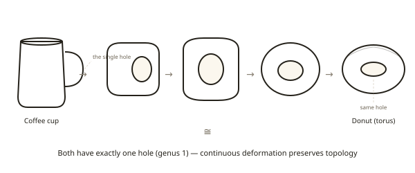

Both objects have exactly one hole — one passage through which you could
thread a string. The cup's hole is the handle; the donut's hole is the
obvious one through the middle. A topologist can continuously deform one
shape into the other by stretching the cup's body until it merges with the
handle, leaving a torus. No cuts, no gluing. This deformation is called a
**homeomorphism**, and it means the two shapes are topologically identical.

### Invariants vs. geometry

Geometry cares about measurements: lengths, angles, curvature. Topology
cares about **invariants** — quantities that do not change under continuous
deformation. If you stretch a rubber band into an oval, the circumference
changes (geometry), but the fact that it is a single closed loop with no
self-crossings does not change (topology).

Every concept in this primer is a topological invariant or is built from
one. The puzzles in the EXKNOTS series exploit the gap between what your
eyes measure (geometry) and what actually matters (topology). A cord that
wraps impressively around a bar may have zero linking number. A twisted strip
that looks more complex may actually have a simpler boundary. The recurring
lesson: ignore the geometry, find the invariant.

### Physical intuition

When you pick up an EXKNOTS puzzle, you are holding a physical theorem. The
metal, wood, and cord embody topological relationships. Your hands perform
continuous deformations — sliding a cord, rotating a ring, threading a loop.
You cannot cut or glue. You are, physically, doing topology.

### Rigorous statement

A **topological space** is a set X together with a collection of subsets
(called open sets) satisfying certain axioms (unions of open sets are open,
finite intersections of open sets are open, the empty set and X are open). A
**homeomorphism** is a continuous bijection whose inverse is also continuous.
Two spaces are **topologically equivalent** (homeomorphic) if a
homeomorphism exists between them. A **topological invariant** is any
property preserved by homeomorphisms.

---

## 2. Curves: Open vs. Closed

### Plain-language definition

A **closed curve** (loop) is a curve whose endpoints meet — it has no free
ends. A rubber band is a closed curve. An **open curve** (arc) has two
distinct endpoints. A piece of string with two loose ends is an open curve.

This distinction is the single most important idea in the EXKNOTS series.
Whether a cord forms a loop or an arc changes what is topologically possible.

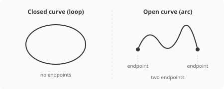

### Why endpoints change everything

A closed loop around a post is trapped. It must be cut or the post must be
broken. But an open arc draped over the same post can always be slid off one
end. The arc's free endpoints provide escape routes that a loop does not
have.

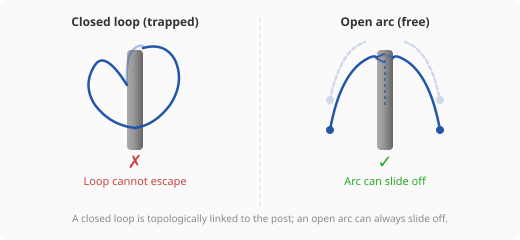

### Which puzzles use this

- **Puzzle 1, The Gatekeeper:** The cord is an arc (both ends fixed to the
  U-bar), not a loop. This is why the ring can be freed — the cord never
  truly encircles the bar. Solvers who assume the cord is a closed loop will
  believe the puzzle is unsolvable.

- **Puzzle 8, The Ferryman's Knot:** The cord wraps around a post in a
  trefoil-like pattern with three crossings. If the cord were a closed loop,
  it would be a genuine trefoil knot — permanently knotted. But the cord is
  an open arc (one end tied to a ring on the post, the other to a hook in
  the base). Each wrap can be individually lifted over the finial because the
  arc's endpoint slides along the post's axis.

### Physical intuition

When you encounter an EXKNOTS puzzle with cord, the very first question to
ask is: "Is this cord a loop or an arc?" Trace the cord from one end to the
other. If the ends meet (or are spliced together), it is a loop and linking
matters. If the ends are separate (tied to different points, or one is
free), it is an arc and you may have more freedom than you think.

### Rigorous statement

An **arc** is the image of a continuous injection from the closed interval
[0, 1] into three-dimensional space. A **loop** (simple closed curve) is the
image of a continuous injection from the circle S^1 into three-dimensional
space. The fundamental difference: arcs are contractible (can be
continuously shrunk to a point), while loops may or may not be contractible
depending on the ambient space. In particular, a loop linked with another
curve cannot be separated by isotopy, but an arc in the complement of a
straight line can always be unlinked.

---

## 3. Linking Number

### Plain-language definition

The **linking number** measures how many times two closed curves wind around
each other. It is an integer: positive, negative, or zero. If the linking
number is zero, the two curves can be pulled apart. If it is nonzero, they
are genuinely linked.

The key insight: crossings have **signs**. A crossing where curve A passes
over curve B from left to right contributes +1. A crossing where A passes
over B from right to left contributes -1. The linking number is the sum of
all crossing signs, divided by 2.

### Worked example: +1 and -1 cancellation

Consider Puzzle 3, The Prisoner's Ring. A cord loop drapes over a crossbar,
creating two visible crossings:

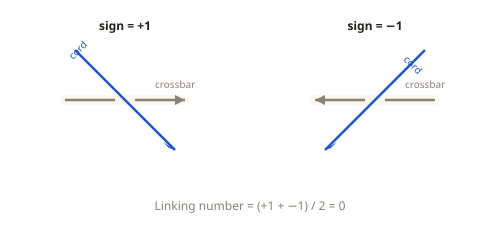

#### Computing a crossing sign

Here is the recipe the figure is applying:

1. **Orient both curves.** Draw a travel arrow on the cord and a travel
   arrow on the crossbar. (Which directions you pick does not matter, as
   long as you keep them fixed while you count.)
2. **At each crossing, look only at the two arrows.** Pivot the
   under-strand's arrow about the crossing point, through the smaller
   angle (always less than 180 degrees), until it points the same way as
   the over-strand's arrow.
3. **Read off the sign.** If that pivot was clockwise, the crossing is
   +1. If it was counterclockwise, the crossing is -1. (This is the
   right-hand rule in disguise — equivalently, rotating the over-strand's
   arrow counterclockwise onto the under-strand's arrow marks the
   crossing +1.)

Apply it to the figure. At the left crossing, the crossbar's arrow points
right and the cord's arrow points down-and-right: aligning the crossbar's
arrow with the cord's arrow is a short **clockwise** pivot, so the sign
is +1. At the right crossing, the crossbar's arrow points left and the
cord's arrow points down-and-left: the pivot is **counterclockwise**, so
the sign is -1. Sum of signs: +1 + (-1) = 0, and half of that is still 0.

The two crossings cancel perfectly. Despite the visual impression that the
cord "wraps around" the crossbar, the linking number is zero. The cord and
crossbar can be separated.

### Why zero means separable

The linking number is a topological invariant. If two closed curves have
linking number zero, there exists a continuous deformation (isotopy) that
pulls them apart without cutting either curve. This is a theorem, not a
guess. It means: if you compute linking number zero, a solution exists,
period. The puzzle becomes finding the physical moves that realize the
mathematical separation.

(A technical caveat: linking number zero is necessary but not sufficient for
unlinking in general — there exist links with linking number zero that
cannot be separated, such as the Whitehead link. However, for the simple
two-component situations in EXKNOTS Puzzles 1 and 3, linking number zero
does guarantee separability.)

### Which puzzles use this

- **Puzzle 1, The Gatekeeper:** The cord's arc has linking number 0 with the
  U-bar because it is an open arc, not a closed loop. The ring slides free
  because there is no genuine linking.

- **Puzzle 3, The Prisoner's Ring:** The cord loop's two crossings with the
  crossbar have opposite signs, yielding linking number 0. The cord can be
  freed from the crossbar by pulling a bight over the crossbar's end,
  after which the ring slides off.

### Physical intuition

When you see a cord wrapped around a bar and your instinct says "it's
locked," stop and count crossings. Assign each crossing a sign. If the signs
cancel to zero, the lock is an illusion — the cord can be freed. The visual
complexity of the wrap is geometric noise; the linking number is the
topological signal.

### Rigorous statement

Given two disjoint oriented closed curves C1 and C2 in R^3, project them
onto a plane to obtain a link diagram. At each crossing where C1 passes over
C2, assign +1 or -1 according to the right-hand rule (the sign of the
crossing in the oriented diagram). The **linking number** lk(C1, C2) is
half the sum of these signed crossings. It is an isotopy invariant of the
link. Equivalently, lk(C1, C2) equals the degree of the Gauss map
(C1 x C2) -> S^2 defined by (x, y) -> (y - x)/|y - x|.

---

## 4. Genus and Handles

### Plain-language definition

The **genus** of a surface is the number of "handles" attached to a sphere.
A handle is a tube connecting two points on the surface — it creates a
hole you can stick your finger through.

- Genus 0: a sphere (no holes, no handles)
- Genus 1: a torus, i.e., a donut (one hole, one handle)
- Genus 2: a two-holed torus (two holes, two handles)

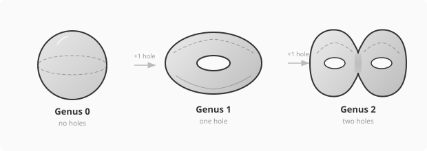

Think of "handles" literally: a coffee mug has one handle, so it has genus
1. A pot with two handles on its sides has genus 2.

### How a hole creates a topological handle

Take a sphere. Cut out two small disks. Connect the two holes with a tube
(a cylinder). You have added one handle, raising the genus by one. The tube
provides a new path through the surface — a loop that goes "into" one hole
and "out" the other. This loop cannot be shrunk to a point on the surface.
Each such irreducible loop corresponds to one generator of the surface's
fundamental group.

### Which puzzles use this

- **Puzzle 2, Shepherd's Yoke:** The wooden paddle with a single hole is a
  genus-1 object (topologically equivalent to a solid torus). The cord loop
  is threaded through the handle. The solution exploits the handle: by
  pushing a bight of cord back through the hole and stretching it over the
  paddle's edge, you pass the paddle's body through the loop — the handle
  becomes the escape route, not the trap.

- **Puzzle 11, Genus Trap:** The acrylic block with two non-intersecting
  through-tunnels is a genus-2 handlebody. Each tunnel is a handle. The
  fundamental group of this handlebody is the free group on two generators,
  F(a, b), where generator **a** corresponds to a path through Tunnel A and
  generator **b** corresponds to a path through Tunnel B. The cord's path
  encodes the word aba^{-1} in this group. (See Section 6 for details.)

### Physical intuition

When you see a rigid object with holes, count the holes. That is the genus.
Each hole is a "handle" that a flexible cord can exploit. Holes are not
traps — they are passages. The topology of the object is determined not by
its overall shape (which is geometry) but by how many independent paths
pass through it.

### Rigorous statement

The **genus** of a closed orientable surface is the number of handles in a
connected sum decomposition with copies of the torus T^2. Equivalently, for
a compact orientable surface S without boundary, the genus g satisfies the
Euler characteristic formula chi(S) = 2 - 2g. A **handlebody** of genus g
is a 3-manifold homeomorphic to a closed regular neighborhood of a wedge of
g circles embedded in R^3. Its boundary is a closed orientable surface of
genus g, and its fundamental group is the free group F_g on g generators.

---

## 5. Orientability and the Mobius Band

### Plain-language definition

A surface is **orientable** if it has two distinct sides — an "inside" and
an "outside," or a "top" and a "bottom." A sphere is orientable: you can
paint the outside blue and the inside red, and the two colors never meet. A
cylinder is orientable: the inside surface and the outside surface are
separate.

A surface is **non-orientable** if it has only one side. The most famous
example is the **Mobius band** (also spelled Mobius strip): take a
rectangular strip of paper, give it a half-twist (180 degrees), and glue the
short edges together.

### One-sided vs. two-sided: the edge count

The edge count tells the story. Compare an ordinary band (cylinder) with a
Mobius band:

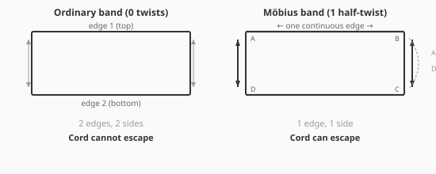

The ordinary band has two separate edges (top and bottom) and two sides
(inner and outer). A cord wedged between the two edges is trapped — it
cannot cross from one edge to the other without leaving the band.

The Mobius band has only one edge. If you start tracing along what appears
to be the "top" edge, the half-twist carries you to what appears to be the
"bottom" edge, and you arrive back at the start after going around twice.
Because there is only one edge, a cord that seems to be trapped between
"two edges" is actually free to slide along the single continuous boundary
until it escapes.

### Strip diagram: how the twist changes the boundary

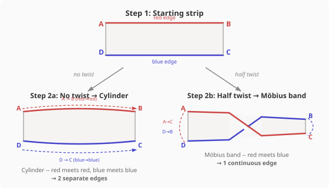

### Which puzzle uses this

- **Puzzle 4, Mobius Snare:** A cord loop with a ring is threaded around a
  leather Mobius band. On an ordinary (untwisted) band, the cord would be
  trapped between the two edges — genuinely inescapable. But the Mobius
  band's single edge means the cord can travel continuously from one "face"
  to the other by following the half-twist. The cord slides along the
  surface, through the twist, and eventually off the single edge. The
  half-twist is the solution, not the complication.

### Physical intuition

When you encounter a strip or band in a puzzle, check for twists. An even
number of half-twists (0, 2, 4, ...) gives you an orientable band with two
edges — a cord between the edges is trapped. An odd number of half-twists
(1, 3, 5, ...) gives you a non-orientable band with one edge — a cord can
reach any point by following the surface, and escape is possible.

The twist looks like it adds complexity. It does the opposite: it removes a
boundary, simplifying the topology.

### Rigorous statement

A surface is **orientable** if it admits a consistent choice of normal
vector at every point — equivalently, if it does not contain a Mobius band
as a subspace. The **Mobius band** is the quotient space [0,1] x [0,1] /
((0, y) ~ (1, 1-y)). It is a compact non-orientable surface with one
boundary component (a single closed curve). The boundary of the Mobius band
is homeomorphic to S^1 and has a specific embedding in R^3 that wraps
twice around the band's core circle. The Euler characteristic of the
Mobius band is 0.

---

## 6. The Fundamental Group

### Plain-language definition

The **fundamental group** of a space captures the different ways you can
walk in a loop starting and ending at the same point. Two loops are
considered "the same" if one can be continuously deformed into the other
(without cutting). The fundamental group collects all the genuinely
different loop classes and gives them a group structure: you can compose
loops (walk one, then the other) and reverse them (walk one backwards).

### Generators and relations

In many spaces, you can describe every possible loop using a small set of
building blocks called **generators**. Each generator is a basic loop that
cannot be simplified. Every other loop can be written as a sequence
(**word**) of generators and their inverses.

For example, in a space with two generators **a** and **b**:
- The word **ab** means "walk loop a, then walk loop b."
- The word **a^{-1}** means "walk loop a backwards."
- The word **aba^{-1}** means "walk a, then b, then a backwards."

### The free group F(a, b)

When the generators obey NO relations (no equations between them other than
the trivial ones like aa^{-1} = identity), the fundamental group is called
a **free group**. The free group on two generators, F(a, b), is the
fundamental group of a genus-2 handlebody (a solid block with two tunnels).

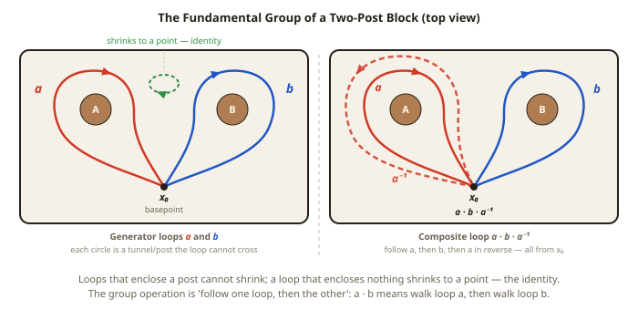

In the figure, generator **a** (red) circles the left post and generator
**b** (blue) circles the right post — the same colors the Genus Trap
diagrams use for Tunnel A and Tunnel B. A loop that encircles neither
post (green) shrinks to a point: it is the identity.

In a free group, the only way a word simplifies is by **cancellation of
adjacent inverses**:
- **aa^{-1} = identity** (walking a forward then backward returns you to
  the start)
- **b^{-1}b = identity** (same idea)
- **aba^{-1}** does NOT simplify — the **b** is "shielded" between **a**
  and **a^{-1}**, preventing any cancellation

This last point is crucial. In an abelian (commutative) group, aba^{-1}
would simplify to b (because you could swap the order). But the free group
is non-abelian: the order of generators matters, and you cannot move **b**
past **a** or **a^{-1}**.

### Worked example: aba^{-1} in the genus-2 handlebody (Puzzle 11)

Puzzle 11, Genus Trap, has an acrylic block with two tunnels:
- Tunnel A (left-to-right) contributes generator **a**
- Tunnel B (front-to-back) contributes generator **b**

The cord's path:
1. Through Tunnel A, left to right = **a**
2. Through Tunnel B, front to back = **b**
3. Through Tunnel A, right to left = **a^{-1}**

The cord encodes the word **aba^{-1}**.

**Why aba^{-1} is not the identity:** In the free group F(a, b), the only
simplification rule is cancellation of adjacent inverse pairs. In
**aba^{-1}**, the adjacent pairs are (a, b) and (b, a^{-1}). Neither pair
consists of a generator and its inverse. The **b** in the middle blocks the
**a** and **a^{-1}** from meeting and canceling. Therefore **aba^{-1}**
cannot be reduced. It is a non-trivial element, meaning the cord is
genuinely tangled with the block's topology.

**Why aa^{-1} = identity:** If you remove the **b** (physically, by
rerouting the cord so it no longer passes through Tunnel B), you are left
with **aa^{-1}**. Here, **a** and **a^{-1}** are adjacent and cancel
immediately, giving the identity element. The cord is now topologically
trivial — it is not tangled with anything, and the rings slide off.

**The solution:** Pull the cord segment that passes through Tunnel B back
out and reroute it through Tunnel A. This transforms the word from
**aba^{-1}** to **a(aa^{-1})a^{-1} = aa^{-1} = identity**. The rings are
free.

### Which puzzles use this

- **Puzzle 7, Devil's Pitchfork:** The configuration space of the ring on
  the three-pronged fork has a non-trivial fundamental group. The solution
  requires the cord to trace a specific non-contractible loop (over the
  center prong) before the ring can be transferred. The loop represents a
  non-trivial element of the fundamental group of the configuration space.

- **Puzzle 11, Genus Trap:** The full worked example above. The free group
  F(a, b) is the fundamental group of the genus-2 handlebody, and the
  cord's path is a word in this group.

### Physical intuition

Think of the fundamental group as an accounting system for tangles. Each
tunnel or handle you thread through is a "letter" in a word. Threading
through and then back (same tunnel, opposite direction) cancels the letter.
Threading through different tunnels stacks up letters that cannot cancel
with each other. To free a cord, you must manipulate it until the word
reduces to nothing — the identity element.

When you are stuck on Puzzle 11, write down the word. Every move you make
with the cord changes the word. If the word is getting longer, you are going
the wrong direction. If adjacent inverses appear, you are making progress.

### Rigorous statement

The **fundamental group** pi_1(X, x_0) of a topological space X at a
basepoint x_0 is the set of homotopy classes of loops based at x_0,
equipped with the operation of concatenation. A **free group** F(S) on a
generating set S is a group where every element has a unique reduced
representation as a finite word in S and S^{-1} (letters and their formal
inverses), with the only relation being cancellation of adjacent inverse
pairs. For a genus-g handlebody H_g, pi_1(H_g) is isomorphic to F_g, the
free group on g generators. This is because H_g deformation-retracts onto a
wedge of g circles.

---

## 7. Borromean and Brunnian Links

### Plain-language definition

**Borromean rings** are three closed curves that are mutually linked — the
three of them hold together — but no two of them are linked to each other.
Remove any one ring, and the other two fall apart.

This is deeply counterintuitive. We expect linking to be a pairwise
relationship: A is linked to B, B is linked to C, and that is why the
three hold together. Borromean rings violate this expectation. The linking
is a purely three-body phenomenon that cannot be reduced to pairwise
interactions.

### Classic Borromean rings diagram

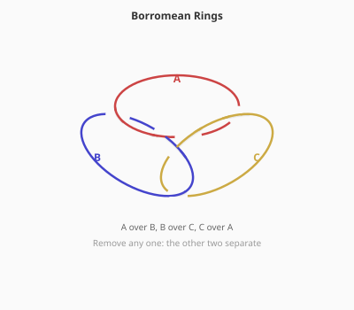

In the diagram, the three rings are interlocked in a cyclic over-under
pattern:
- Ring A passes over Ring B
- Ring B passes over Ring C
- Ring C passes over Ring A

No two rings are linked (linking number = 0 for every pair), but the three
together cannot be pulled apart.

### Brunnian links: the general case

A **Brunnian link** is a link of n components where removing any single
component makes the remaining n-1 components completely unlinked. Borromean
rings are the simplest Brunnian link (n = 3). Brunnian links exist for any
n >= 3.

### Milnor's invariant: higher-order linking

If linking number (a pairwise invariant) is zero for every pair, what
detects the Borromean property? The answer is **Milnor's invariant**, a
higher-order linking invariant. While the ordinary linking number counts
how two curves wind around each other, Milnor's invariant captures how
three (or more) curves interact collectively.

For Borromean rings:
- Pairwise linking numbers: lk(A,B) = lk(B,C) = lk(A,C) = 0
- Milnor's triple linking number: mu(A,B,C) = +/-1 (nonzero)

The nonzero Milnor invariant is the mathematical certificate that the three
rings are collectively linked despite being pairwise unlinked.

### Which puzzle uses this

- **Puzzle 6, Trinity Lock:** Three identical steel ovals must be assembled
  into the Borromean configuration. The puzzle is an assembly challenge: the
  solver must weave all three simultaneously because no two are ever linked
  at any intermediate stage. The natural instinct — "connect two first,
  then add the third" — fails because there is no pairwise connection to
  build on. The Borromean property forces a fundamentally non-incremental
  approach.

### Physical intuition

Hold three rubber bands. Try to arrange them so they hold together as a
cluster, but any one you remove lets the other two fall apart. You will
discover that you cannot assemble them incrementally — you must weave all
three at once, maintaining the cyclic over-under pattern throughout. This
feeling of "I cannot build this step by step" is your hands discovering
that the Borromean property is irreducibly collective.

### Rigorous statement

A **Borromean link** is a 3-component link L = L_1 ∪ L_2 ∪ L_3 in S^3
such that each 2-component sublink is the unlink, but L itself is not the
unlink. More generally, a **Brunnian link** of n components is an
n-component link such that every proper sublink is trivial. The non-
triviality of Borromean rings is detected by **Milnor's mu-bar invariant**
mu_bar(1,2,3), a higher-order invariant derived from the lower central
series of the link group. For the standard Borromean rings,
|mu_bar(1,2,3)| = 1.

---

## 8. Configuration Spaces

### Plain-language definition

A **configuration space** is the space of all possible states of a system.
Each point in the configuration space represents one specific arrangement
of all the parts. As you manipulate a puzzle, the state traces a path
through the configuration space.

A solution to a puzzle is a path in the configuration space from the
starting state to the goal state. If no such path exists, the puzzle is
unsolvable. If the path exists but must navigate around obstacles (holes,
barriers), the configuration space has non-trivial topology.

### Concrete example

Consider a ring on a prong. The ring's state is determined by its height on
the prong and its rotation. The configuration space might be a simple line
segment (just height) — or it might be more complex if the ring is
connected to a cord that constrains its movement. Barriers in the
configuration space (ball-stops, cord length limits) create holes and walls
that the state-path must navigate around.

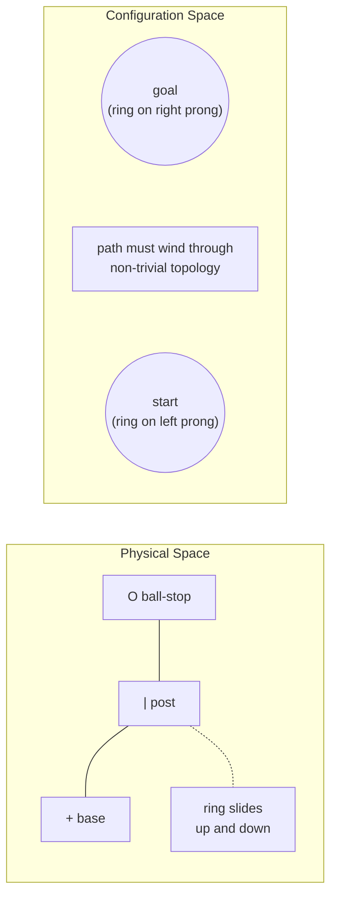

### Non-trivial topology of the state space

The key idea: the configuration space itself can have holes, handles, and
non-contractible loops — the very same topological features described
elsewhere in this primer. When the configuration space has a non-trivial
fundamental group, certain sequences of moves (loops in the configuration
space) cannot be contracted to a point. This means some rearrangements
require the system to pass through specific intermediate states — there are
no shortcuts.

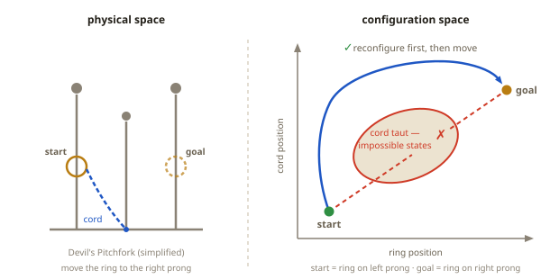

### Which puzzle uses this

- **Puzzle 7, Devil's Pitchfork:** A ring sits on the left prong of a
  three-pronged fork. A cord connects it to the base of the center prong.
  The goal is to move the ring to the right prong. The configuration space
  of this system has a non-trivial fundamental group because of how the
  cord, the ring, and the three prongs interact. The solution requires
  first reconfiguring the cord (looping it over the shorter center prong)
  to change the topology of the accessible configuration space, and only
  then transferring the ring. The solver must change the constraints before
  moving the constrained object — a meta-level insight that arises directly
  from the configuration space's topology.

### Physical intuition

When a puzzle feels like it "should" be solvable but every direct approach
fails, you may be encountering non-trivial configuration-space topology.
The accessible states are not simply connected — there are holes in the
space of possibilities. You must navigate around these holes, which
sometimes means making moves that feel like going backward (they are
actually navigating around an obstacle in the configuration space).

### Rigorous statement

The **configuration space** C(X, n) of n particles on a space X is the
subspace of X^n obtained by requiring all particles to be distinct (or, in
constrained settings, by imposing mechanical constraints). More generally,
for a mechanical system with parts P_1, ..., P_k subject to constraints,
the configuration space is the submanifold of the product of all individual
state spaces satisfying all constraint equations. The topology of this
space (in particular, its fundamental group and higher homotopy groups)
governs which state transitions are possible and which sequences of moves
are topologically necessary.

---

## 9. Gray Codes and Recursive Complexity

### Plain-language definition

A **Gray code** is a sequence of binary numbers in which consecutive entries
differ by exactly one bit. The standard binary sequence 000, 001, 010, 011,
... has the problem that some consecutive entries differ by multiple bits
(e.g., 011 to 100 changes all three bits). A Gray code avoids this: each
step flips exactly one bit.

| Step | Standard Binary | Bits Changed | Gray Code | Bits Changed |
|------|----------------|-------------|-----------|-------------|
| 0 | 000 | — | 000 | — |
| 1 | 001 | 1 | 001 | 1 |
| 2 | 010 | **2** | 011 | 1 |
| 3 | 011 | 1 | 010 | 1 |
| 4 | 100 | **3** | 110 | 1 |
| 5 | 101 | 1 | 111 | 1 |
| 6 | 110 | **2** | 101 | 1 |
| 7 | 111 | 1 | 100 | 1 |

Standard binary: some consecutive pairs differ by **multiple** bits. Gray code: every consecutive pair differs by **exactly one** bit.

### Why the sequence is optimal

Gray codes are not just a convenient ordering — they are the unique minimal
solution to certain sequential puzzles. The puzzle constraints determine
which bit can be flipped at each step, and these constraints force the
Gray code ordering. There is no shorter sequence. Any attempt to take a
"shortcut" (flip multiple bits at once, or flip a different bit out of
order) violates the physical constraints.

### Binary recursion

The Gray code has a beautiful recursive structure. To construct the n-bit
Gray code from the (n-1)-bit Gray code:
1. Take the (n-1)-bit sequence
2. Write it forward, prefixing each entry with 0
3. Write it backward, prefixing each entry with 1
4. Concatenate

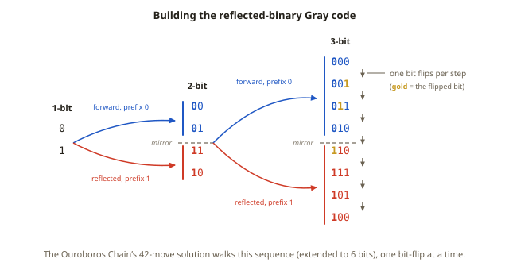

This recursion mirrors the structure of the Chinese Rings puzzle: to remove
ring k, you must first set up a specific configuration of rings k+1 through
n, which requires the same kind of recursive setup.

### Which puzzle uses this

- **Puzzle 10, Ouroboros Chain:** Six cord loops on posts, each threaded
  through its neighbor, with a shuttle bar through all of them. This is a
  reimagining of the Baguenaudier (Chinese Rings). Each loop is either ON
  (1) or OFF (0) the shuttle bar, giving a 6-bit state. The rules for which
  loop can be toggled at each step mirror the Gray code constraints exactly.
  The minimum solution requires 42 physical manipulations. No shortcuts
  exist — the recursive structure of the Gray code is the irreducible
  minimum.

### Physical intuition

The Ouroboros Chain teaches patience and trust. Each move is simple (toggle
one loop on or off the shuttle bar), but the sequence is long and
counterintuitive — you frequently "undo" progress by replacing loops you
already removed. This feels wrong but is mathematically necessary: the
recursive structure requires setting up configurations that look like
backward steps but are actually preconditions for the next forward step.

If you are losing track, write down the state as a 6-bit binary number
after each move. The pattern will become visible: you are walking through
the reflected binary (Gray) code, one bit-flip at a time.

### No shortcuts in topology

The Ouroboros Chain embodies a deep principle: some topological puzzles have
**irreducible sequential complexity**. There is no "aha!" moment, no single
clever trick. The solution is an algorithm that must be followed completely.
The topology of the state space (the Gray code graph) determines the
minimum number of moves, and no amount of cleverness can reduce it.

### Rigorous statement

An n-bit **Gray code** is a Hamiltonian path on the n-dimensional
hypercube graph Q_n (whose vertices are the 2^n binary strings of length n,
with edges between strings differing in exactly one bit). The **reflected
binary Gray code** (RBGC) is a specific recursive construction. The
**Baguenaudier** (Chinese Rings) puzzle with n rings has a state graph
isomorphic to a path graph whose vertex sequence is the RBGC. The minimum
number of moves to reach the goal state (all rings off) from the initial
state (all rings on) is (2^n + 1)/3 for n odd and (2^n - 1)/3 for n even
(counting state transitions; physical manipulations may be higher).

---

## 10. Fiber Bundles and the Hopf Fibration

### Plain-language definition

Imagine a space made up of a collection of identical "fibers" (think
threads), all organized by a "base space." Each point in the base space has
one fiber hanging over it. If you could separate the fibers cleanly — like
untwisting a cable into its individual strands — the total space would just
be the product of the base and the fiber. But in a non-trivial **fiber
bundle**, the fibers are twisted together in a way that makes global
separation impossible.

### S^1, S^2, S^3: accessible definitions

- **S^1** (the 1-sphere): the **circle**. The set of all points at
  distance 1 from the origin in the plane (2D). It is a one-dimensional
  curve that closes on itself.

- **S^2** (the 2-sphere): the **ordinary sphere** — the surface of a ball.
  The set of all points at distance 1 from the origin in 3D space. It is a
  two-dimensional surface. (Note: we mean only the surface, not the solid
  ball inside.)

- **S^3** (the 3-sphere): a "sphere in 4D." The set of all points at
  distance 1 from the origin in 4-dimensional space. We cannot visualize
  S^3 directly (it lives in 4D), but we can reason about it
  mathematically. It is a three-dimensional manifold — locally it looks
  like ordinary 3D space, but globally it wraps around and closes on
  itself, just as S^2 (a 2D surface) closes on itself in 3D.

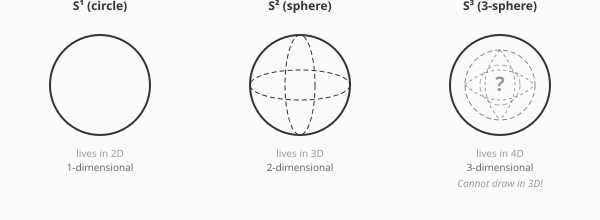

### The Hopf map

The **Hopf fibration** is a specific map h: S^3 -> S^2 that sends each
point of the 3-sphere to a point on the 2-sphere. The key property: the
preimage of each point on S^2 is a circle (S^1) inside S^3. These circles
are the "fibers."

So the Hopf fibration decomposes S^3 into a family of circles, one for
each point on S^2. These circles are not arbitrary — they are linked in a
specific, beautiful way:
- Any two distinct fibers are linked (linking number 1)
- No fiber can be continuously deformed to a point in S^3 minus any other
  fiber
- The fibers twist around each other as you move across S^2

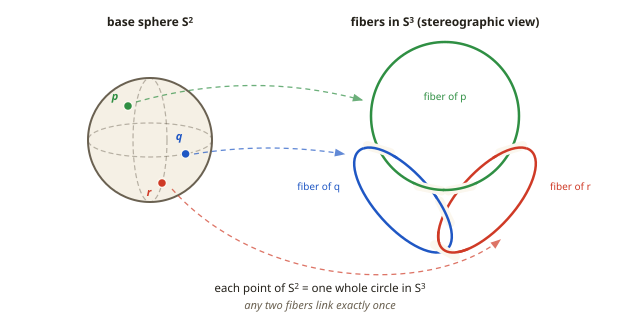

This structure makes S^3 a non-trivial fiber bundle: S^1 fibers over S^2
base, but the total space is NOT the simple product S^2 x S^1 (which would
be a different space entirely). The twist is essential.

### Why fibers twist: the 2:1 rotation

The Hopf fibration arises naturally from the relationship between rotations
in 3D and points on S^3. (The group of unit quaternions, which represents
3D rotations, is exactly S^3.) Moving along a Hopf fiber corresponds to
rotating simultaneously about two orthogonal axes in a 2:1 ratio — one
full rotation about one axis for every half rotation about the other.

This coupled rotation cannot be decomposed into sequential single-axis
rotations. It is an irreducibly two-axis motion.

### The belt trick / plate trick: an accessible analogy

Hold a belt by one end, with the other end fixed. Give the belt a full
twist (360 degrees). The belt is twisted and cannot be untwisted by any
manipulation that keeps the ends fixed. Now give it another full twist in
the same direction (720 degrees total). Remarkably, you can now untwist the
belt by passing it around one end — the double twist is equivalent to no
twist at all.


The belt trick is a physical demonstration that the space of 3D rotations
is not simply connected: pi_1(SO(3)) = Z/2, realized by the double cover
SU(2) -> SO(3). A 360-degree rotation traces a loop in SO(3) that cannot
be contracted, but traversing it twice (720 degrees) gives a contractible
loop. The connection to the Hopf fibration is close but not identical:
SU(2) is the same 3-sphere S^3 the Hopf fibration lives on, but the
fibration (S^3 -> S^2, with circle fibers) and the double cover
(S^3 -> SO(3), with two-point fibers) are different maps — the belt trick
illustrates the double cover, and serves as an analogy for the puzzle's
coupled motion rather than an instance of the Hopf map.

The **plate trick** is similar: hold a plate flat on your palm. Rotate it
360 degrees (keeping it level) by twisting your arm — your arm is now
twisted. Rotate it another 360 degrees in the same direction — and by
looping your arm around, you can untwist back to the start. Filipino
waiters use this daily.

### Which puzzle uses this

- **Puzzle 12, The Hopf Paradox:** A ring is trapped inside a cage made of
  two orthogonal great-circle hoops. The ring cannot be extracted by any
  sequence of single-axis rotations. At the pole (where the two hoops
  intersect), the ring must execute a corkscrew motion: simultaneous
  rotation and translation in a fixed ratio, corresponding to motion along
  a Hopf fiber. The solver must physically discover the coupled rotation —
  a genuinely new motor skill. The puzzle is unique in the series because
  understanding the solution conceptually is not sufficient; the
  coupled-rotation motor skill must also be developed.

### Physical intuition

When you hold the cage from Puzzle 12 and try to extract the ring at the
pole junction, your hands will naturally attempt sequential moves: rotate
the ring, then push it forward, then rotate again. This fails. The junction
geometry requires both motions simultaneously. The moment you find the
corkscrew — the smooth spiral that threads the ring between the two hoop
wires — you have physically experienced a Hopf fiber. It feels like
threading a nut onto a bolt: the rotation and the forward motion are
coupled and cannot happen separately.

### Rigorous statement

A **fiber bundle** is a structure (E, B, F, pi) where E is the total
space, B the base space, F the fiber, and pi: E -> B a continuous
surjection such that each point b in B has a neighborhood U with
pi^{-1}(U) homeomorphic to U x F (local triviality). The bundle is
**trivial** if the total space is globally homeomorphic to B x F; otherwise
it is **non-trivial**. The **Hopf fibration** is the fiber bundle
h: S^3 -> S^2 with fiber S^1, defined in complex coordinates by
h(z_1, z_2) = [z_1 : z_2] (viewing S^2 as CP^1). It is non-trivial: S^3
is not homeomorphic to S^2 x S^1. The Hopf fibration is classified by the
generator of pi_3(S^2) = Z, discovered by Heinz Hopf in 1931.

---

## 11. Knot Theory Basics

### Plain-language definition

**Knot theory** studies closed curves in three-dimensional space —
specifically, how they are tangled. A **knot** is a single closed curve
(loop) embedded in 3D. A **link** is a collection of two or more closed
curves. Two knots (or links) are considered "the same" if one can be
continuously deformed into the other without cutting.

### Knots vs. links

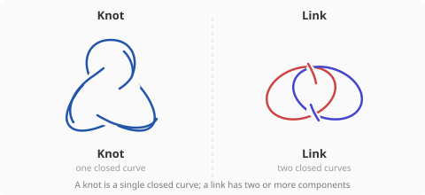

### The unknot

The **unknot** is the simplest knot: a closed curve with no crossings — a
plain circle. Any knot that can be deformed into the unknot is called
"trivially knotted" or just "unknotted."

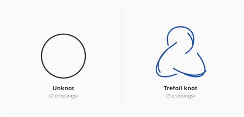

### Crossing number

The **crossing number** of a knot is the minimum number of crossings in
any diagram of the knot. The unknot has crossing number 0. The trefoil has
crossing number 3. The figure-eight knot has crossing number 4.

### Reidemeister moves

Any deformation of a knot in 3D can be represented by a sequence of three
local diagram changes called **Reidemeister moves**:

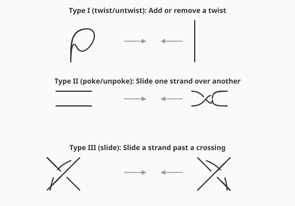

If two knot diagrams represent the same knot, there is a finite sequence of
Reidemeister moves transforming one diagram into the other. These three
moves are **complete**: they capture all possible continuous deformations.

### Open knots vs. closed knots (the critical distinction)

Classical knot theory studies **closed** curves. An open arc (with two free
endpoints) is never really "knotted" in the classical sense — it can always
be unknotted by sliding the tangles off the free ends. This is why the
distinction between open and closed curves (Section 2) is so important for
the EXKNOTS puzzles.

However, an open arc **with constrained endpoints** (e.g., one end tied to
a post, the other to a hook) behaves differently from a free arc. The
constraints limit which Reidemeister moves are available. In Puzzle 8, each
wrap corresponds to a Type I Reidemeister move (twist removal), and the
finial provides the mechanism for executing it.

### Which puzzles use this

- **Puzzle 1, The Gatekeeper:** The cord is an unknotted open arc. The
  solver must recognize that despite the visual wrapping, the cord has
  crossing number 0 with respect to the U-bar.

- **Puzzle 3, The Prisoner's Ring:** The cord loop and crossbar form a
  two-component link. The linking number (computed from crossing signs) is
  zero, so the link is trivial — the components can be separated.

- **Puzzle 8, The Ferryman's Knot:** The cord wraps around a post in a
  trefoil-like pattern (3 crossings). If the cord were a closed loop, this
  would be a genuine trefoil (crossing number 3, not unknottable). But the
  cord is an open arc on a fixed axis, and each crossing can be removed by
  a Type I Reidemeister move — lifting the cord loop over the finial. Three
  Reidemeister moves, and the cord hangs free.

### Physical intuition

When you look at a tangled cord in an EXKNOTS puzzle, draw the knot
diagram: project the 3D arrangement onto a flat surface, marking each
crossing as "over" or "under." Then check:
1. Is the curve closed or open?
2. If closed, what is the linking number with other components?
3. If open, can Reidemeister moves (executed via the puzzle's physical
   mechanisms) simplify the diagram?

Knot diagrams are tools, not abstract art. Draw them on paper. Mark the
crossings. Count the signs. The diagram will tell you whether the puzzle is
solvable and often suggest how.

### Rigorous statement

A **knot** is an embedding of S^1 into S^3 (or R^3), considered up to
ambient isotopy. A **link** is an embedding of a disjoint union of copies
of S^1. Two knots are **equivalent** if there is an ambient isotopy of S^3
carrying one to the other. **Reidemeister's theorem** (1927) states that
two knot diagrams represent equivalent knots if and only if they are related
by a finite sequence of Reidemeister moves (types I, II, III) and planar
isotopy. The **crossing number** c(K) of a knot K is the minimum number of
crossings over all diagrams of K. The **unknot** U satisfies c(U) = 0. The
**trefoil** T satisfies c(T) = 3 and is the unique prime knot with this
crossing number.

---

## 12. Chirality and Handedness

### Plain-language definition

A knot is **chiral** if it is not equivalent to its mirror image. The simplest example: the trefoil knot comes in two versions — left-handed and right-handed — that are topologically distinct. No continuous deformation in 3D space can convert one into the other.

A knot that IS equivalent to its mirror image is called **amphichiral** (or achiral). The figure-eight knot is amphichiral — its mirror image can be deformed back to the original.

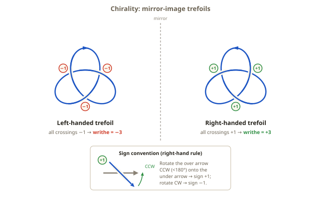

### How to detect chirality

At each crossing, follow the knot in a consistent direction. If the overpasses spiral clockwise, the trefoil is right-handed. If counterclockwise, left-handed. More formally, chirality can be detected by knot polynomials: the Jones polynomial of a chiral knot differs from the Jones polynomial of its mirror image.

### Worked example: reading handedness crossing by crossing

The crossing-sign rule from Section 3 turns "which hand is this?" into
arithmetic. Orient the knot: pick a starting point and draw a travel
arrow along the curve. Then visit each of the trefoil's three crossings
and apply the sign rule — pivot the under-strand's arrow through the
smaller angle onto the over-strand's arrow; clockwise means +1,
counterclockwise means -1 (equivalently, as the figure's inset shows,
over-strand arrow rotated counterclockwise onto the under-strand arrow
means +1).

On the right-handed trefoil every crossing comes out +1: the read-off is
+ + +, and the sum of signs — called the **writhe** of the diagram — is
+3. Reflect the diagram in a mirror and every over-strand becomes an
under-strand: each sign flips, the read-off is - - -, and the writhe is
-3. Reversing the travel arrow does NOT change the answer: both arrows
at a crossing reverse together, and the pivot direction survives. So the
read-off is independent of the orientation you happened to choose.

One honest caveat: writhe is a property of the *diagram*, not of the
knot — a Type I Reidemeister move adds a kink and changes the writhe by
1. But for *reduced alternating* diagrams like these minimal 3-crossing
trefoil diagrams, the writhe is the same in every such diagram (one of
the Tait conjectures, proved in the 1980s). So +3 versus -3 is a
genuine, checkable difference between the two trefoils' standard
diagrams — it is the number your hands compute when you trace a wire
frame in Puzzle 5.

### Detection by the Jones polynomial

The **Jones polynomial** V_K(t) converts mirror reflection into an
algebraic substitution: the mirror image m(K) satisfies V_{m(K)}(t) =
V_K(t^{-1}). So if V_K is not symmetric under swapping t and t^{-1},
the knot cannot equal its mirror image. For the right-handed trefoil,
V(t) = -t^4 + t^3 + t; substituting t -> t^{-1} gives
-t^{-4} + t^{-3} + t^{-1}, the left-handed trefoil's polynomial. The
two are different, so the trefoil is chiral — a three-line proof of a
fact that resisted proof until Max Dehn's 1914 argument. The
figure-eight knot's polynomial, V(t) = t^2 - t + 1 - t^{-1} + t^{-2},
is palindromic (unchanged by t -> t^{-1}), exactly as an amphichiral
knot's must be.

### Which puzzles use this

- **Puzzle 5, The Mirror Gate:** Two trefoil frames — one left-handed, one right-handed — must be matched to mirror-image recesses. The solver must identify the handedness of each trefoil by examining its crossing pattern.

### Physical intuition

Hold both trefoils side by side. They look identical until you try to seat one in the other's recess — it simply does not fit. The physical mismatch at the crossing points IS the chirality. Your hands can feel the difference that your eyes initially miss. This is exactly the situation in chemistry, where chiral molecules (enantiomers) have identical properties in isolation but interact differently with other chiral structures.

### Rigorous statement

A knot K in S^3 is **chiral** if there is no ambient isotopy carrying K
to its mirror image m(K), where m is any orientation-reversing
homeomorphism of S^3 — concretely, reflection through a plane,
(x, y, z) -> (x, y, -z). K is **amphichiral** if K and m(K) are
ambient-isotopic. The trefoil is chiral (Dehn, 1914); the figure-eight
knot is amphichiral — an explicit sequence of Reidemeister moves carries
its mirror diagram back to the original. Mirror reflection reverses the
sign of every crossing, so it negates the writhe of a diagram; by the
Tait writhe theorem this already distinguishes the two trefoils'
reduced alternating diagrams. In general, chirality is certified by the
Jones polynomial via V_{m(K)}(t) = V_K(t^{-1}): asymmetry of V_K under
t -> t^{-1} implies chirality (the converse fails — some chiral knots
have symmetric Jones polynomials, so a symmetric V proves nothing).

---

## 13. Braid Groups

### Plain-language definition

A **braid** on n strands is a set of n non-intersecting curves that may cross over and under each other. The **braid group** B_n is the set of all such braids, with "stacking" (composition) as the group operation.

For three strands (B_3), the two generators are:
- **sigma_1**: strand 1 crosses over strand 2
- **sigma_2**: strand 2 crosses over strand 3

These generators do NOT commute: sigma_1 * sigma_2 ≠ sigma_2 * sigma_1.

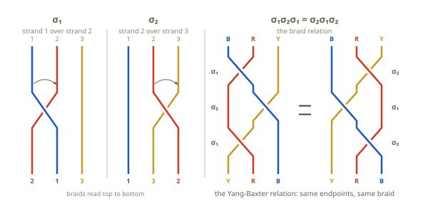

### The Artin presentation

Emil Artin showed in 1925 that B_n is completely described by n-1
generators and just two families of relations. The generators are
sigma_1, ..., sigma_{n-1}, where sigma_i crosses strand i over strand
i+1. The relations:

- **Far commutation:** sigma_i * sigma_j = sigma_j * sigma_i whenever
  |i - j| >= 2. Swaps involving disjoint pairs of strands do not
  interfere — swapping strands 1-2 and swapping strands 3-4 can happen
  in either order.
- **Braid relation:** sigma_i * sigma_{i+1} * sigma_i =
  sigma_{i+1} * sigma_i * sigma_{i+1}. Adjacent swaps that share a
  strand obey exactly one exchange law — the Yang-Baxter relation
  discussed next.

Everything true about braids follows from these two rules. Notice what
is *missing*: there is no relation sigma_i * sigma_i = identity.
Swapping the same pair of strands twice does not undo the swap — it
adds a full twist to the cords. This is precisely where B_n parts ways
with the group of mere permutations, and it is why B_n is an infinite
group.

### The Yang-Baxter relation

The key algebraic relation in B_3 is: **sigma_1 * sigma_2 * sigma_1 = sigma_2 * sigma_1 * sigma_2**. This is the braid relation (Yang-Baxter equation). It says that two specific three-step sequences of swaps produce the same braid.

### Worked example: sigma_2-then-sigma_1 vs sigma_1-then-sigma_2

Puzzle 13, The Braid Cage, starts with rings Blue - Yellow - Red on
posts 1-2-3 and asks for Red - Blue - Yellow. Compare the two shortest
candidate words, applying the left factor first (sigma_1 swaps the
rings on posts 1 and 2; sigma_2 swaps posts 2 and 3):

| Word | Start | After first swap | After second swap |
|------|-------|------------------|-------------------|
| sigma_2 then sigma_1 | Blue · Yellow · Red | Blue · Red · Yellow | **Red · Blue · Yellow** ✓ |
| sigma_1 then sigma_2 | Blue · Yellow · Red | Yellow · Blue · Red | Yellow · Red · Blue ✗ |

The same two generators, applied in opposite orders, land the rings on
different posts. This is non-commutativity at the coarsest possible
level: the two words do not even agree as permutations, let alone as
braids.

### From braids to permutations

Forgetting which strand crossed *over* which turns a braid into a plain
permutation of the n positions. This forgetting map B_n -> S_n is a
surjective group homomorphism: every permutation is achievable by some
braid. Its kernel — the braids that permute nothing, yet are not
trivial — is the **pure braid group** P_n. A non-trivial pure braid is
exactly the Braid Cage's characteristic failure mode: every ring back
on its target post, but the cords wound around each other. The rings
see only the permutation; the cords remember the whole braid.

### From braids to knots

Joining the top of each strand to the bottom of the same position
closes a braid into a knot or link. Torus knots arise this way: T(p, q)
is the closure of the word (sigma_1 * sigma_2 * ... * sigma_{p-1})^q.
The trefoil T(2, 3) is the closure of sigma_1^3 in B_2 — three
identical swaps of two strands, sealed shut. Section 14 picks up this
thread.

### Which puzzles use this

- **Puzzle 13, The Braid Cage:** Three rings on posts connected by cords. The cords record the history of swaps. Only braid-relation sequences leave the cords untangled. The solver feels non-commutativity directly — wrong swap orders tangle the cords.

### Physical intuition

When you swap two rings by lifting one over a post finial, the connecting cord records the swap as a braid generator. Swapping in a different order produces a different braid — and different braids leave the cords in different states (tangled vs. untangled). The order of operations has physical consequences.

### Rigorous statement

The **braid group** B_n is the group with the Artin presentation:
generators sigma_1, ..., sigma_{n-1}, subject to sigma_i sigma_j =
sigma_j sigma_i for |i - j| >= 2 and sigma_i sigma_{i+1} sigma_i =
sigma_{i+1} sigma_i sigma_{i+1} for 1 <= i <= n-2. Equivalently, B_n is
the fundamental group of the configuration space of n unordered points
in the plane (Section 8 again: a braid is a loop of point
configurations, traced out in time). Imposing the extra relations
sigma_i^2 = 1 collapses B_n onto the symmetric group S_n; the quotient
map B_n -> S_n sends each braid to its endpoint permutation, and its
kernel is the pure braid group P_n, giving the short exact sequence
1 -> P_n -> B_n -> S_n -> 1. By Alexander's theorem (1923), every knot
and link in R^3 is the closure of some braid.

---

## 14. Torus Knots

### Plain-language definition

A **(p,q) torus knot** lies on the surface of a torus, winding p times around the central axis (the long way) and q times around the tube — each tube wrap passes through the hole. The curve closes up into a single connected knot when gcd(p,q) = 1.

Key examples:
- (1, q) for any q → unknot
- (2, 2) → two-component link
- (2, 3) → trefoil (simplest torus knot, 3 crossings)
- (2, 5) → Solomon's seal knot (5 crossings)
- (3, 4) → torus knot with 8 crossings

The rule: (p,q) with gcd(p,q) = 1 and p,q ≥ 2 produces a genuine knot.

### Parametrization on the standard torus

Put the torus in standard position: a tube of radius r whose center
circle has radius R. The (p,q) torus knot is traced by a point that
circles the hole p times while circling the tube q times, both at
constant rates:

x(t) = (R + r cos qt) cos pt, y(t) = (R + r cos qt) sin pt,
z(t) = r sin qt, for t from 0 to 2 pi.

The curve lives entirely on the torus surface — it never tunnels
through the solid part. A surprising symmetry: **T(p,q) and T(q,p) are
the same knot.** The (2,3) curve and the (3,2) curve look different on
the torus (their standard flat projections show 3 and 4 crossings
respectively), yet an isotopy of the ambient space — turning the torus
inside out through its own hole, so that hole-circles and tube-circles
trade roles — carries one onto the other. Both are the trefoil.

### Worked example: tracing the (2,3) winding

Follow the cord of Puzzle 14, The Torus Winder, condensed to its
topological skeleton:

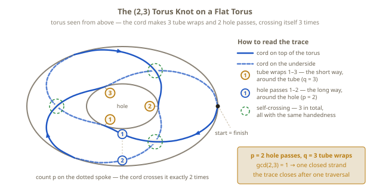

1. Circle the central axis once, the long way around (first of p = 2),
   wrapping around the tube as you go — each tube wrap passes through
   the hole.
2. Circle the axis again (second of p = 2), still wrapping the tube.
3. Complete the third tube wrap (q = 3) — and the cord arrives back at
   its starting point, pointing the way it began.

The cord closes into a **single** curve because gcd(2,3) = 1: since 2
and 3 share no common factor, the strand cannot return to its start
until it has spent all of its winding in both directions at once. Wind
(2,2) instead and the curve closes early, after half the journey,
leaving two separate loops — a link, and the ring escapes between them.
Now count the crossings of the completed (2,3) winding: exactly 3, all
of the same handedness. That matches the general formula below: the
crossing number of T(p,q) is min(p(q-1), q(p-1)) = min(4, 3) = 3. The
trefoil again — built this time by winding rather than knotting.

### Two more numbers the winding determines

The pair (p,q) does not just decide *whether* the curve is knotted; it
determines the knot's key invariants by closed formulas:

- **Genus** (Section 16): (p-1)(q-1)/2. For (2,3): 1.
- **Crossing number**: min(p(q-1), q(p-1)). For (2,3): 3.
- **Unknotting number** (Section 17): (p-1)(q-1)/2 — the same number as
  the genus. For (2,3): 1.

### Which puzzles use this

- **Puzzle 14, The Torus Winder:** A cord must be wound around a torus following guide notches to create the (2,3) torus knot. Most windings fail to trap a sliding ring — only the correct (p,q) pair produces a genuine knot.

- **Puzzle 17, The Satellite Trap:** The internal tunnel of the torus shell follows a (2,3) torus knot path, forming the companion knot of the satellite structure.

### Physical intuition

Wind a cord around a donut-shaped ring. If you go around the central axis twice (the long way) while wrapping around the tube three times — each tube wrap passing through the hole — the cord crosses itself exactly three times and cannot be unwound without cutting. Change the numbers and the knot either simplifies to a circle or splits into multiple loops. The relationship between the two winding numbers is what determines knottedness.

### Rigorous statement

For integers p, q, the **torus knot/link** T(p,q) is the image of the
curve t -> ((R + r cos qt) cos pt, (R + r cos qt) sin pt, r sin qt) on
the standard torus in R^3 — equivalently, the image of
t -> (e^{ipt}, e^{iqt}) on the Clifford torus in S^3. T(p,q) is
ambient-isotopic to T(q,p). If gcd(p,q) = d > 1 the curve closes into a
link of d parallel copies of T(p/d, q/d) rather than a knot; if
gcd(p,q) = 1 it is a knot, and it is the unknot exactly when |p| <= 1
or |q| <= 1. For coprime p, q >= 2: the genus is g(T(p,q)) =
(p-1)(q-1)/2, realized by Seifert's algorithm on the standard diagram
(Section 16); the crossing number is c(T(p,q)) = min(p(q-1), q(p-1))
(Murasugi, 1991); and the unknotting number is u(T(p,q)) =
(p-1)(q-1)/2 — the Milnor conjecture, proved by Kronheimer and Mrowka
in 1993 (Section 17). T(p,q) is the closure of the braid word
(sigma_1 sigma_2 ... sigma_{p-1})^q in B_p (Section 13).

---

## 15. Knot Coloring and Tricolorability

### Plain-language definition

A **Fox 3-coloring** of a knot diagram assigns one of three colors to each arc (strand between consecutive undercrossings) such that at every crossing, the three meeting arcs are either all the same color or all different colors.

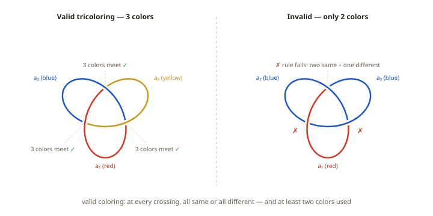

A knot is **tricolorable** if it admits a non-trivial Fox 3-coloring (one using more than one color). Tricolorability is a topological invariant — it is preserved under Reidemeister moves.

Key facts:
- The unknot is NOT tricolorable
- The trefoil IS tricolorable
- The figure-eight IS NOT tricolorable
- Since the unknot and trefoil differ in tricolorability, they are distinct knots

### Worked example: checking the trefoil crossing by crossing

Label the trefoil's three arcs a1, a2, a3 — an arc runs from one
undercrossing to the next — and color them red, blue, and yellow, as in
the left panel of the figure. In the standard diagram, each crossing
brings together all three arcs: one passes over, and the other two are
the under-strand's incoming and outgoing segments. Check the Fox rule
at every crossing:

| Crossing | Over-arc | Under-arcs | Colors meeting | Valid? |
|----------|----------|------------|----------------|--------|
| 1 | a1 (red) | a2 (blue), a3 (yellow) | all different | yes |
| 2 | a2 (blue) | a3 (yellow), a1 (red) | all different | yes |
| 3 | a3 (yellow) | a1 (red), a2 (blue) | all different | yes |

Every crossing passes, and the coloring uses more than one color, so
the trefoil is tricolorable. The right panel of the figure shows why
two colors cannot work: with only two colors in play, some crossing
must see two arcs of one color and one arc of the other — neither "all
same" nor "all different." That two-and-one configuration is exactly
the forbidden one.

### The arithmetic form of the rule

Number the colors 0, 1, 2 and work mod 3. The Fox condition at a
crossing with over-arc color o and under-arc colors u1, u2 becomes one
linear equation:

**2·o ≡ u1 + u2 (mod 3)**

If all three colors are equal, both sides agree. If all three are
different, then u1 + u2 is the sum of the two colors other than o, and
since 0 + 1 + 2 ≡ 0 (mod 3), that sum is -o ≡ 2o (mod 3) — valid
again. But two-same-one-different always fails. The whimsical-looking
coloring rule is secretly a system of linear equations in mod-3
arithmetic: one equation per crossing, one unknown per arc.

### Counting colorings

Solve that system for the trefoil: there are exactly **9** colorings —
3 trivial ones (all arcs red, all arcs blue, all arcs yellow) plus 6
nontrivial ones, the 3! = 6 ways to give the three arcs three distinct
colors. For the unknot — a diagram with a single arc and no crossings —
only the 3 trivial colorings exist. The total count of 3-colorings is a
knot invariant and is always a power of 3. Nine is bigger than three:
the trefoil admits colorings the unknot cannot, so **the trefoil is not
the unknot**. This is the simplest complete proof that a genuinely
knotted curve exists.

### Why Reidemeister moves preserve the count

Sketch for a Type I move (adding a kink): the kink creates one new
crossing at which the over-arc and one under-arc are the same strand,
carrying some color x. The equation 2x ≡ x + u2 (mod 3) forces u2 ≡ x —
the arc on the far side of the kink must wear the same color as the
old one. So colorings of the kinked diagram correspond one-to-one with
colorings of the plain diagram, and the count is unchanged. Type II and
Type III moves yield to the same kind of bookkeeping, and together the
three checks prove that the coloring count — in particular,
tricolorability — is a topological invariant.

### Which puzzles use this

- **Puzzle 15, The Tricolor Lock:** The solver must find the valid Fox 3-coloring of a trefoil frame. Valid coloring reveals a physical passage (aligned notches) that frees a trapped ring. Invalid coloring leaves the ring trapped.

### Physical intuition

Color the three arcs of a trefoil with three distinct colors. At each crossing, check: are all three colors different? If yes at every crossing, the coloring is valid. This algebraic rule has a physical consequence in the puzzle: the colored sleeves have notches that align only under a valid coloring. The invariant is not just a number — it changes the puzzle's physical geometry.

### Rigorous statement

A **Fox 3-coloring** of a knot diagram D is a function c from the arcs
of D to Z/3 satisfying 2c(o) - c(u1) - c(u2) ≡ 0 (mod 3) at every
crossing, where o is the over-arc and u1, u2 the under-arcs. The
solutions form a vector space over the field with three elements, so
their number is 3^k with k >= 1 (the constant colorings always solve
the system); this number is unchanged by all three Reidemeister moves
and is therefore a knot invariant. K is **tricolorable** if and only if
the solution space has dimension at least 2 — equivalently, a
non-constant solution exists. Colorings correspond bijectively to
homomorphisms from the knot group pi_1(S^3 \ K) to the symmetric group
S_3 sending every meridian to a transposition: label the transpositions
(12), (13), (23) with the three colors, and the Wirtinger relation at
each crossing becomes exactly the Fox condition. Nontrivial colorings
correspond to the surjective homomorphisms. The trefoil has 9
colorings; the unknot and the figure-eight have 3.

---

## 16. Seifert Surfaces

### Plain-language definition

A **Seifert surface** for a knot is an orientable, connected surface whose boundary (edge) is the knot itself. Seifert's theorem (1934) guarantees that every knot bounds such a surface.

The **Seifert algorithm** constructs the surface explicitly:
1. At each crossing, smooth it into two parallel arcs
2. The smoothed arcs form simple closed curves (Seifert circles)
3. Fill each circle with a disk
4. Reconnect at crossings with half-twist bands

The **genus** of the minimal Seifert surface is a knot invariant: genus = (crossings - Seifert circles + 1) / 2.

### Worked example: the algorithm on the trefoil, end to end

Run the algorithm on the standard 3-crossing trefoil diagram — exactly
what Puzzle 16, The Seifert Sail, has you do with physical panels:

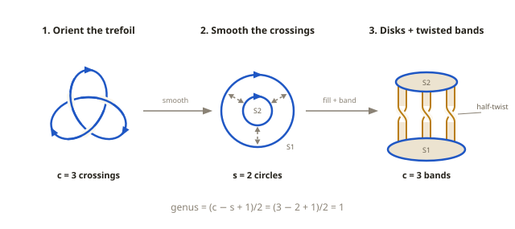

1. **Orient.** Draw a travel arrow along the knot.
2. **Smooth all 3 crossings.** At each crossing, delete the crossing
   and reconnect the four loose ends in the only way that respects the
   arrows: incoming strands join outgoing strands without crossing.
3. **Count the circles.** The smoothed diagram falls apart into s = 2
   Seifert circles — a small circle nested inside a larger one.
4. **Cap with disks.** Fill each circle with a disk; picture the two
   disks stacked at slightly different heights.
5. **Reattach c = 3 bands.** At each former crossing, join the two
   disks with a narrow band given a half-twist. The twist direction
   records the sign of the crossing it replaced.

The result is one connected surface whose boundary is precisely the
original trefoil, and it is orientable: because the smoothing respected
the travel arrows, the two disks can be given compatible rotation
senses, and the half-twist bands join them consistently — the surface
has a genuine front and back.

Now compute the genus from the counts. The Euler characteristic is
chi = s - c = 2 - 3 = -1, and for a connected orientable surface with
one boundary circle, chi = 1 - 2g, so g = 1. Equivalently, by the
formula above: genus = (c - s + 1)/2 = (3 - 2 + 1)/2 = 1. The trefoil's
spanning membrane is a torus with one puncture — one genuine handle,
visible in the assembled Sail as the gap between the twisted bands.
And since a knot of genus 0 would bound a disk and be the unknot, while
Section 15 proved the trefoil is knotted, genus 1 is not just what this
particular surface happens to have — it is the trefoil's true genus.

### Which puzzles use this

- **Puzzle 16, The Seifert Sail:** Three shaped panels are assembled inside a trefoil frame to physically construct a Seifert surface. Once built, a cord loop can be pushed across the surface and freed. The surface makes visible the theorem that every knot bounds an orientable surface.

### Physical intuition

The Seifert surface is a membrane spanning the interior of a knot. Imagine stretching a soap film inside a wire trefoil — the film would form a surface whose edge is the trefoil wire. This surface has a half-twist at each crossing (which is why soap films on trefoils look twisted). A cord linked with the wire can be pushed across this surface and freed, because the surface provides a continuous path from one side to the other.

### Rigorous statement

**Seifert's theorem** (1934): every oriented knot or link in S^3 bounds
a compact, connected, orientable surface embedded in S^3 — a **Seifert
surface** — and Seifert's algorithm constructs one from any diagram.
For a knot diagram with c crossings whose smoothing produces s Seifert
circles, the resulting surface has Euler characteristic chi = s - c and
genus (c - s + 1)/2. The **genus** g(K) of a knot K is the minimum
genus over all Seifert surfaces for K. It satisfies g(K) = 0 if and
only if K is the unknot — a knot bounding an embedded disk is trivial —
and it is additive under connected sum: g(K1 # K2) = g(K1) + g(K2).
For torus knots, Seifert's algorithm applied to the standard diagram
realizes the minimum, giving g(T(p,q)) = (p-1)(q-1)/2 (Section 14).

---

## 17. Unknotting Number

### Plain-language definition

The **unknotting number** u(K) of a knot K is the minimum number of crossing changes needed to convert K into the unknot. A crossing change swaps which strand goes over and which goes under at a single crossing.

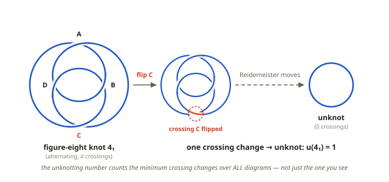

Key values:
- Unknot: u = 0
- Trefoil: u = 1
- Figure-eight: u = 1
- Cinquefoil (5_1): u = 2

The unknotting number is a topological invariant that measures how far a knot is from being trivial.

### Worked example: predict-then-flip on the minimal diagram

Puzzle 9, The Crossing Number, makes u(figure-eight) = 1 physical —
with a generosity the definition does not promise. The frame realizes
the standard 4-crossing diagram, labeled A through D as in the figure,
each crossing flippable by inverting its pin. On this diagram, **every
one of the four flips produces the unknot.**

Why: the minimal diagram has exactly two bigon faces — an outer shell
whose corners are crossings A and C, and a central eye whose corners
are B and D — and every crossing is a corner of exactly one bigon. In
the alternating diagram each bigon is a locked clasp. Flip either of
its corners and one arc of that bigon rides over at both ends: a
Reidemeister II move slides it off, both crossings vanish, and the two
surviving crossings degenerate into kinks that Reidemeister I untwists.
Any pin you pick is a corner of some clasp, so any pin frees the ring.

This over-delivery is itself instructive:

- What u = 1 actually promises is that *some* single flip in *some*
  diagram unknots the knot. This particular diagram happens to realize
  the minimum at every crossing — a fact about the diagram, not a law
  about crossing changes (on the cinquefoil, u = 2, so no single flip
  of any diagram works at all).
- No flip on this diagram produces a trefoil — all four land on the
  unknot — and that is not a shortcoming of the diagram. A 2012
  theorem of Kawauchi shows that no single crossing change in *any*
  diagram of the figure-eight yields a trefoil: the Gordian distance
  between the two knots is 2. Crossing-change distance between knots,
  like unknotting number itself, is a question about the knots, not
  about the picture you happen to be looking at. For a diagram where
  the choice of crossing genuinely decides the destination, look one
  knot up the table at 5_2: flip a clasp crossing of its minimal
  diagram and the knot dissolves to the unknot, but flip a crossing
  in its twist region and two twists cancel, leaving a trefoil.
- Because the flip always succeeds, the puzzle's real test is
  foresight: predict which clasp opens and trace the R-II-then-R-I
  dissolution *before* touching the pin. Flip first and the frame
  unknots anyway — teaching nothing.

### Why unknotting number is hard

The definition hides a quantifier over infinitely many diagrams: u(K)
is the minimum over ALL diagrams of K and all choices of crossings.
The optimal crossing change may not be visible in the diagram in front
of you — you might have to deform the knot into a completely different
diagram before the decisive crossing even exists. This is why no simple
algorithm computes u, why lower bounds like the signature bound below
are precious, and why some knots with only ten crossings still have
unknown unknotting numbers.

### Which puzzles use this

- **Puzzle 9, The Crossing Number:** A figure-eight knot frame with 4 flippable crossing pins. Flipping any one of the four converts this minimal diagram to the unknot (u = 1 realized four ways); the solver's task is to predict, before flipping, which clasp opens and which Reidemeister moves dissolve the frame.

### Physical intuition

Each crossing pin controls which strand is on top at that point. Flip a pin and the knot type changes instantly, though the steel never moves; slide the ring and it glides past what used to be a catch point. On this frame any pin frees the ring, so the test is of foresight rather than luck: say which moves the flip will unlock before you pull the pin. The unknotting number tells you how many flips are needed — for the figure-eight, exactly one. In general it does not tell you which crossing, or even which diagram, realizes them.

### Rigorous statement

The **unknotting number** u(K) is the minimum, over all diagrams of K
and all finite sequences of crossing changes and ambient isotopies
transforming K into the unknot, of the number of crossing changes used.
u(K) = 0 if and only if K is the unknot. The **signature bound**
(Murasugi, 1965): |sigma(K)| / 2 <= u(K), where sigma(K) is the knot
signature. The trefoil has |sigma| = 2, forcing u >= 1 and hence u = 1;
the figure-eight has sigma = 0, so the bound says nothing — yet u = 1.
Lower bounds can be blind. For torus knots the answer is complete:
u(T(p,q)) = (p-1)(q-1)/2, conjectured by Milnor and proved by
Kronheimer and Mrowka (1993) using gauge theory. Examples:
u(T(2,3)) = 1 (trefoil) and u(T(2,5)) = 2 (cinquefoil), matching the
table above — and for torus knots the unknotting number coincides with
the genus (Sections 14 and 16).

---

## 18. Satellite Knots and JSJ Decomposition

### Plain-language definition

A **satellite knot** is a knot that can be decomposed into two layers:
- The **companion**: a non-trivial knot embedded as the core curve of a solid torus
- The **pattern**: a knot or link inside the solid torus that wraps around the companion

The satellite knot is the result of replacing the companion's tubular neighborhood with the pattern's structure. It is more complex than either component alone.

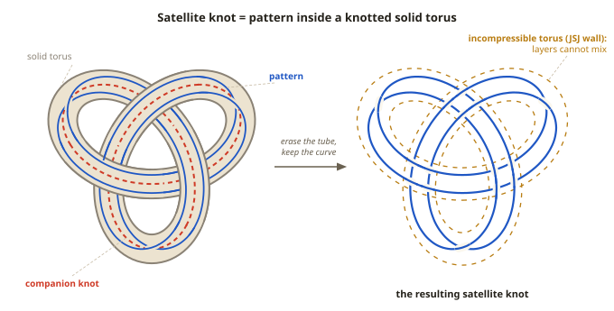

### JSJ decomposition

The **Jaco-Shalen-Johannson (JSJ) decomposition** theorem states that every compact, orientable, irreducible 3-manifold has a unique decomposition along incompressible tori into Seifert-fibered and hyperbolic pieces. For knot complements, this means satellite knots decompose uniquely into companion and pattern components.

The practical consequence: a satellite knot's properties can be analyzed by studying each layer independently.

### Worked example: decomposing the Satellite Trap

Apply the two-layer analysis to Puzzle 17 itself:

- **Companion: the trefoil tunnel.** The tunnel molded into the torus
  shell follows a (2,3) torus-knot path. It is rigid, embedded in the
  shell, and nothing a solver does can change it.
- **Pattern: the cord.** The cord's route — through the tunnel, out a
  port, across the surface, back in — is a curve inside the solid torus
  that surrounds the tunnel. Pulling bights of cord through the ports
  changes the pattern, and only the pattern.
- **The JSJ wall: the shell itself.** Topologically, the boundary
  between the layers is the incompressible torus around the companion;
  physically, it is the acrylic wall your fingers stop at.

Now place the two rings, one per layer:

- The **outer ring** encircles an external arc of cord. Its linking is
  entirely with the pattern — the layer on the accessible side of the
  wall — so pattern moves (pull a bight through a port, pass it over
  the ring, feed it back) can and do free it.
- The **inner ring** rides a section of cord inside the tunnel. Its
  linking is with the companion layer, on the far side of the wall.
  The companion is a genuine trefoil that no surface manipulation can
  alter, so the inner ring is trapped permanently.

The decomposition is not just a description — it is the solving
strategy. It tells you in advance which sub-problem is solvable (the
pattern) and which is provably hopeless (the companion), so you stop
wasting moves on the wrong ring.

### Which puzzles use this

- **Puzzle 17, The Satellite Trap:** A torus shell contains a trefoil-knotted tunnel (companion). A cord threads through the tunnel and connects externally (pattern). Two rings are trapped by different layers: the outer ring is linked only with the pattern (and can be freed by rerouting the external cord), while the inner ring is linked with the companion (and is permanently trapped).

### Physical intuition

Think of a satellite knot as a knot within a knot, like Russian nesting dolls. The outer structure (pattern) can be manipulated without affecting the inner structure (companion). In the puzzle, you can reroute the cord where it exits the torus (changing the pattern) without being able to change the trefoil tunnel inside (the companion). One ring lives in the pattern layer and can be freed; the other lives in the companion layer and cannot.

### Rigorous statement

Let V = S^1 x D^2 be the standard solid torus and let P (the
**pattern**) be a knot in V that is essential: P is not contained in
any 3-ball inside V and is not isotopic to the core circle S^1 x {0}.
Let e: V -> S^3 be an embedding carrying the core to a non-trivial knot
C (the **companion**). Then K = e(P) is a **satellite knot**. The image
torus e(dV) is essential (incompressible and not boundary-parallel) in
the complement of K, and conversely a knot is a satellite if and only
if its complement contains an essential torus. The **JSJ decomposition
theorem** (Jaco-Shalen and Johannson, 1979): every compact, orientable,
irreducible 3-manifold contains a minimal family of disjoint essential
tori, unique up to isotopy, that cuts it into pieces each of which is
Seifert-fibered or atoroidal (and the atoroidal pieces are hyperbolic,
by Thurston's geometrization of Haken manifolds). For the Satellite
Trap, the shell wall is the JSJ torus: the piece beyond it is the
trefoil complement, which is Seifert-fibered — as befits a torus knot
(Section 14) — while the piece containing the cord is the pattern
space V minus P.

---

## 19. The Whitehead Link and Higher-Order Linking

### Plain-language definition

Section 3 gave you the linking number and, with it, a promise: if two closed
curves have linking number zero, some continuous motion pulls them apart.
That promise came with a footnote. This section is the footnote made solid.

The **Whitehead link** is a pair of closed loops whose linking number is
exactly zero, and which nevertheless cannot be separated by any amount of
sliding, stretching, or bending. The winding of one loop around the other
genuinely cancels — count it and you get zero. What holds them together is a
**clasp**: a place where the loops hook through each other in a pattern the
linking number is blind to.

So the inference "linking number zero, therefore separable" is *false in
general*. Zero linking is **necessary** for two loops to come apart — a
nonzero value proves they are stuck (Section 3) — but it is not
**sufficient**. A zero says only that the door is not provably locked. It
does not say the door opens.

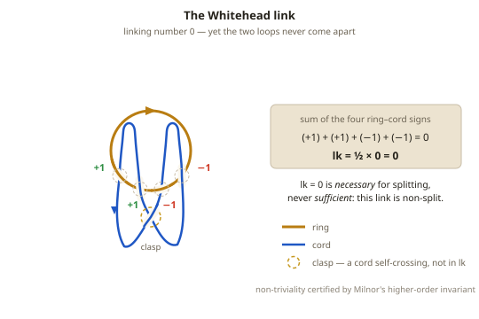

### Worked example: recomputing lk = 0

Take the standard diagram in the figure: a rigid ring and a cord loop woven
through it twice — once front to back, once back to front — with the cord's
two hanging lobes meeting in a clasp below. Orient both curves and sign each
ring-cord crossing by the recipe of Section 3.

The two passes through the ring's aperture contribute four crossings. The
front-to-back pass pierces the ring's spanning disk one way and shows up as
two crossings of the **same** sign, +1 and +1. The back-to-front pass pierces
the other way: two crossings of sign -1 and -1. Summing,

**(+1) + (+1) + (-1) + (-1) = 0,   so   lk = 1/2 x 0 = 0.**

(The factor of 1/2 is the same one from Section 3: between two closed loops
every threading registers as *two* crossings, so the signed crossing sum is
always twice the linking number.) The clasp is a crossing of the cord with
*itself*, not with the ring, so it never enters the linking-number sum at
all. The count is honestly, provably zero.

### What the count cannot see: the clasp

Here is where the analysis of Section 3 runs out. The +1 pass and the -1 pass
would, on their own, happily cancel — pull one back out through the aperture,
then the other, and the cord lifts away. But the clasp ties the cord's two
lobes together, and neither lobe can retract without first passing through
the other. The cancellation that the arithmetic describes exists on paper and
cannot be performed in space. The clasp remembers exactly what the linking
number forgets.

The linking number is a **first-order** invariant: it reports the *net*
number of times one curve passes through the other. It says nothing about how
those passes are arranged relative to one another — and that arrangement is
the whole content of the Whitehead link.

### Higher-order linking

What, then, certifies that the Whitehead link is genuinely stuck? The answer
is a **higher-order linking invariant**, and it is the two-component cousin of
the invariant that rescued the Borromean rings in Section 7.

Recall the pattern there: three rings, every pairwise linking number zero, yet
inseparable as a trio — and the certificate was **Milnor's invariant**
mu_bar(1,2,3), which measures a purely three-body linking that no pairwise
count can detect. The Whitehead link distills that warning down to two
components. Its ordinary (first-order) linking number vanishes, and its
non-triviality is witnessed instead by a **second-order** Milnor invariant,
mu_bar(1,1,2,2) — one with a *repeated* index, encoding how the two passes of
one component clasp back through the other. Equivalently, this is the
**Sato-Levine invariant**, defined precisely for two-component links of
linking number zero, which evaluates to +/-1 on the Whitehead link.

Both the Borromean rings (Section 7) and the Whitehead link are therefore
members of the same family: links that are trivial to every lower-order test
and are held together only by higher-order linking. Milnor's invariants form
a graded ladder of such tests, and these links live one rung above the linking
number.

### Which puzzle uses this

- **Puzzle 18, The Whitehead Waltz:** Two near-identical stations each present
  a ring with a cord woven through it twice and clasped below. Both compute to
  linking number zero. One is a genuine Whitehead link (the clasp hooks) and
  can never be freed; the other has that single clasp crossing flipped, making
  it an unlink in disguise, and its cord lifts off. The solver must resist the
  reflex "lk = 0, therefore free," identify the true clasp, and prove the
  point by freeing only the loop that can be freed.

### Physical intuition

Hold the trapped station and try to lift the cord. It always *feels* one
clever move from freedom — there is slack everywhere, the count says zero, the
loop swings loosely. But every attempt to retract one pass drags the other
lobe into the clasp, and the hook cinches against the ring wire. You can slide
the clasp anywhere along the cord, yet it is always *somewhere*, and it always
arrives at the aperture exactly when the cord tries to leave. That inescapable
catch, felt in the hands, is higher-order linking — the thing the arithmetic
could not see.

### Rigorous statement

The **Whitehead link** W is a two-component link in S^3 with linking number
lk(W) = 0 that is nonetheless **non-split**: no embedded 2-sphere in S^3
separates its two components, so no ambient isotopy pulls them apart. Its
non-triviality is detected by the first non-vanishing **Milnor mu-bar
invariant** mu_bar(1,1,2,2) = +/-1 — a second-order invariant drawn from the
lower central series of the link group — equivalently by the **Sato-Levine
invariant**, defined for two-component links of linking number zero, which
equals +/-1 on W. The Whitehead link also has **unlinking number 1** (a single
crossing change at the clasp converts it to the two-component unlink), and its
complement S^3 \ W is a **hyperbolic** 3-manifold of finite volume — one of
the standard examples of low-dimensional topology, widely used in Dehn-surgery
constructions. The Borromean rings (Section 7) are the three-component member
of the same Brunnian/higher-order family: all lower-order linking data vanish,
and a Milnor invariant supplies the certificate.

---

## 20. Rational Tangles and Continued Fractions

### Plain-language definition

A **tangle**, in John Conway's sense, is what you get by pinning the four
ends of two arcs to the boundary of a disk (think: a square frame with a cord
end fixed at each corner) and letting the arcs cross each other freely inside.
The simplest tangle is two horizontal parallel strands with no crossings at
all — the **0 tangle**.

From the 0 tangle you can build endlessly with just two operations:

- **TWIST (T):** grab the two right-hand ends and cross one over the other,
  adding a single crossing.
- **ROTATE (R):** turn the entire frame a quarter-turn.

Any tangle you can reach from the 0 tangle using only these two moves is
called **rational**. (Not every tangle is — but every tangle in Puzzle 19 is,
because T and R are the only moves the frame allows.) Conway's discovery is
that each rational tangle carries a single number, its **fraction**, an
element of the rationals Q together with one extra value, infinity — and that
this number is a *complete* record of the tangle.

### The two moves are arithmetic

Assign the 0 tangle the number 0. Then the two physical moves act on the
fraction as pure arithmetic:

- **T (twist):** x -> x + 1. A right-hand twist adds one positive crossing,
  and adds 1 to the fraction.
- **R (rotate):** x -> -1/x. The quarter-turn moves no strand relative to any
  other; it only changes which pair of ends faces the twisting edge, and its
  effect on the number is to send it to its negative reciprocal.

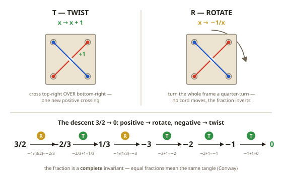

One caution about the extra value: the fraction infinity is the tangle of two
*vertical* parallel strands. R swaps 0 and infinity, so of the two
crossingless tangles only one — the horizontal one, fraction 0 — is the goal.

### Conway's theorem: a complete invariant

**Conway's theorem (1970):** two rational tangles are ambient-isotopic, with
their four endpoints held fixed, **if and only if** their fractions are equal.

This is the hinge of the entire arc, so it is worth stating against the
backdrop of Section 19. The linking number is an **incomplete** invariant: it
is lossy, collapsing many genuinely different configurations onto the same
integer, which is exactly why lk = 0 could promise nothing about the Whitehead
link. The tangle fraction is the opposite — a **complete** invariant. Equal
fractions do not merely *fail to distinguish* two tangles; they *guarantee*
the tangles are the same. An incomplete invariant can only ever prove
impossibility ("these differ, so no motion connects them"); a complete one
hands you an algorithm ("drive the fraction to the target and the tangles must
coincide"). Half a meter of cord and any pile of crossings compress,
losslessly, into one rational number.

### The compass: continued fractions

Where does the fraction come from? Write it as a **continued fraction**. For
the puzzle's starting tangle,

**3/2 = 1 + 1/2,**

which reads directly off the diagram as one right twist stacked on top of two
vertical twists. In general a twist/rotate word encodes, and its fraction
equals, a continued fraction [a_n, ..., a_2, a_1] built from the counts of
successive twist regions.

Unwinding a continued fraction from the outside in is nothing but **Euclid's
algorithm** on the numerator and denominator, and that is what dictates the
solving rule. Read the fraction and obey a compass:

- **Positive?** ROTATE.
- **Negative?** TWIST.
- **Zero?** Stop — solved.

Each rotate-then-twist block performs one division step of Euclid's algorithm,
and because Euclid's algorithm always terminates, the descent is guaranteed to
reach 0 — walking up from the negative integers one unit at a time, never
overshooting.

### Worked example: the descent from 3/2 to 0

Start at 3/2 and apply the compass, verifying each step against the two laws
(T adds 1; R sends x to -1/x):

1. **3/2** is positive -> **R**:  -1/(3/2) = **-2/3**.
2. **-2/3** is negative -> **T**:  -2/3 + 1 = **1/3**.
3. **1/3** is positive -> **R**:  -1/(1/3) = **-3**.
4. **-3** is negative -> **T**:  -3 + 1 = **-2**.
5. **-2** is negative -> **T**:  -2 + 1 = **-1**.
6. **-1** is negative -> **T**:  -1 + 1 = **0**.  Solved.

Six moves, R T R T T T, each one forced. Notice that the *picture* does not
simplify monotonically — step 3 turns a tidy 1/3 into three stacked crossings
(-3), which looks like a setback. But the *number* is marching toward zero,
and distance-to-solved is measured by continued-fraction depth, not by crossing
count or by absolute value. Judge the tangle by its fraction and the descent
is a straight line down.

### Which puzzle uses this

- **Puzzle 19, The Tangle Dance:** Two cords span a square frame, with the two
  legal moves — T and R — embossed on its edges. The frame is preset to
  fraction 3/2, and the objective is to return it to 0. Because the fraction is
  a complete invariant, solving is not a search but a computation: run the
  compass, write down the ledger above, and execute six forced moves.

### Physical intuition

A twist is honest labor — the cords visibly wrap and the tangle thickens. A
rotate is eerie: you turn the frame like a steering wheel and *nothing between
your hands changes*, yet the number naming the state flips from 3/2 to -2/3,
and a move that was making things worse a moment ago is suddenly the move that
helps. The most important operation looks like doing nothing, because the thing
it changes is not the cords but their relationship to the twisting edge. At the
very end, the last twist lands a crossing against its mirror image, a
Reidemeister II pair annihilates, and the cords fall parallel. You feel the
zero.

### Rigorous statement

A **rational tangle** is a tangle obtained from the 0 tangle (two
boundary-parallel arcs in a 3-ball with four marked boundary points) by a
finite sequence of the generating operations twist and rotate; equivalently,
it is a tangle whose double branched cover is a solid torus. To each rational
tangle Conway assigns a **fraction** F in Q ∪ {infinity}, computed as the
continued fraction determined by its twist/rotate word. **Conway's
classification theorem** (1970): two rational tangles are ambient-isotopic rel
their four endpoints if and only if they have the same fraction. The generators
act on the fraction by T: x -> x + 1 and R: x -> -1/x, so the fraction of a
word in T and R equals the continued fraction that word encodes; R is its own
inverse (-1/(-1/x) = x), while T has infinite order. Because the compass rule
realizes the Euclidean algorithm on (numerator, denominator), every rational
tangle descends to the 0 tangle in finitely many moves. In contrast to the
linking number of Section 19, which is a lossy (incomplete) invariant, the
tangle fraction is a **complete** invariant of rational tangles: it determines
the isotopy class exactly.

---

## 21. Connected Sums and Composite Knots

### Plain-language definition

Tie a knot in a closed loop of cord, then tie a second knot farther along the
same loop, and you have formed the **connected sum** of the two, written
K1 # K2. Each factor keeps its own stretch of cord; the two are joined by a
short two-strand **neck**. Slice through that neck with an imaginary sphere —
the **sum sphere** — and you separate the loop into two pieces, one factor
sealed inside the sphere and the other outside, with the loop puncturing the
sphere at exactly two points.

This is the knot-theoretic echo of prime factorization. A knot is **prime** if
it is not the connected sum of two nontrivial knots — it cannot be cut along
any sum sphere into simpler pieces. A knot that *is* a nontrivial connected
sum is **composite**. The trefoil, the figure-eight, and every torus knot are
prime; the square and granny knots of Puzzle 20 are composite, each built from
two trefoils.

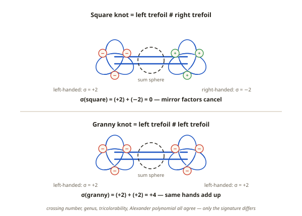

### Square versus granny

Two composites, both made of two trefoils, can differ only in the *handedness*
of their factors:

- **Square knot** = left trefoil # right trefoil (a mirror-image pair).
- **Granny knot** = left trefoil # left trefoil (two of the same hand).

If your shoelaces keep slipping, you are tying the granny where you wanted the
square. Topologically the two are genuinely different knots — but proving it
takes the right invariant, because almost every invariant in this primer
cannot tell them apart.

### Additive and multiplicative invariants

Connected sum interacts cleanly with the standard invariants, and *how* it
interacts is the key:

- **Genus is additive:** g(K1 # K2) = g(K1) + g(K2) (Section 16). Two genus-1
  trefoils give genus 2, for both square and granny.
- **Signature is additive:** sigma(K1 # K2) = sigma(K1) + sigma(K2). This is
  the one that will separate them.
- **Crossing number** is additive for **alternating** knots such as these
  (3 + 3 = 6); additivity in general is a famous open problem.
- **The Alexander polynomial is multiplicative:** the polynomial of a sum is
  the product of the factors' polynomials. Each trefoil contributes
  t - 1 + t^{-1}, so both composites have Alexander polynomial
  (t - 1 + t^{-1})^2.
- **The number of Fox 3-colorings is multiplicative** (up to the shared
  trivial colorings): each trefoil has 9, and each composite has
  9 x 9 / 3 = 27 (Section 15). Mirroring never changes a coloring count.

### The invariant scoreboard

Line up the series' whole toolkit against the two suspects:

| Invariant | Square knot | Granny knot | Verdict |
|-----------|-------------|-------------|---------|
| Crossing number | 6 | 6 | same |
| Genus | 1 + 1 = 2 | 1 + 1 = 2 | same |
| Tricolorable | yes (27 colorings) | yes (27 colorings) | same |
| Alexander polynomial | (t - 1 + t^{-1})^2 | (t - 1 + t^{-1})^2 | same |
| **Signature** | **0** | **+4** | **different** |

Four of the five tests are stone silent. The **signature** sigma is the one
that speaks. It is an integer read off a knot's Seifert surface (Section 16);
it *adds* under connected sum and, crucially, *flips sign* under mirroring.
Fix the convention that the right-handed trefoil (all-positive crossings) has
sigma = -2, so its mirror the left-handed trefoil has sigma = +2. Then:

- **sigma(square) = sigma(L) + sigma(R) = (+2) + (-2) = 0.** The mirror
  factors cancel. (Any amphichiral knot must have signature 0.)
- **sigma(granny) = sigma(L) + sigma(L) = (+2) + (+2) = +4.** Same hands add
  up.

Since 0 does not equal +4, the square and granny knots are provably distinct.
The same sign-flip-under-mirroring settles each composite's relationship to its
own reflection: mirror(square) = mirror(L # R) = R # L = square, so the
**square knot is amphichiral** — equal to its own mirror image. But
mirror(granny) = R # R is the *other* granny, so the **granny knot is chiral**,
coming in mirror twins with signatures +4 and -4.

### Worked example: reading the scoreboard

The discipline the scoreboard teaches is that an **invariant is a question you
ask a knot**, and the skill is choosing a question that separates your
suspects. Ask "how many crossings?" and square and granny answer identically.
Ask "what is your genus? your Alexander polynomial? are you tricolorable?" —
identical, identical, identical. Every one of those questions is blind to
handedness, and the difference between square and granny is *entirely* a matter
of handedness. Only the signature is built to see a mirror, and it is built to
survive connected sum (it adds), so it survives to deliver the verdict: 0
versus +4.

### Which puzzle uses this

- **Puzzle 20, The Granny's Downfall:** Two closed six-crossing loops — one a
  square knot, one a granny — must be matched against a mold carved with the
  square knot's diagram. Only the square loop seats fully, because a seated
  loop physically *realizes* that diagram and therefore *is* that knot. The
  granny cannot seat: its wrong-handed second clump would have to be re-handed,
  which would drop its signature from +4 to 0 and turn it into a square knot —
  and no manipulation of a closed loop changes its knot type.

### Physical intuition

Pull either loop from opposite sides and the two knotted clumps slide apart
until a clean two-strand neck connects them — your hands are holding the sum
sphere's equator. Seating the square loop feels like slotting a key. The granny
starts identically, then its second clump refuses: all three of its crossings
insist on lying the wrong way over the mold's bridges. Flip that clump to fix
it and nothing improves — the flip is a symmetry of the trefoil, so the same
three crossings refuse in the same way. What you keep failing to seat is not
one stray crossing but a whole wrong-handed clump, a conserved lump of three
crossings. You are pushing, with your hands, on the +4 that the signature
measured.

### Rigorous statement

The **connected sum** K1 # K2 of two oriented knots is formed by removing a
small arc from each and splicing the four ends together respecting
orientation; the operation is well-defined and, on oriented knots, commutative
and associative, with the unknot as unit. A knot is **prime** if it is not the
connected sum of two nontrivial knots. **Schubert's theorem** (1949): every
knot factors as a connected sum of prime knots, uniquely up to order — the
oriented knots form a **free commutative monoid** on the set of prime knots,
the exact analogue of the fundamental theorem of arithmetic. Under connected
sum the **genus is additive**, g(K1 # K2) = g(K1) + g(K2) (Section 16); the
**signature is additive**, sigma(K1 # K2) = sigma(K1) + sigma(K2); and the
**Alexander polynomial is multiplicative**,
Delta_{K1 # K2}(t) = Delta_{K1}(t) Delta_{K2}(t). The signature also negates
under mirroring, sigma(mK) = -sigma(K). With sigma(right trefoil) = -2 and
sigma(left trefoil) = +2, these rules give sigma(square) = 0 and
sigma(granny) = +4, so the square and granny knots are distinct; and since the
square knot equals its own mirror it is amphichiral, while the granny is chiral.

---

## 22. Glossary

Concise definitions of every technical term used across the EXKNOTS puzzle
files, listed alphabetically.

**Arc** — An open curve with two distinct endpoints. Unlike a loop, an arc
can always be unknotted in free space. In the EXKNOTS puzzles, arcs arise
when a cord has two separate attachment points (Puzzles 1, 8).

**Bight** — A U-shaped fold or loop of cord, created by doubling the cord
back on itself without crossing the ends. Used as a manipulation technique
in Puzzles 2, 3, 7, 11, and 17 to thread cord through holes or over obstacles.

**Borromean rings** — A specific 3-component link in which the three
components are mutually linked but no two are linked to each other. The
simplest non-trivial Brunnian link. Puzzle 6 (Trinity Lock) is built on
this structure.

**Brunnian link** — A link of n components such that removing any single
component makes the remaining components completely unlinked. Borromean
rings are the case n = 3. Named after Hermann Brunn (1892).

**Composite knot** — A nontrivial connected sum of two or more prime knots,
the knot-theoretic analogue of a composite number. The square and granny knots
(Puzzle 20) are composite: each is a sum of two trefoils.

**Configuration space** — The space of all possible states of a mechanical
system. Each point represents one arrangement of all parts. The topology of
this space governs which transitions between states are possible (Puzzle 7).

**Connected sum** — The knot formed by splicing two knots into one loop along
a sum sphere, written K1 # K2. Genus and signature add under connected sum, the
Alexander polynomial multiplies, and factorization into primes is unique
(Schubert). The basis of Puzzle 20.

**Crossing number** — The minimum number of crossings in any planar diagram
of a knot or link. The unknot has crossing number 0; the trefoil has
crossing number 3.

**Fiber bundle** — A space that is locally a product of a base space and a
fiber, but may be globally twisted. The Hopf fibration is the central
example in EXKNOTS (Puzzle 12).

**Free group** — A group whose generators satisfy no relations other than
the trivial cancellation of a generator with its inverse. The free group
F(a, b) on two generators is the fundamental group of a genus-2 handlebody
(Puzzle 11).

**Fundamental group** — The group of homotopy classes of loops at a
basepoint in a topological space. Captures the distinct ways to walk in a
closed path. Denoted pi_1(X). Used in Puzzles 7 and 11.

**Generator** — A basic element of a group from which all other elements
can be built by composition and inversion. In the fundamental group of a
genus-g handlebody, there are g generators, one for each tunnel/handle.

**Genus** — The number of handles on a surface. A sphere has genus 0, a
torus has genus 1, a two-holed torus has genus 2. For a handlebody, the
genus equals the number of through-tunnels (Puzzles 2, 11).

**Gray code** — A binary numbering system in which consecutive values
differ by exactly one bit. Also called reflected binary code. Governs the
solution sequence of the Ouroboros Chain (Puzzle 10).

**Handlebody** — A solid body with through-tunnels. A genus-g handlebody
has g tunnels and its fundamental group is the free group on g generators.
The acrylic block in Puzzle 11 is a genus-2 handlebody.

**Homeomorphism** — A continuous bijection whose inverse is also
continuous. Two spaces related by a homeomorphism are topologically
identical — they have the same topological invariants.

**Homotopy** — A continuous deformation of one map (or loop, or path) into
another. Two loops are homotopic if one can be continuously deformed into
the other. Homotopy is the equivalence relation underlying the fundamental
group.

**Hopf fibration** — The map h: S^3 -> S^2 whose fibers are circles (S^1).
Discovered by Heinz Hopf in 1931. Decomposes the 3-sphere into a family of
linked circles. Underlies the coupled-rotation mechanism of Puzzle 12.

**Identity** — The neutral element of a group. In the fundamental group,
the identity is the class of loops that can be contracted to a point. In the
free group F(a, b), a word reduces to the identity only when all generators
cancel via adjacent inverse pairs.

**Linking number** — An integer invariant measuring how many times two
closed curves wind around each other. Computed by summing signed crossings
and dividing by 2. A linking number of 0 is necessary (though not always
sufficient) for the curves to be separable (Puzzles 1, 3).

**Milnor invariant** — A higher-order linking invariant that detects
collective linking when the pairwise linking numbers all vanish. The triple
invariant mu-bar(1,2,3) certifies the Borromean rings (Puzzle 6); a
repeated-index form mu-bar(1,1,2,2), equivalently the Sato-Levine invariant,
certifies the Whitehead link (Puzzle 18).

**Mobius band** — A non-orientable surface with one edge and one side,
formed by joining a rectangular strip with a single half-twist. The single
boundary component is the key to Puzzle 4 (Mobius Snare).

**Orientability** — A surface is orientable if it has two distinct sides
(a consistent notion of "clockwise" at every point). Non-orientable
surfaces, like the Mobius band, have only one side.

**Prime knot** — A nontrivial knot that is not the connected sum of two
nontrivial knots, the analogue of a prime number. Trefoils, the figure-eight,
and torus knots are prime; every knot factors uniquely into primes (Schubert).

**Rational tangle** — A tangle of two arcs in a disk, built from the trivial
tangle by twisting adjacent ends and rotating the disk, and classified
completely by its Conway fraction in Q ∪ {infinity} (Puzzle 19).

**Reidemeister moves** — Three types of local diagram changes (twist,
poke, slide) that generate all equivalences between knot diagrams. Any
continuous deformation of a knot in 3D can be decomposed into a sequence
of these three moves (Puzzles 1, 3, 5, and 8).

**S^1** — The 1-sphere; the circle. The set of points at unit distance
from the origin in the plane. The fiber in the Hopf fibration.

**S^2** — The 2-sphere; the ordinary sphere surface. The set of points at
unit distance from the origin in 3D. The base space in the Hopf fibration.

**S^3** — The 3-sphere; a three-dimensional manifold living in 4D space.
The set of points at unit distance from the origin in R^4. The total space
of the Hopf fibration. Locally looks like R^3 but is compact and closed.

**Signature** — An integer knot invariant sigma(K) computed from a Seifert
surface; it adds under connected sum and negates under mirroring. It separates
the square knot (sigma = 0) from the granny knot (sigma = +4) in Puzzle 20.

**Tangle fraction** — The rational number (in Q ∪ {infinity}) that Conway
assigns to a rational tangle. A complete invariant: two rational tangles are
isotopic if and only if their fractions are equal (Puzzle 19).

**Topological invariant** — Any property of a topological space that is
preserved under homeomorphism (or, for knots and links, under ambient
isotopy). Examples: genus, linking number, crossing number, fundamental
group. Invariants are what topology actually measures.

**Trefoil** — The simplest non-trivial knot, with crossing number 3. It
cannot be unknotted. The visual pattern in Puzzle 8 (The Ferryman's Knot)
resembles a trefoil, but the cord is an open arc rather than a closed loop,
so it is not a true trefoil.

**Unknot** — A knot equivalent to a simple circle — no crossings, no
tangles. A closed curve that can be deformed into a round circle. Crossing
number 0. The cord in Puzzle 1 (The Gatekeeper) is topologically an unknot
(or rather, an unknotted arc).

**Whitehead link** — A two-component link with linking number zero that is
nonetheless non-split, held together by a clasp. Its non-triviality is
certified by a higher-order (Milnor / Sato-Levine) invariant, not by the
linking number. The trap in Puzzle 18.

**Word** — In group theory, a finite sequence of generators and their
inverses. For example, aba^{-1} is a word in the free group F(a, b). The
word represents an element of the group. In EXKNOTS, a cord's path through
tunnels encodes a word in the fundamental group, and the puzzle is solved
when the word reduces to the identity (Puzzle 11).

---

*This primer covers every topological concept used in the twenty EXKNOTS
puzzles. For construction details, solution walkthroughs, and physical
specifications, see the individual puzzle files in the `puzzles/` directory.*
